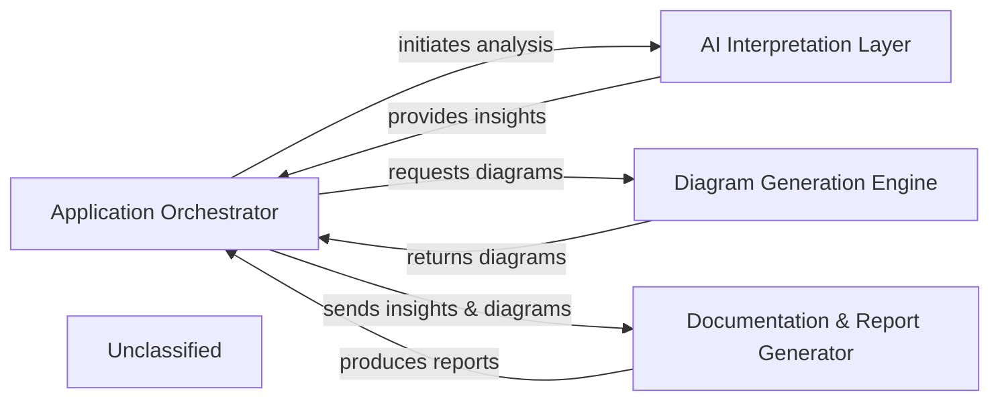

## Details

The system operates through a centralized Application Orchestrator that manages the end-to-end process of architectural analysis and documentation. It initiates the AI Interpretation Layer to extract insights from the codebase. These insights are then used by the Diagram Generation Engine to create visual representations. Finally, both the insights and diagrams are passed to the Documentation & Report Generator to produce comprehensive, human-readable outputs. This orchestration ensures a streamlined flow from code analysis to final documentation and diagram generation.

### Application Orchestrator [[Expand]](./Application_Orchestrator.md)
Manages the overall application lifecycle, coordinating the execution and data flow between the AI Interpretation Layer, Diagram Generation Engine, and Documentation & Report Generator. It acts as the central control point, initiating processes and integrating results.

**Related Classes/Methods**:

- <a href="https://github.com/CodeBoarding/CodeBoarding/blob/main/.codeboardingmain.py" target="_blank" rel="noopener noreferrer">`main.py`</a>

### AI Interpretation Layer [[Expand]](./AI_Interpretation_Layer.md)
Analyzes the codebase to extract structured architectural insights and understanding. It serves as the primary intelligence source for the system.

**Related Classes/Methods**:

- <a href="https://github.com/CodeBoarding/CodeBoarding/blob/main/.codeboardingagents/agent.py" target="_blank" rel="noopener noreferrer">`agents.agent`</a>

### Diagram Generation Engine
Generates visual architectural diagrams from the structured insights provided by the AI Interpretation Layer, often utilizing external rendering tools.

**Related Classes/Methods**:

- <a href="https://github.com/CodeBoarding/CodeBoarding/blob/main/.codeboardingdiagram_analysis/diagram_generator.py" target="_blank" rel="noopener noreferrer">`diagram_analysis.diagram_generator`</a>

### Documentation & Report Generator
Compiles architectural insights and generated diagrams into comprehensive, human-readable documentation and reports in various formats.

**Related Classes/Methods**:

- <a href="https://github.com/CodeBoarding/CodeBoarding/blob/main/.codeboardingoutput_generators/markdown.py" target="_blank" rel="noopener noreferrer">`output_generators.markdown`</a>
- <a href="https://github.com/CodeBoarding/CodeBoarding/blob/main/.codeboardingoutput_generators/html.py" target="_blank" rel="noopener noreferrer">`output_generators.html`</a>
- <a href="https://github.com/CodeBoarding/CodeBoarding/blob/main/.codeboardingoutput_generators/mdx.py" target="_blank" rel="noopener noreferrer">`output_generators.mdx`</a>
- <a href="https://github.com/CodeBoarding/CodeBoarding/blob/main/.codeboardingoutput_generators/sphinx.py" target="_blank" rel="noopener noreferrer">`output_generators.sphinx`</a>

### Unclassified
Component for all unclassified files and utility functions (Utility functions/External Libraries/Dependencies)

**Related Classes/Methods**: _None_

### [FAQ](https://github.com/CodeBoarding/GeneratedOnBoardings/tree/main?tab=readme-ov-file#faq)
