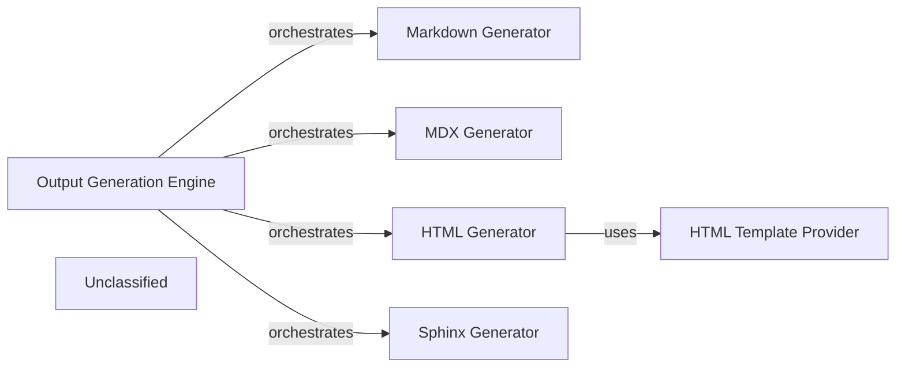

## Details

The Output Generation Engine subsystem is defined by the output_generators directory and its contained modules. It encompasses all functionality related to transforming structured architectural insights into various documentation and report formats. The Output Generation Engine acts as a central hub, coordinating various specialized generator components. Each generator is a distinct module responsible for a specific output format. This structure exemplifies a modular design where the Output Generation Engine provides a unified interface to a suite of pluggable output formatters.

### Output Generation Engine [[Expand]](./Output_Generation_Engine.md)
The primary orchestrator for the entire output generation process. It acts as a facade, coordinating the activities of individual format-specific generators to produce diverse documentation and report types from processed architectural insights.

**Related Classes/Methods**:

- <a href="https://github.com/CodeBoarding/CodeBoarding/blob/main/.codeboardingoutput_generators/__init__.py" target="_blank" rel="noopener noreferrer">`output_generators.__init__`</a>

### Markdown Generator
Specializes in converting structured architectural data into Markdown format, suitable for general documentation, READMEs, and simple reports.

**Related Classes/Methods**:

- <a href="https://github.com/CodeBoarding/CodeBoarding/blob/main/.codeboardingoutput_generators/markdown.py" target="_blank" rel="noopener noreferrer">`output_generators.markdown`</a>

### MDX Generator
Responsible for generating documentation in MDX (Markdown with JSX) format, enabling richer, interactive content within Markdown files.

**Related Classes/Methods**:

- <a href="https://github.com/CodeBoarding/CodeBoarding/blob/main/.codeboardingoutput_generators/mdx.py" target="_blank" rel="noopener noreferrer">`output_generators.mdx`</a>

### HTML Generator
Focuses on producing comprehensive documentation in HTML format, often used for web-based documentation portals or detailed reports.

**Related Classes/Methods**:

- <a href="https://github.com/CodeBoarding/CodeBoarding/blob/main/.codeboardingoutput_generators/html.py" target="_blank" rel="noopener noreferrer">`output_generators.html`</a>

### Sphinx Generator
Generates documentation compatible with the Sphinx documentation generator, commonly used for Python projects, supporting reStructuredText and other formats.

**Related Classes/Methods**:

- <a href="https://github.com/CodeBoarding/CodeBoarding/blob/main/.codeboardingoutput_generators/sphinx.py" target="_blank" rel="noopener noreferrer">`output_generators.sphinx`</a>

### HTML Template Provider
Manages and provides HTML templates and potentially utility functions specifically tailored for the `HTML Generator`, ensuring consistent styling and structure.

**Related Classes/Methods**:

- <a href="https://github.com/CodeBoarding/CodeBoarding/blob/main/.codeboardingoutput_generators/html_template.py" target="_blank" rel="noopener noreferrer">`output_generators.html_template`</a>

### Unclassified
Component for all unclassified files and utility functions (Utility functions/External Libraries/Dependencies)

**Related Classes/Methods**: _None_

### [FAQ](https://github.com/CodeBoarding/GeneratedOnBoardings/tree/main?tab=readme-ov-file#faq)
