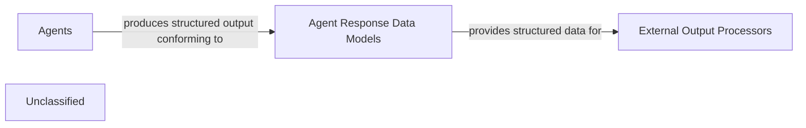

## Details

The `agents` subsystem is a core analytical component, where various specialized agents perform static analysis and generate insights. These insights are meticulously structured using the `Agent Response Data Models`, which define a standardized schema for representing complex information such as source code references, inter-component relationships, and comprehensive analysis summaries. This structured output ensures consistency and facilitates seamless integration with downstream processes, enabling the generation of detailed documentation and visual architectural diagrams. The `Agent Response Data Models` act as a crucial interface, ensuring that the raw analytical output from the agents is transformed into a consumable format for higher-level output generation functionalities.

### Agent Response Data Models
This component defines the standardized data structures and schemas used by various agents to encapsulate their analysis results, insights, and references. It includes models for source code references, inter-component relationships, and overall analysis summaries, facilitating consistent data representation for subsequent processing and output generation.

**Related Classes/Methods**:

- <a href="https://github.com/CodeBoarding/CodeBoarding/blob/main/.codeboardingagents/agent_responses.py" target="_blank" rel="noopener noreferrer">`agents.agent_responses.LLMBaseModel`</a>
- <a href="https://github.com/CodeBoarding/CodeBoarding/blob/main/.codeboardingagents/agent_responses.py" target="_blank" rel="noopener noreferrer">`agents.agent_responses.SourceCodeReference`</a>
- <a href="https://github.com/CodeBoarding/CodeBoarding/blob/main/.codeboardingagents/agent_responses.py" target="_blank" rel="noopener noreferrer">`agents.agent_responses.Relation`</a>
- <a href="https://github.com/CodeBoarding/CodeBoarding/blob/main/.codeboardingagents/agent_responses.py" target="_blank" rel="noopener noreferrer">`agents.agent_responses.Component`</a>
- <a href="https://github.com/CodeBoarding/CodeBoarding/blob/main/.codeboardingagents/agent_responses.py" target="_blank" rel="noopener noreferrer">`agents.agent_responses.AnalysisInsights`</a>
- <a href="https://github.com/CodeBoarding/CodeBoarding/blob/main/.codeboardingagents/agent_responses.py" target="_blank" rel="noopener noreferrer">`agents.agent_responses.CFGComponent`</a>
- <a href="https://github.com/CodeBoarding/CodeBoarding/blob/main/.codeboardingagents/agent_responses.py" target="_blank" rel="noopener noreferrer">`agents.agent_responses.CFGAnalysisInsights`</a>
- <a href="https://github.com/CodeBoarding/CodeBoarding/blob/main/.codeboardingagents/agent_responses.py" target="_blank" rel="noopener noreferrer">`agents.agent_responses.ValidationInsights`</a>
- <a href="https://github.com/CodeBoarding/CodeBoarding/blob/main/.codeboardingagents/agent_responses.py" target="_blank" rel="noopener noreferrer">`agents.agent_responses.UpdateAnalysis`</a>

### Agents
The `agents` subsystem is a core analytical component, where various specialized agents perform static analysis and generate insights.

**Related Classes/Methods**:

- <a href="https://github.com/CodeBoarding/CodeBoarding/blob/main/.codeboardingagents/__init__.py" target="_blank" rel="noopener noreferrer">`agents`</a>

### External Output Processors
External components (e.g., documentation generators, diagram renderers) that consume and transform structured data into human-readable documentation and visual representations.

**Related Classes/Methods**:

- `external_output_processors`

### Unclassified
Component for all unclassified files and utility functions (Utility functions/External Libraries/Dependencies)

**Related Classes/Methods**: _None_

### [FAQ](https://github.com/CodeBoarding/GeneratedOnBoardings/tree/main?tab=readme-ov-file#faq)
