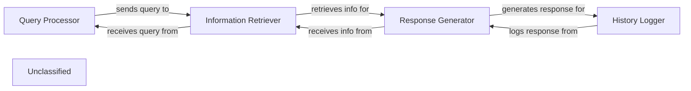

## Details

The system operates by processing user queries through a series of interconnected components. The `Query Processor` initially handles incoming queries, preparing them for subsequent stages. This processed query is then directed to the `Information Retriever`, which is responsible for fetching relevant data from a knowledge base, now enhanced with capabilities to resolve code references for more accurate information retrieval. The retrieved information is subsequently passed to the `Response Generator`, which leverages a language model to formulate a coherent natural language response. Finally, the `History Logger` records the interaction, storing both the original query and the generated response for future reference.

### Query Processor
Handles incoming user queries and prepares them for further processing. This component may leverage reference resolution capabilities to better understand code-related queries.

**Related Classes/Methods**:

- `QueryHandler.process`

### Information Retriever
Fetches relevant information based on the processed query from a knowledge base. This component is enhanced by the `ReferenceResolveMixin` to accurately navigate and fetch code-related information by resolving references.

**Related Classes/Methods**:

- `KnowledgeBase.retrieve`

### Response Generator
Utilizes a language model to generate a natural language response.

**Related Classes/Methods**:

- <a href="https://github.com/CodeBoarding/CodeBoarding/blob/main/.codeboardingagents/llm_config.py" target="_blank" rel="noopener noreferrer">`LanguageModel.generate_response`</a>

### History Logger
Stores the user query and the generated response for future reference.

**Related Classes/Methods**:

- <a href="https://github.com/CodeBoarding/CodeBoarding/blob/main/.codeboardingmonitoring/callbacks.py#L16-L166" target="_blank" rel="noopener noreferrer">`InteractionLogger.log`:16-166</a>

### Unclassified
Component for all unclassified files and utility functions (Utility functions/External Libraries/Dependencies)

**Related Classes/Methods**: _None_

### [FAQ](https://github.com/CodeBoarding/GeneratedOnBoardings/tree/main?tab=readme-ov-file#faq)
