```mermaid
graph LR
    Static_Analyzer["Static Analyzer"]
    LSP_Client["LSP Client"]
    Ignore_Utility["Ignore Utility"]
    Orchestration_Engine["Orchestration Engine"]
    Output_Generation_Engine["Output Generation Engine"]
    HTML_Generator["HTML Generator"]
    HTML_Template_Processor["HTML Template Processor"]
    Markdown_MDX_Sphinx_Generators["Markdown/MDX/Sphinx Generators"]
    Unclassified["Unclassified"]
    Static_Analyzer -- "processes code using" --> LSP_Client
    Static_Analyzer -- "controls scope with" --> Ignore_Utility
    Static_Analyzer -- "sends interpreted results to" --> Orchestration_Engine
    LSP_Client -- "provides analysis to" --> Static_Analyzer
    Ignore_Utility -- "defines scope for" --> Static_Analyzer
    Orchestration_Engine -- "receives results from" --> Static_Analyzer
    Orchestration_Engine -- "sends processed results to" --> Output_Generation_Engine
    Output_Generation_Engine -- "dispatches data to" --> HTML_Generator
    Output_Generation_Engine -- "dispatches data to" --> Markdown_MDX_Sphinx_Generators
    Output_Generation_Engine -- "receives processed results from" --> Orchestration_Engine
    HTML_Generator -- "utilizes" --> HTML_Template_Processor
    HTML_Template_Processor -- "provides templating services to" --> HTML_Generator
    Markdown_MDX_Sphinx_Generators -- "receives data from" --> Output_Generation_Engine
    click Orchestration_Engine href "https://github.com/CodeBoarding/CodeBoarding/blob/main/.codeboarding/Orchestration_Engine.md" "Details"
    click Output_Generation_Engine href "https://github.com/CodeBoarding/CodeBoarding/blob/main/.codeboarding/Output_Generation_Engine.md" "Details"
```

## Details

The system's architecture is structured around a pipeline that begins with the Static Analyzer. This component is responsible for in-depth code analysis, leveraging an LSP Client for language-specific insights and an Ignore Utility to precisely control the scope of its operations. The "interpreted results" from the Static Analyzer are then passed to the Orchestration Engine, which acts as an intermediary, preparing the data for the final output stage. The Output Generation Engine serves as the central coordinator for documentation generation, dispatching the processed insights to various specialized generators, including the HTML Generator, Markdown Generator, MDX Generator, and Sphinx Generator. The HTML Generator further relies on an HTML Template Processor to ensure consistent styling and structure in its output. This modular design ensures a clear separation of concerns, from code analysis and scope management to the final rendering of diverse documentation formats.

### Static Analyzer
Responsible for analyzing source code and generating "interpreted results." It integrates with LSP clients for language-specific analysis and uses an ignore mechanism to control the scope of its operations.

**Related Classes/Methods**:

### LSP Client
Facilitates communication between the Static Analyzer and Language Server Protocols to perform detailed code analysis.

**Related Classes/Methods**:

- <a href="https://github.com/CodeBoarding/CodeBoarding/blob/main/.codeboardingstatic_analyzer/lsp_client/client.py" target="_blank" rel="noopener noreferrer">`lsp_client.client.LSPClient`</a>

### Ignore Utility
Manages rules for including or excluding files and directories from the Static Analyzer's processing scope.

**Related Classes/Methods**:

- <a href="https://github.com/CodeBoarding/CodeBoarding/blob/main/.codeboardingrepo_utils/ignore.py" target="_blank" rel="noopener noreferrer">`repo_utils.ignore.IgnoreUtility`</a>

### Orchestration Engine [[Expand]](./Orchestration_Engine.md)
Receives "interpreted results" from the Static Analyzer, performs further processing, and prepares them for output generation.

**Related Classes/Methods**:

- `orchestration.engine.OrchestrationEngine`:1-10

### Output Generation Engine [[Expand]](./Output_Generation_Engine.md)
The primary entry point for the subsystem, coordinating the selection and execution of specific format generators based on the desired output type.

**Related Classes/Methods**:

### HTML Generator
Transforms architectural insights into well-structured HTML documentation.

**Related Classes/Methods**:

- <a href="https://github.com/CodeBoarding/CodeBoarding/blob/main/.codeboardingoutput_generators/html.py#L61-L122" target="_blank" rel="noopener noreferrer">`html_generator.generator.HTMLGenerator`:61-122</a>

### HTML Template Processor
Manages and applies HTML templates to the data provided by the HTML Generator.

**Related Classes/Methods**:

- `html_template_processor.processor.HTMLTemplateProcessor`

### Markdown/MDX/Sphinx Generators
Convert architectural insights into Markdown, MDX, or Sphinx-compatible formats.

**Related Classes/Methods**:

- `format_generators.unified.UnifiedGenerator`

### Unclassified
Component for all unclassified files and utility functions (Utility functions/External Libraries/Dependencies)

**Related Classes/Methods**: _None_

### [FAQ](https://github.com/CodeBoarding/GeneratedOnBoardings/tree/main?tab=readme-ov-file#faq)
