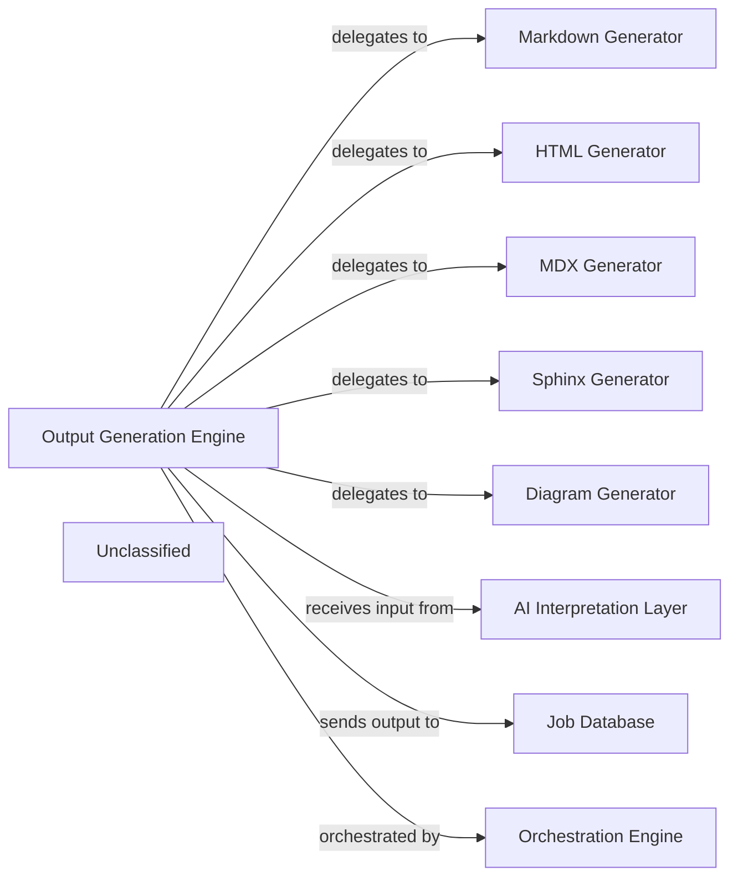

## Details

The Output Generation Subsystem is responsible for transforming raw architectural insights into various structured documentation and visual diagrams. At its core, the Output Generation Engine acts as an orchestrator, receiving architectural insights from an external AI Interpretation Layer. It then delegates the task of generating specific output formats to a suite of specialized generators, including the Markdown Generator, HTML Generator, MDX Generator, Sphinx Generator for diverse documentation needs, and the Diagram Generator for visual representations. Once generated, these outputs are delivered to an external Job Database for storage. The entire process within this subsystem is initiated and managed by an external Orchestration Engine, ensuring a streamlined workflow from insight to deliverable.

### Output Generation Engine [[Expand]](./Output_Generation_Engine.md)
The primary orchestrator, responsible for coordinating the generation of various documentation and diagram formats. It acts as the facade for the entire output generation process.

**Related Classes/Methods**:

- <a href="https://github.com/CodeBoarding/CodeBoarding/blob/main/.codeboardingoutput_generators/__init__.py" target="_blank" rel="noopener noreferrer">`output_generators`</a>
- <a href="https://github.com/CodeBoarding/CodeBoarding/blob/main/.codeboardingdiagram_analysis/__init__.py" target="_blank" rel="noopener noreferrer">`diagram_analysis`</a>

### Markdown Generator
Specializes in generating documentation in Markdown format.

**Related Classes/Methods**:

- <a href="https://github.com/CodeBoarding/CodeBoarding/blob/main/.codeboardingoutput_generators/markdown.py" target="_blank" rel="noopener noreferrer">`output_generators.markdown`</a>

### HTML Generator
Specializes in generating documentation in HTML format.

**Related Classes/Methods**:

- <a href="https://github.com/CodeBoarding/CodeBoarding/blob/main/.codeboardingoutput_generators/html.py" target="_blank" rel="noopener noreferrer">`output_generators.html`</a>

### MDX Generator
Specializes in generating documentation in MDX (Markdown with JSX) format.

**Related Classes/Methods**:

- <a href="https://github.com/CodeBoarding/CodeBoarding/blob/main/.codeboardingoutput_generators/mdx.py" target="_blank" rel="noopener noreferrer">`output_generators.mdx`</a>

### Sphinx Generator
Specializes in generating documentation compatible with Sphinx.

**Related Classes/Methods**:

- <a href="https://github.com/CodeBoarding/CodeBoarding/blob/main/.codeboardingoutput_generators/sphinx.py" target="_blank" rel="noopener noreferrer">`output_generators.sphinx`</a>

### Diagram Generator
Manages the creation of various visual diagrams from architectural insights.

**Related Classes/Methods**:

- <a href="https://github.com/CodeBoarding/CodeBoarding/blob/main/.codeboardingdiagram_analysis/diagram_generator.py" target="_blank" rel="noopener noreferrer">`diagram_analysis.diagram_generator`</a>

### AI Interpretation Layer [[Expand]](./AI_Interpretation_Layer.md)
An external component that provides architectural insights as input to the Output Generation Engine.

**Related Classes/Methods**:

- `AIInterpretationLayerInterface`:1-10

### Job Database
An external component that receives and stores the generated documentation and diagrams.

**Related Classes/Methods**:

- `JobDatabaseInterface`

### Orchestration Engine
An external component responsible for triggering and managing the Output Generation Engine.

**Related Classes/Methods**:

- `OrchestrationEngineInterface`

### Unclassified
Component for all unclassified files and utility functions (Utility functions/External Libraries/Dependencies)

**Related Classes/Methods**: _None_

### [FAQ](https://github.com/CodeBoarding/GeneratedOnBoardings/tree/main?tab=readme-ov-file#faq)
