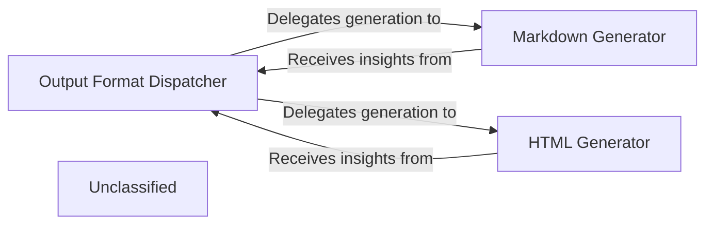

## Details

The Output Generation Engine is orchestrated by the Output Format Dispatcher, a conceptual component responsible for directing AI-interpreted insights to the appropriate specialized output generators based on the desired format. This dispatcher ensures a clear separation of concerns, adhering to a pipeline architectural pattern. Key specialized generators include the Markdown Generator, which produces human-readable documentation, and the HTML Generator, which creates rich, web-based reports. These components collectively transform raw insights into various structured documentation formats, enabling flexible integration and presentation.

### Output Format Dispatcher
This component serves as the central orchestrator within the Output Generation Engine. It receives AI-interpreted insights along with the desired output format and dispatches the data to the appropriate specialized generator (e.g., Markdown, HTML). This component is crucial for maintaining a clear separation of concerns and supporting the "Pipeline/Workflow" architectural pattern by managing the flow to specific formatters.

**Related Classes/Methods**:

- <a href="https://github.com/CodeBoarding/CodeBoarding/blob/main/.codeboardingoutput_generators/markdown.py" target="_blank" rel="noopener noreferrer">`output_generators.markdown.MarkdownGenerator`</a>
- <a href="https://github.com/CodeBoarding/CodeBoarding/blob/main/.codeboardingoutput_generators/html.py" target="_blank" rel="noopener noreferrer">`output_generators.html.HTMLGenerator`</a>

### Markdown Generator
Specializes in converting AI-interpreted insights into a well-structured Markdown format. This output is ideal for human-readable documentation, README files, and integration with Markdown-based rendering tools. It is a fundamental component for generating textual documentation, a primary output of a "Code Analysis and Documentation Generation Tool."

**Related Classes/Methods**:

- <a href="https://github.com/CodeBoarding/CodeBoarding/blob/main/.codeboardingoutput_generators/markdown.py" target="_blank" rel="noopener noreferrer">`output_generators.markdown.MarkdownGenerator`</a>

### HTML Generator
Focuses on transforming AI-interpreted insights into HTML format. This enables rich, web-based documentation, interactive reports, and seamless integration with web platforms or tools. This component provides an alternative, often more visually rich, documentation output, supporting diverse presentation needs.

**Related Classes/Methods**:

- <a href="https://github.com/CodeBoarding/CodeBoarding/blob/main/.codeboardingoutput_generators/html.py" target="_blank" rel="noopener noreferrer">`output_generators.html.HTMLGenerator`</a>

### Unclassified
Component for all unclassified files and utility functions (Utility functions/External Libraries/Dependencies)

**Related Classes/Methods**: _None_

### [FAQ](https://github.com/CodeBoarding/GeneratedOnBoardings/tree/main?tab=readme-ov-file#faq)
