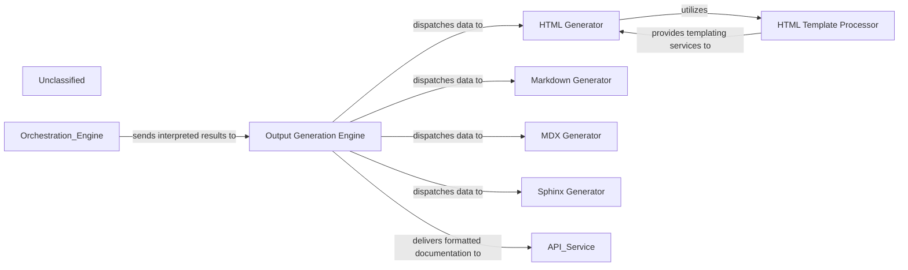

## Details

The Output Generation Engine subsystem is responsible for converting interpreted architectural results into a variety of documentation formats. It acts as a central dispatcher, receiving processed data from an external Orchestration Engine and routing it to specialized generators for HTML, Markdown, MDX, and Sphinx formats. The generated documentation is then delivered to an external API Service. Within the subsystem, the HTML Generator leverages an HTML Template Processor to ensure consistent and structured HTML output. This design promotes modularity, allowing for easy extension with new output formats and maintaining a clear separation of concerns between content generation and formatting.

### Output Generation Engine [[Expand]](./Output_Generation_Engine.md)
The primary entry point for the subsystem, coordinating the selection and execution of specific format generators based on the desired output type. It receives processed insights and dispatches them to the appropriate internal generator.

**Related Classes/Methods**:

- <a href="https://github.com/CodeBoarding/CodeBoarding/blob/main/.codeboardingoutput_generators/__init__.py" target="_blank" rel="noopener noreferrer">`output_generators`</a>

### HTML Generator
Responsible for transforming architectural insights into well-structured HTML documentation. It leverages templates for consistent presentation.

**Related Classes/Methods**:

- <a href="https://github.com/CodeBoarding/CodeBoarding/blob/main/.codeboardingoutput_generators/html.py" target="_blank" rel="noopener noreferrer">`output_generators.html`</a>

### HTML Template Processor
Manages and applies HTML templates to the data provided by the HTML Generator, ensuring consistent styling and structure across HTML outputs.

**Related Classes/Methods**:

- <a href="https://github.com/CodeBoarding/CodeBoarding/blob/main/.codeboardingoutput_generators/html_template.py" target="_blank" rel="noopener noreferrer">`output_generators.html_template`</a>

### Markdown Generator
Converts architectural insights into standard Markdown format, suitable for various platforms and easy readability.

**Related Classes/Methods**:

- <a href="https://github.com/CodeBoarding/CodeBoarding/blob/main/.codeboardingoutput_generators/markdown.py" target="_blank" rel="noopener noreferrer">`output_generators.markdown`</a>

### MDX Generator
Generates documentation in MDX format, combining Markdown with JSX for interactive and dynamic content.

**Related Classes/Methods**:

- <a href="https://github.com/CodeBoarding/CodeBoarding/blob/main/.codeboardingoutput_generators/mdx.py" target="_blank" rel="noopener noreferrer">`output_generators.mdx`</a>

### Sphinx Generator
Produces documentation compatible with the Sphinx documentation generator, often used for Python projects.

**Related Classes/Methods**:

- <a href="https://github.com/CodeBoarding/CodeBoarding/blob/main/.codeboardingoutput_generators/sphinx.py" target="_blank" rel="noopener noreferrer">`output_generators.sphinx`</a>

### Unclassified
Component for all unclassified files and utility functions (Utility functions/External Libraries/Dependencies)

**Related Classes/Methods**: _None_

### [FAQ](https://github.com/CodeBoarding/GeneratedOnBoardings/tree/main?tab=readme-ov-file#faq)
