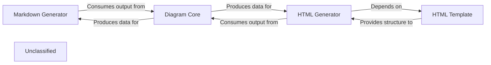

## Details

The documentation and diagram generation subsystem is centered around the Diagram Core, which is responsible for processing analysis insights and producing raw diagram data. This data is then consumed by format-specific generators: the Markdown Generator for static Markdown output with Mermaid syntax, and the HTML Generator for interactive web-based documentation. The HTML Generator further relies on the HTML Template to provide the structural and stylistic foundation for the final web pages, embedding the interactive diagrams and detailed component information. This architecture ensures a clear separation of concerns between diagram data generation and output formatting, allowing for flexible and extensible documentation capabilities.

### Markdown Generator
Generates comprehensive documentation in Markdown format. This includes structuring detailed component descriptions, creating Mermaid graph syntax for diagrams, and linking to other generated files. It is a primary output mechanism for the tool.

**Related Classes/Methods**:

- <a href="https://github.com/CodeBoarding/CodeBoarding/blob/main/.codeboardingoutput_generators/markdown.py" target="_blank" rel="noopener noreferrer">`output_generators.markdown`</a>

### HTML Generator
Produces interactive documentation in HTML format. It is responsible for creating the JSON data structure required for Cytoscape.js diagrams, embedding this data within an HTML template, and populating the template with structured component details and navigation links.

**Related Classes/Methods**:

- <a href="https://github.com/CodeBoarding/CodeBoarding/blob/main/.codeboardingoutput_generators/html.py" target="_blank" rel="noopener noreferrer">`output_generators.html`</a>

### Diagram Core
Provides the foundational logic for generating diagram data structures or syntax from analysis insights, independent of the final output format. It abstracts the complexities of different diagramming libraries (e.g., Mermaid, Cytoscape.js) and produces the raw diagram information that format-specific generators then integrate. This component is crucial for the "visual diagrams" aspect of the engine.

**Related Classes/Methods**:

- <a href="https://github.com/CodeBoarding/CodeBoarding/blob/main/.codeboardingdiagram_analysis/diagram_generator.py" target="_blank" rel="noopener noreferrer">`diagram_analysis.diagram_generator`</a>

### HTML Template
Defines the overall HTML structure, layout, and styling for the web-based documentation. It serves as a static foundation that the HTML Generator dynamically populates with content, including component details, descriptions, and embedded interactive diagrams.

**Related Classes/Methods**:

- <a href="https://github.com/CodeBoarding/CodeBoarding/blob/main/.codeboardingoutput_generators/html_template.py" target="_blank" rel="noopener noreferrer">`output_generators.html_template`</a>

### Unclassified
Component for all unclassified files and utility functions (Utility functions/External Libraries/Dependencies)

**Related Classes/Methods**: _None_

### [FAQ](https://github.com/CodeBoarding/GeneratedOnBoardings/tree/main?tab=readme-ov-file#faq)
