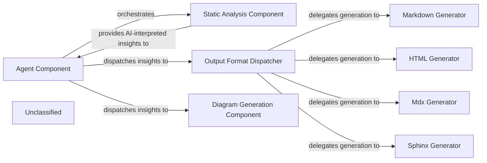

## Details

The system's architecture is centered around the `Agent Component`, which acts as the primary orchestrator for static analysis and documentation generation. This component leverages its enhanced information-gathering capabilities to interact with the `Static Analysis Component`, a crucial upstream dependency responsible for performing robust code analysis and generating "AI-interpreted insights." These insights, enriched by the `Static Analysis Component`'s strengthened LSP client integration and sophisticated language understanding, are then dispatched by the `Agent Component` to two distinct pathways: the `Output Format Dispatcher` and the `Diagram Generation Component`. The `Output Format Dispatcher` delegates the conversion of insights into various textual documentation formats (Markdown, HTML, MDX, Sphinx) via specialized generators, while the newly recognized `Diagram Generation Component` provides visual representations of the analysis results. This modular design ensures a clear separation of concerns, supporting a flexible and extensible pipeline for both comprehensive documentation and insightful visualizations.

### Agent Component
This component acts as the primary orchestrator, driving the overall process of static analysis and documentation generation. It has significantly enhanced capabilities for gathering information from the codebase through its internal tools. It interacts with the `Static Analysis Component` to obtain AI-interpreted insights and then directs these insights to the `Output Format Dispatcher` for conversion into various documentation formats, and to the `Diagram Generation Component` for visualization. This component embodies the core workflow logic, coordinating the different stages of the documentation pipeline.

**Related Classes/Methods**:

- <a href="https://github.com/CodeBoarding/CodeBoarding/blob/main/.codeboardingagents/agent.py" target="_blank" rel="noopener noreferrer">`agents/agent.py`</a>

### Static Analysis Component
This component is responsible for performing robust static analysis on the codebase and generating "AI-interpreted insights." It acts as a crucial upstream dependency, providing the raw, processed data that the `Agent Component` then utilizes. Its strengthened LSP client integration and sophisticated understanding of various programming languages enhance its ability to identify, parse, and process code, delivering deeper insights within the development environment.

**Related Classes/Methods**:

- <a href="https://github.com/CodeBoarding/CodeBoarding/blob/main/.codeboardingstatic_analyzer/lsp_client/client.py" target="_blank" rel="noopener noreferrer">`static_analyzer/lsp_client/client.py`</a>

### Output Format Dispatcher
This component serves as the central orchestrator within the Output Generation Engine. It receives AI-interpreted insights along with the desired output format from the `Agent Component` and dispatches the data to the appropriate specialized generator (e.g., Markdown, HTML, MDX, Sphinx). This component is crucial for maintaining a clear separation of concerns and supporting the "Pipeline/Workflow" architectural pattern by managing the flow to specific formatters.

**Related Classes/Methods**:

- <a href="https://github.com/CodeBoarding/CodeBoarding/blob/main/.codeboardingoutput_generators/markdown.py" target="_blank" rel="noopener noreferrer">`output_generators/markdown.py`</a>
- <a href="https://github.com/CodeBoarding/CodeBoarding/blob/main/.codeboardingoutput_generators/html.py" target="_blank" rel="noopener noreferrer">`output_generators/html.py`</a>
- <a href="https://github.com/CodeBoarding/CodeBoarding/blob/main/.codeboardingoutput_generators/mdx.py" target="_blank" rel="noopener noreferrer">`output_generators/mdx.py`</a>
- <a href="https://github.com/CodeBoarding/CodeBoarding/blob/main/.codeboardingoutput_generators/sphinx.py" target="_blank" rel="noopener noreferrer">`output_generators/sphinx.py`</a>

### Markdown Generator
Specializes in converting AI-interpreted insights into a well-structured Markdown format. This output is ideal for human-readable documentation, README files, and integration with Markdown-based rendering tools. It is a fundamental component for generating textual documentation, a primary output of a "Code Analysis and Documentation Generation Tool."

**Related Classes/Methods**:

- <a href="https://github.com/CodeBoarding/CodeBoarding/blob/main/.codeboardingoutput_generators/markdown.py" target="_blank" rel="noopener noreferrer">`output_generators/markdown.py`</a>

### HTML Generator
Focuses on transforming AI-interpreted insights into HTML format. This enables rich, web-based documentation, interactive reports, and seamless integration with web platforms or tools. This component provides an alternative, often more visually rich, documentation output, supporting diverse presentation needs.

**Related Classes/Methods**:

- <a href="https://github.com/CodeBoarding/CodeBoarding/blob/main/.codeboardingoutput_generators/html.py" target="_blank" rel="noopener noreferrer">`output_generators/html.py`</a>

### Mdx Generator
Specializes in converting AI-interpreted insights into MDX (Markdown with JSX) format. This enables the creation of interactive and dynamic documentation, leveraging the power of React components within Markdown.

**Related Classes/Methods**:

- <a href="https://github.com/CodeBoarding/CodeBoarding/blob/main/.codeboardingoutput_generators/mdx.py" target="_blank" rel="noopener noreferrer">`output_generators/mdx.py`</a>

### Sphinx Generator
Focuses on transforming AI-interpreted insights into a format compatible with Sphinx, a popular documentation generator. This allows for the creation of comprehensive and structured documentation, often used for large software projects.

**Related Classes/Methods**:

- <a href="https://github.com/CodeBoarding/CodeBoarding/blob/main/.codeboardingoutput_generators/sphinx.py" target="_blank" rel="noopener noreferrer">`output_generators/sphinx.py`</a>

### Diagram Generation Component
This component is responsible for generating diagrams and visualizations from the AI-interpreted insights. It provides a new way to present and understand the analysis results, complementing the textual documentation outputs.

**Related Classes/Methods**:

- <a href="https://github.com/CodeBoarding/CodeBoarding/blob/main/.codeboardingdiagram_analysis/diagram_generator.py" target="_blank" rel="noopener noreferrer">`diagram_analysis/diagram_generator.py`</a>

### Unclassified
Component for all unclassified files and utility functions (Utility functions/External Libraries/Dependencies)

**Related Classes/Methods**: _None_

### [FAQ](https://github.com/CodeBoarding/GeneratedOnBoardings/tree/main?tab=readme-ov-file#faq)
