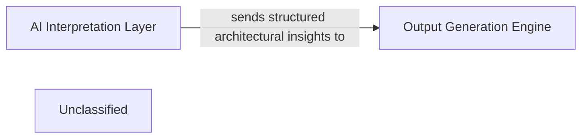

## Details

This subsystem is designed to translate complex architectural analysis into clear, structured documentation and visual representations. The primary flow begins with the AI Interpretation Layer, which processes raw project data to extract and formulate structured architectural insights. These insights represent the core understanding of the system's design and components. The critical interaction pathway involves the AI Interpretation Layer sending these structured architectural insights directly to the Output Generation Engine. The Output Generation Engine then takes on the responsibility of transforming these insights into various consumable formats. This includes generating human-readable documentation (e.g., Markdown reports) and machine-readable data (e.g., JSON) that can be used for automated diagram generation. This ensures a consistent and automated pipeline from AI-driven analysis to final architectural documentation.

### AI Interpretation Layer
This component is responsible for processing raw data and generating structured architectural insights. It acts as the source of high-level understanding derived from the project's analysis, providing the foundational data for documentation and diagram generation.

**Related Classes/Methods**:

- `ai_interpretation_layer`:1-10

### Output Generation Engine [[Expand]](./Output_Generation_Engine.md)
This component is the core of the subsystem. It receives structured architectural insights from the AI Interpretation Layer and is responsible for formatting these insights into diverse output types, such as Markdown, JSON, reports, or raw data suitable for diagram generation. It ensures that the generated documentation adheres to specified standards and acts as the crucial bridge between AI-processed data and the final end-user documentation.

**Related Classes/Methods**:

- <a href="https://github.com/CodeBoarding/CodeBoarding/blob/main/.codeboardingoutput_generators/__init__.py" target="_blank" rel="noopener noreferrer">`output_generators`</a>

### Unclassified
Component for all unclassified files and utility functions (Utility functions/External Libraries/Dependencies)

**Related Classes/Methods**: _None_

### [FAQ](https://github.com/CodeBoarding/GeneratedOnBoardings/tree/main?tab=readme-ov-file#faq)
