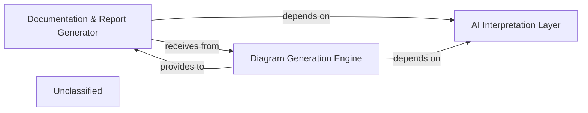

## Details

The system is structured around three core components: the AI Interpretation Layer, the Diagram Generation Engine, and the Documentation & Report Generator. The AI Interpretation Layer serves as the foundational analysis component, extracting structured architectural insights from the codebase. These insights are then consumed by both the Diagram Generation Engine to visualize the architecture and the Documentation & Report Generator to produce comprehensive human-readable documentation. The Diagram Generation Engine further provides its generated diagrams to the Documentation & Report Generator for inclusion in final reports, ensuring a cohesive and visually rich output.

### AI Interpretation Layer [[Expand]](./AI_Interpretation_Layer.md)
This component is responsible for analyzing the codebase to extract and generate structured architectural insights. It acts as the primary source of high-level architectural understanding, which is then consumed by other components for documentation and diagram generation. This component aligns with the "Codebase Analysis Tool" pattern.

**Related Classes/Methods**:

- <a href="https://github.com/CodeBoarding/CodeBoarding/blob/main/.codeboardingagents/__init__.py" target="_blank" rel="noopener noreferrer">`agents`</a>

### Documentation & Report Generator
This component is responsible for transforming architectural insights, potentially enriched by AI interpretation, into various human-readable documentation formats such as Markdown, HTML, MDX, and Sphinx. It also integrates visual diagrams provided by the Diagram Generation Engine into comprehensive reports. This component aligns with the "Documentation Generator" project type pattern.

**Related Classes/Methods**:

- <a href="https://github.com/CodeBoarding/CodeBoarding/blob/main/.codeboardingoutput_generators/markdown.py" target="_blank" rel="noopener noreferrer">`output_generators.markdown`</a>
- <a href="https://github.com/CodeBoarding/CodeBoarding/blob/main/.codeboardingoutput_generators/html.py" target="_blank" rel="noopener noreferrer">`output_generators.html`</a>
- <a href="https://github.com/CodeBoarding/CodeBoarding/blob/main/.codeboardingoutput_generators/mdx.py" target="_blank" rel="noopener noreferrer">`output_generators.mdx`</a>
- <a href="https://github.com/CodeBoarding/CodeBoarding/blob/main/.codeboardingoutput_generators/sphinx.py" target="_blank" rel="noopener noreferrer">`output_generators.sphinx`</a>

### Diagram Generation Engine
This component is dedicated to creating visual representations (diagrams) of the codebase architecture from structured architectural insights. It likely utilizes external tools or libraries, such as Mermaid.js, for rendering these diagrams. This component aligns with the "Codebase Analysis Tool" pattern due to its role in visualizing code structure.

**Related Classes/Methods**:

- <a href="https://github.com/CodeBoarding/CodeBoarding/blob/main/.codeboardingdiagram_analysis/diagram_generator.py" target="_blank" rel="noopener noreferrer">`diagram_analysis.diagram_generator`</a>

### Unclassified
Component for all unclassified files and utility functions (Utility functions/External Libraries/Dependencies)

**Related Classes/Methods**: _None_

### [FAQ](https://github.com/CodeBoarding/GeneratedOnBoardings/tree/main?tab=readme-ov-file#faq)
