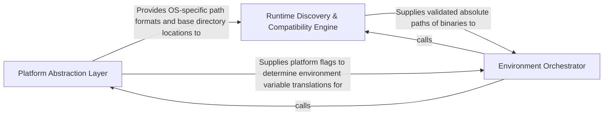

## Details

Centralizes filesystem logic for tool installation paths, version compatibility, and binary discovery.

### Platform Abstraction Layer
Provides the foundational OS-specific logic required to navigate different filesystems and handle path normalization for Windows, POSIX, and WSL environments.

**Related Classes/Methods**:

- `tool_registry.paths.exe_suffix`:29-31
- `tool_registry.paths.user_data_dir`:76-78
- `tool_registry.paths.get_servers_dir`:81-83

**Source Files:**

- [`tool_registry/paths.py`](https://github.com/CodeBoarding/CodeBoarding/blob/main/.codeboardingtool_registry/paths.py)
  - `tool_registry.paths.embedded_node_path` ([L100-L104](https://github.com/CodeBoarding/CodeBoarding/blob/main/.codeboardingtool_registry/paths.py#L100-L104)) - Function
  - `tool_registry.paths.embedded_npm_cli_path` ([L114-L117](https://github.com/CodeBoarding/CodeBoarding/blob/main/.codeboardingtool_registry/paths.py#L114-L117)) - Function

### Runtime Discovery & Compatibility Engine
Implements the core logic for locating and validating Node.js and npm runtimes, including version probing and caching results.

**Related Classes/Methods**:

- `tool_registry.paths.preferred_node_path`:200-215
- `tool_registry.paths.node_is_acceptable`:173-194
- `tool_registry.paths.node_version_tuple`:124-170
- `tool_registry.paths.nodeenv_root_dir`:89-91

**Source Files:**

- [`tool_registry/paths.py`](https://github.com/CodeBoarding/CodeBoarding/blob/main/.codeboardingtool_registry/paths.py)
  - `tool_registry.paths.exe_suffix` ([L29-L31](https://github.com/CodeBoarding/CodeBoarding/blob/main/.codeboardingtool_registry/paths.py#L29-L31)) - Function
  - `tool_registry.paths.native_binary_ok` ([L60-L70](https://github.com/CodeBoarding/CodeBoarding/blob/main/.codeboardingtool_registry/paths.py#L60-L70)) - Function
  - `tool_registry.paths.get_servers_dir` ([L81-L83](https://github.com/CodeBoarding/CodeBoarding/blob/main/.codeboardingtool_registry/paths.py#L81-L83)) - Function
  - `tool_registry.paths.embedded_npm_path` ([L107-L111](https://github.com/CodeBoarding/CodeBoarding/blob/main/.codeboardingtool_registry/paths.py#L107-L111)) - Function
  - `tool_registry.paths.node_version_tuple` ([L124-L170](https://github.com/CodeBoarding/CodeBoarding/blob/main/.codeboardingtool_registry/paths.py#L124-L170)) - Function
  - `tool_registry.paths.node_is_acceptable` ([L173-L194](https://github.com/CodeBoarding/CodeBoarding/blob/main/.codeboardingtool_registry/paths.py#L173-L194)) - Function
  - `tool_registry.paths.ensure_node_on_path` ([L265-L294](https://github.com/CodeBoarding/CodeBoarding/blob/main/.codeboardingtool_registry/paths.py#L265-L294)) - Function

### Environment Orchestrator
Translates discovered paths into actionable execution contexts by managing environment variables and constructing command-line arguments for subprocesses.

**Related Classes/Methods**:

- `tool_registry.paths.ensure_node_on_path`:265-294
- `tool_registry.paths.npm_subprocess_env`:253-262
- `tool_registry.paths.preferred_npm_command`:232-250
- `tool_registry.paths.sibling_npm_path`:218-229

**Source Files:**

- [`tool_registry/paths.py`](https://github.com/CodeBoarding/CodeBoarding/blob/main/.codeboardingtool_registry/paths.py)
  - `tool_registry.paths.platform_bin_dir` ([L51-L57](https://github.com/CodeBoarding/CodeBoarding/blob/main/.codeboardingtool_registry/paths.py#L51-L57)) - Function
  - `tool_registry.paths.user_data_dir` ([L76-L78](https://github.com/CodeBoarding/CodeBoarding/blob/main/.codeboardingtool_registry/paths.py#L76-L78)) - Function
  - `tool_registry.paths.nodeenv_root_dir` ([L89-L91](https://github.com/CodeBoarding/CodeBoarding/blob/main/.codeboardingtool_registry/paths.py#L89-L91)) - Function
  - `tool_registry.paths.nodeenv_bin_dir` ([L94-L97](https://github.com/CodeBoarding/CodeBoarding/blob/main/.codeboardingtool_registry/paths.py#L94-L97)) - Function
  - `tool_registry.paths.preferred_node_path` ([L200-L215](https://github.com/CodeBoarding/CodeBoarding/blob/main/.codeboardingtool_registry/paths.py#L200-L215)) - Function
  - `tool_registry.paths.sibling_npm_path` ([L218-L229](https://github.com/CodeBoarding/CodeBoarding/blob/main/.codeboardingtool_registry/paths.py#L218-L229)) - Function
  - `tool_registry.paths.preferred_npm_command` ([L232-L250](https://github.com/CodeBoarding/CodeBoarding/blob/main/.codeboardingtool_registry/paths.py#L232-L250)) - Function
  - `tool_registry.paths.npm_subprocess_env` ([L253-L262](https://github.com/CodeBoarding/CodeBoarding/blob/main/.codeboardingtool_registry/paths.py#L253-L262)) - Function

### [FAQ](https://github.com/CodeBoarding/GeneratedOnBoardings/tree/main?tab=readme-ov-file#faq)