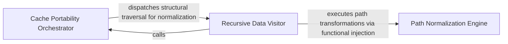

## Details

Ensures cache portability by recursively traversing analysis artifacts to convert absolute system paths to relative project paths, allowing cache files to be shared across different environments.

### Path Normalization Engine
Provides the fundamental logic for bidirectional path conversion, calculating common prefixes to generate relative paths and joining project roots to restore absolute system paths.

**Related Classes/Methods**:

- `repo_utils.path_utils.to_absolute_path`:35-41

**Source Files:**

- [`repo_utils/path_utils.py`](https://github.com/CodeBoarding/CodeBoarding/blob/main/.codeboardingrepo_utils/path_utils.py)
  - `repo_utils.path_utils.to_absolute_path` ([L35-L41](https://github.com/CodeBoarding/CodeBoarding/blob/main/.codeboardingrepo_utils/path_utils.py#L35-L41)) - Function
- [`static_analyzer/analysis_cache.py`](https://github.com/CodeBoarding/CodeBoarding/blob/main/.codeboardingstatic_analyzer/analysis_cache.py)
  - `static_analyzer.analysis_cache.StaticAnalysisCache._to_absolute` ([L76-L77](https://github.com/CodeBoarding/CodeBoarding/blob/main/.codeboardingstatic_analyzer/analysis_cache.py#L76-L77)) - Method
- [`static_analyzer/language_results.py`](https://github.com/CodeBoarding/CodeBoarding/blob/main/.codeboardingstatic_analyzer/language_results.py)
  - `static_analyzer.language_results.PackageDependencies.visit_paths` ([L111-L116](https://github.com/CodeBoarding/CodeBoarding/blob/main/.codeboardingstatic_analyzer/language_results.py#L111-L116)) - Method

### Cache Portability Orchestrator
Manages the lifecycle of the static analysis cache at the I/O boundary, coordinating the relativization and absolutization of data during save and load operations.

**Related Classes/Methods**: _None_

**Source Files:**

- [`repo_utils/path_utils.py`](https://github.com/CodeBoarding/CodeBoarding/blob/main/.codeboardingrepo_utils/path_utils.py)
  - `repo_utils.path_utils.to_relative_path` ([L23-L32](https://github.com/CodeBoarding/CodeBoarding/blob/main/.codeboardingrepo_utils/path_utils.py#L23-L32)) - Function
- [`static_analyzer/analysis_cache.py`](https://github.com/CodeBoarding/CodeBoarding/blob/main/.codeboardingstatic_analyzer/analysis_cache.py)
  - `static_analyzer.analysis_cache.StaticAnalysisCache._to_relative` ([L73-L74](https://github.com/CodeBoarding/CodeBoarding/blob/main/.codeboardingstatic_analyzer/analysis_cache.py#L73-L74)) - Method
- [`static_analyzer/graph.py`](https://github.com/CodeBoarding/CodeBoarding/blob/main/.codeboardingstatic_analyzer/graph.py)
  - `static_analyzer.graph.Edge.visit_paths` ([L116-L120](https://github.com/CodeBoarding/CodeBoarding/blob/main/.codeboardingstatic_analyzer/graph.py#L116-L120)) - Method
- [`static_analyzer/language_results.py`](https://github.com/CodeBoarding/CodeBoarding/blob/main/.codeboardingstatic_analyzer/language_results.py)
  - `static_analyzer.language_results.SourceFiles.visit_paths` ([L128-L131](https://github.com/CodeBoarding/CodeBoarding/blob/main/.codeboardingstatic_analyzer/language_results.py#L128-L131)) - Method

### Recursive Data Visitor
Implements the Visitor pattern to recursively traverse nested analysis artifacts, identifying and normalizing file references within complex data structures.

**Related Classes/Methods**:

- `static_analyzer.language_results.LanguageResults.visit_paths`:144-149

**Source Files:**

- [`static_analyzer/analysis_cache.py`](https://github.com/CodeBoarding/CodeBoarding/blob/main/.codeboardingstatic_analyzer/analysis_cache.py)
  - `static_analyzer.analysis_cache.StaticAnalysisCache._relativize` ([L79-L91](https://github.com/CodeBoarding/CodeBoarding/blob/main/.codeboardingstatic_analyzer/analysis_cache.py#L79-L91)) - Method
  - `static_analyzer.analysis_cache.StaticAnalysisCache._absolutize` ([L93-L101](https://github.com/CodeBoarding/CodeBoarding/blob/main/.codeboardingstatic_analyzer/analysis_cache.py#L93-L101)) - Method
- [`static_analyzer/graph.py`](https://github.com/CodeBoarding/CodeBoarding/blob/main/.codeboardingstatic_analyzer/graph.py)
  - `static_analyzer.graph.ClusterResult.visit_paths` ([L72-L77](https://github.com/CodeBoarding/CodeBoarding/blob/main/.codeboardingstatic_analyzer/graph.py#L72-L77)) - Method
  - `static_analyzer.graph.CallGraph.visit_paths` ([L304-L310](https://github.com/CodeBoarding/CodeBoarding/blob/main/.codeboardingstatic_analyzer/graph.py#L304-L310)) - Method
- [`static_analyzer/language_results.py`](https://github.com/CodeBoarding/CodeBoarding/blob/main/.codeboardingstatic_analyzer/language_results.py)
  - `static_analyzer.language_results.ControlFlowGraph` ([L21-L58](https://github.com/CodeBoarding/CodeBoarding/blob/main/.codeboardingstatic_analyzer/language_results.py#L21-L58)) - Class
  - `static_analyzer.language_results.ControlFlowGraph.visit_paths` ([L55-L58](https://github.com/CodeBoarding/CodeBoarding/blob/main/.codeboardingstatic_analyzer/language_results.py#L55-L58)) - Method
  - `static_analyzer.language_results.ClassHierarchy` ([L62-L80](https://github.com/CodeBoarding/CodeBoarding/blob/main/.codeboardingstatic_analyzer/language_results.py#L62-L80)) - Class
  - `static_analyzer.language_results.ClassHierarchy.visit_paths` ([L75-L80](https://github.com/CodeBoarding/CodeBoarding/blob/main/.codeboardingstatic_analyzer/language_results.py#L75-L80)) - Method
  - `static_analyzer.language_results.References` ([L84-L98](https://github.com/CodeBoarding/CodeBoarding/blob/main/.codeboardingstatic_analyzer/language_results.py#L84-L98)) - Class
  - `static_analyzer.language_results.References.visit_paths` ([L93-L98](https://github.com/CodeBoarding/CodeBoarding/blob/main/.codeboardingstatic_analyzer/language_results.py#L93-L98)) - Method
  - `static_analyzer.language_results.PackageDependencies` ([L102-L116](https://github.com/CodeBoarding/CodeBoarding/blob/main/.codeboardingstatic_analyzer/language_results.py#L102-L116)) - Class
  - `static_analyzer.language_results.SourceFiles` ([L120-L131](https://github.com/CodeBoarding/CodeBoarding/blob/main/.codeboardingstatic_analyzer/language_results.py#L120-L131)) - Class
  - `static_analyzer.language_results.LanguageResults.visit_paths` ([L144-L149](https://github.com/CodeBoarding/CodeBoarding/blob/main/.codeboardingstatic_analyzer/language_results.py#L144-L149)) - Method

### [FAQ](https://github.com/CodeBoarding/GeneratedOnBoardings/tree/main?tab=readme-ov-file#faq)