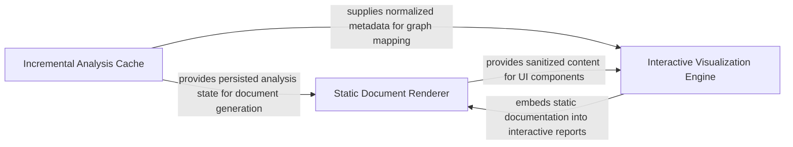

## Details

Renders analysis into human-readable formats and manages caching for efficient incremental runs.

### Incremental Analysis Cache [[Expand]](./Incremental_Analysis_Cache.md)
Manages the persistence and invalidation of static analysis data, ensuring portability by normalizing system paths and using signature-based invalidation for incremental updates.

**Related Classes/Methods**:

- `static_analyzer.analysis_cache.StaticAnalysisCache`:60-276
- `static_analyzer.__init__.StaticAnalyzer.flush_cache`:332-353
- `repo_utils.path_utils.to_relative_path`:23-32
- `caching.cache.ModelSettings.signature`:288-289

**Source Files:**

- [`caching/cache.py`](https://github.com/CodeBoarding/CodeBoarding/blob/main/.codeboardingcaching/cache.py)
  - `caching.cache.ModelSettings.canonical_json` ([L284-L286](https://github.com/CodeBoarding/CodeBoarding/blob/main/.codeboardingcaching/cache.py#L284-L286)) - Method
  - `caching.cache.ModelSettings.signature` ([L288-L289](https://github.com/CodeBoarding/CodeBoarding/blob/main/.codeboardingcaching/cache.py#L288-L289)) - Method
- [`diagram_analysis/diagram_generator.py`](https://github.com/CodeBoarding/CodeBoarding/blob/main/.codeboardingdiagram_analysis/diagram_generator.py)
  - `diagram_analysis.diagram_generator.DiagramGenerator._persist_static_analysis_artifact` ([L310-L317](https://github.com/CodeBoarding/CodeBoarding/blob/main/.codeboardingdiagram_analysis/diagram_generator.py#L310-L317)) - Method
- [`repo_utils/path_utils.py`](https://github.com/CodeBoarding/CodeBoarding/blob/main/.codeboardingrepo_utils/path_utils.py)
  - `repo_utils.path_utils.to_relative_path` ([L23-L32](https://github.com/CodeBoarding/CodeBoarding/blob/main/.codeboardingrepo_utils/path_utils.py#L23-L32)) - Function
  - `repo_utils.path_utils.to_absolute_path` ([L35-L41](https://github.com/CodeBoarding/CodeBoarding/blob/main/.codeboardingrepo_utils/path_utils.py#L35-L41)) - Function
- [`static_analyzer/__init__.py`](https://github.com/CodeBoarding/CodeBoarding/blob/main/.codeboardingstatic_analyzer/__init__.py)
  - `static_analyzer.__init__.StaticAnalyzer.__exit__` ([L206-L207](https://github.com/CodeBoarding/CodeBoarding/blob/main/.codeboardingstatic_analyzer/__init__.py#L206-L207)) - Method
  - `static_analyzer.__init__.StaticAnalyzer.stop_clients` ([L311-L330](https://github.com/CodeBoarding/CodeBoarding/blob/main/.codeboardingstatic_analyzer/__init__.py#L311-L330)) - Method
  - `static_analyzer.__init__.StaticAnalyzer.flush_cache` ([L332-L353](https://github.com/CodeBoarding/CodeBoarding/blob/main/.codeboardingstatic_analyzer/__init__.py#L332-L353)) - Method
  - `static_analyzer.__init__.StaticAnalyzer.load_cached_analysis` ([L373-L409](https://github.com/CodeBoarding/CodeBoarding/blob/main/.codeboardingstatic_analyzer/__init__.py#L373-L409)) - Method
- [`static_analyzer/analysis_cache.py`](https://github.com/CodeBoarding/CodeBoarding/blob/main/.codeboardingstatic_analyzer/analysis_cache.py)
  - `static_analyzer.analysis_cache.StaticAnalysisCache` ([L60-L276](https://github.com/CodeBoarding/CodeBoarding/blob/main/.codeboardingstatic_analyzer/analysis_cache.py#L60-L276)) - Class
  - `static_analyzer.analysis_cache.StaticAnalysisCache.__init__` ([L69-L71](https://github.com/CodeBoarding/CodeBoarding/blob/main/.codeboardingstatic_analyzer/analysis_cache.py#L69-L71)) - Method
  - `static_analyzer.analysis_cache.StaticAnalysisCache._to_relative` ([L73-L74](https://github.com/CodeBoarding/CodeBoarding/blob/main/.codeboardingstatic_analyzer/analysis_cache.py#L73-L74)) - Method
  - `static_analyzer.analysis_cache.StaticAnalysisCache._to_absolute` ([L76-L77](https://github.com/CodeBoarding/CodeBoarding/blob/main/.codeboardingstatic_analyzer/analysis_cache.py#L76-L77)) - Method
  - `static_analyzer.analysis_cache.StaticAnalysisCache._relativize` ([L79-L91](https://github.com/CodeBoarding/CodeBoarding/blob/main/.codeboardingstatic_analyzer/analysis_cache.py#L79-L91)) - Method
  - `static_analyzer.analysis_cache.StaticAnalysisCache._absolutize` ([L93-L101](https://github.com/CodeBoarding/CodeBoarding/blob/main/.codeboardingstatic_analyzer/analysis_cache.py#L93-L101)) - Method
  - `static_analyzer.analysis_cache.StaticAnalysisCache.pkl_path` ([L104-L105](https://github.com/CodeBoarding/CodeBoarding/blob/main/.codeboardingstatic_analyzer/analysis_cache.py#L104-L105)) - Method
  - `static_analyzer.analysis_cache.StaticAnalysisCache.sha_path` ([L108-L109](https://github.com/CodeBoarding/CodeBoarding/blob/main/.codeboardingstatic_analyzer/analysis_cache.py#L108-L109)) - Method
  - `static_analyzer.analysis_cache.StaticAnalysisCache.lock_path` ([L112-L113](https://github.com/CodeBoarding/CodeBoarding/blob/main/.codeboardingstatic_analyzer/analysis_cache.py#L112-L113)) - Method
  - `static_analyzer.analysis_cache.StaticAnalysisCache.read_tag_sha` ([L115-L129](https://github.com/CodeBoarding/CodeBoarding/blob/main/.codeboardingstatic_analyzer/analysis_cache.py#L115-L129)) - Method
  - `static_analyzer.analysis_cache.StaticAnalysisCache._read_tag_sha_unlocked` ([L131-L143](https://github.com/CodeBoarding/CodeBoarding/blob/main/.codeboardingstatic_analyzer/analysis_cache.py#L131-L143)) - Method
  - `static_analyzer.analysis_cache.StaticAnalysisCache._legacy_pkl_path` ([L145-L146](https://github.com/CodeBoarding/CodeBoarding/blob/main/.codeboardingstatic_analyzer/analysis_cache.py#L145-L146)) - Method
  - `static_analyzer.analysis_cache.StaticAnalysisCache.load_with_sha` ([L148-L167](https://github.com/CodeBoarding/CodeBoarding/blob/main/.codeboardingstatic_analyzer/analysis_cache.py#L148-L167)) - Method
  - `static_analyzer.analysis_cache.StaticAnalysisCache.get` ([L169-L181](https://github.com/CodeBoarding/CodeBoarding/blob/main/.codeboardingstatic_analyzer/analysis_cache.py#L169-L181)) - Method
  - `static_analyzer.analysis_cache.StaticAnalysisCache._get_unlocked` ([L183-L217](https://github.com/CodeBoarding/CodeBoarding/blob/main/.codeboardingstatic_analyzer/analysis_cache.py#L183-L217)) - Method
  - `static_analyzer.analysis_cache.StaticAnalysisCache.save` ([L219-L276](https://github.com/CodeBoarding/CodeBoarding/blob/main/.codeboardingstatic_analyzer/analysis_cache.py#L219-L276)) - Method
  - `static_analyzer.analysis_cache.copy_cache_files` ([L279-L318](https://github.com/CodeBoarding/CodeBoarding/blob/main/.codeboardingstatic_analyzer/analysis_cache.py#L279-L318)) - Function
  - `static_analyzer.analysis_cache._atomic_copy` ([L321-L336](https://github.com/CodeBoarding/CodeBoarding/blob/main/.codeboardingstatic_analyzer/analysis_cache.py#L321-L336)) - Function
- [`static_analyzer/graph.py`](https://github.com/CodeBoarding/CodeBoarding/blob/main/.codeboardingstatic_analyzer/graph.py)
  - `static_analyzer.graph.ClusterResult.visit_paths` ([L72-L77](https://github.com/CodeBoarding/CodeBoarding/blob/main/.codeboardingstatic_analyzer/graph.py#L72-L77)) - Method
  - `static_analyzer.graph.Edge.visit_paths` ([L116-L120](https://github.com/CodeBoarding/CodeBoarding/blob/main/.codeboardingstatic_analyzer/graph.py#L116-L120)) - Method
  - `static_analyzer.graph.CallGraph.visit_paths` ([L304-L310](https://github.com/CodeBoarding/CodeBoarding/blob/main/.codeboardingstatic_analyzer/graph.py#L304-L310)) - Method
- [`static_analyzer/language_results.py`](https://github.com/CodeBoarding/CodeBoarding/blob/main/.codeboardingstatic_analyzer/language_results.py)
  - `static_analyzer.language_results.ControlFlowGraph` ([L21-L58](https://github.com/CodeBoarding/CodeBoarding/blob/main/.codeboardingstatic_analyzer/language_results.py#L21-L58)) - Class
  - `static_analyzer.language_results.ControlFlowGraph.visit_paths` ([L55-L58](https://github.com/CodeBoarding/CodeBoarding/blob/main/.codeboardingstatic_analyzer/language_results.py#L55-L58)) - Method
  - `static_analyzer.language_results.ClassHierarchy` ([L62-L80](https://github.com/CodeBoarding/CodeBoarding/blob/main/.codeboardingstatic_analyzer/language_results.py#L62-L80)) - Class
  - `static_analyzer.language_results.ClassHierarchy.visit_paths` ([L75-L80](https://github.com/CodeBoarding/CodeBoarding/blob/main/.codeboardingstatic_analyzer/language_results.py#L75-L80)) - Method
  - `static_analyzer.language_results.References` ([L84-L98](https://github.com/CodeBoarding/CodeBoarding/blob/main/.codeboardingstatic_analyzer/language_results.py#L84-L98)) - Class
  - `static_analyzer.language_results.References.visit_paths` ([L93-L98](https://github.com/CodeBoarding/CodeBoarding/blob/main/.codeboardingstatic_analyzer/language_results.py#L93-L98)) - Method
  - `static_analyzer.language_results.PackageDependencies` ([L102-L116](https://github.com/CodeBoarding/CodeBoarding/blob/main/.codeboardingstatic_analyzer/language_results.py#L102-L116)) - Class
  - `static_analyzer.language_results.PackageDependencies.visit_paths` ([L111-L116](https://github.com/CodeBoarding/CodeBoarding/blob/main/.codeboardingstatic_analyzer/language_results.py#L111-L116)) - Method
  - `static_analyzer.language_results.SourceFiles` ([L120-L131](https://github.com/CodeBoarding/CodeBoarding/blob/main/.codeboardingstatic_analyzer/language_results.py#L120-L131)) - Class
  - `static_analyzer.language_results.SourceFiles.visit_paths` ([L128-L131](https://github.com/CodeBoarding/CodeBoarding/blob/main/.codeboardingstatic_analyzer/language_results.py#L128-L131)) - Method
  - `static_analyzer.language_results.LanguageResults.visit_paths` ([L144-L149](https://github.com/CodeBoarding/CodeBoarding/blob/main/.codeboardingstatic_analyzer/language_results.py#L144-L149)) - Method

### Static Document Renderer [[Expand]](./Static_Document_Renderer.md)
Transforms the internal architectural graph into standard documentation formats like Markdown, MDX, and RST for integration into developer workflows.

**Related Classes/Methods**:

- `output_generators.markdown.generate_markdown`:43-122
- `output_generators.mdx.generate_mdx`:52-158
- `output_generators.sphinx.generate_rst`:46-155

**Source Files:**

- [`output_generators/html.py`](https://github.com/CodeBoarding/CodeBoarding/blob/main/.codeboardingoutput_generators/html.py)
  - `output_generators.html.component_header_html` ([L155-L163](https://github.com/CodeBoarding/CodeBoarding/blob/main/.codeboardingoutput_generators/html.py#L155-L163)) - Function
- [`output_generators/markdown.py`](https://github.com/CodeBoarding/CodeBoarding/blob/main/.codeboardingoutput_generators/markdown.py)
  - `output_generators.markdown.generated_mermaid_str` ([L9-L40](https://github.com/CodeBoarding/CodeBoarding/blob/main/.codeboardingoutput_generators/markdown.py#L9-L40)) - Function
  - `output_generators.markdown.generate_markdown` ([L43-L122](https://github.com/CodeBoarding/CodeBoarding/blob/main/.codeboardingoutput_generators/markdown.py#L43-L122)) - Function
  - `output_generators.markdown.generate_markdown_file` ([L125-L146](https://github.com/CodeBoarding/CodeBoarding/blob/main/.codeboardingoutput_generators/markdown.py#L125-L146)) - Function
  - `output_generators.markdown.component_header` ([L149-L157](https://github.com/CodeBoarding/CodeBoarding/blob/main/.codeboardingoutput_generators/markdown.py#L149-L157)) - Function
- [`output_generators/mdx.py`](https://github.com/CodeBoarding/CodeBoarding/blob/main/.codeboardingoutput_generators/mdx.py)
  - `output_generators.mdx.generated_mermaid_str` ([L8-L35](https://github.com/CodeBoarding/CodeBoarding/blob/main/.codeboardingoutput_generators/mdx.py#L8-L35)) - Function
  - `output_generators.mdx.generate_frontmatter` ([L38-L49](https://github.com/CodeBoarding/CodeBoarding/blob/main/.codeboardingoutput_generators/mdx.py#L38-L49)) - Function
  - `output_generators.mdx.generate_mdx` ([L52-L158](https://github.com/CodeBoarding/CodeBoarding/blob/main/.codeboardingoutput_generators/mdx.py#L52-L158)) - Function
  - `output_generators.mdx.generate_mdx_file` ([L161-L183](https://github.com/CodeBoarding/CodeBoarding/blob/main/.codeboardingoutput_generators/mdx.py#L161-L183)) - Function
  - `output_generators.mdx.component_header` ([L186-L194](https://github.com/CodeBoarding/CodeBoarding/blob/main/.codeboardingoutput_generators/mdx.py#L186-L194)) - Function
- [`output_generators/sphinx.py`](https://github.com/CodeBoarding/CodeBoarding/blob/main/.codeboardingoutput_generators/sphinx.py)
  - `output_generators.sphinx.generated_mermaid_str` ([L8-L43](https://github.com/CodeBoarding/CodeBoarding/blob/main/.codeboardingoutput_generators/sphinx.py#L8-L43)) - Function
  - `output_generators.sphinx.generate_rst` ([L46-L155](https://github.com/CodeBoarding/CodeBoarding/blob/main/.codeboardingoutput_generators/sphinx.py#L46-L155)) - Function
  - `output_generators.sphinx.generate_rst_file` ([L158-L183](https://github.com/CodeBoarding/CodeBoarding/blob/main/.codeboardingoutput_generators/sphinx.py#L158-L183)) - Function
  - `output_generators.sphinx.component_header` ([L186-L197](https://github.com/CodeBoarding/CodeBoarding/blob/main/.codeboardingoutput_generators/sphinx.py#L186-L197)) - Function
- [`static_analyzer/constants.py`](https://github.com/CodeBoarding/CodeBoarding/blob/main/.codeboardingstatic_analyzer/constants.py)
  - `static_analyzer.constants.ClusteringConfig` ([L58-L83](https://github.com/CodeBoarding/CodeBoarding/blob/main/.codeboardingstatic_analyzer/constants.py#L58-L83)) - Class
  - `static_analyzer.constants.NodeType.label` ([L123-L125](https://github.com/CodeBoarding/CodeBoarding/blob/main/.codeboardingstatic_analyzer/constants.py#L123-L125)) - Method
  - `static_analyzer.constants.NodeType.from_name` ([L128-L137](https://github.com/CodeBoarding/CodeBoarding/blob/main/.codeboardingstatic_analyzer/constants.py#L128-L137)) - Method
- [`static_analyzer/graph.py`](https://github.com/CodeBoarding/CodeBoarding/blob/main/.codeboardingstatic_analyzer/graph.py)
  - `static_analyzer.graph.CallGraph._common_dot_prefix` ([L665-L678](https://github.com/CodeBoarding/CodeBoarding/blob/main/.codeboardingstatic_analyzer/graph.py#L665-L678)) - Method
  - `static_analyzer.graph.CallGraph.__cluster_str` ([L681-L770](https://github.com/CodeBoarding/CodeBoarding/blob/main/.codeboardingstatic_analyzer/graph.py#L681-L770)) - Method
- [`utils.py`](https://github.com/CodeBoarding/CodeBoarding/blob/main/.codeboardingutils.py)
  - `utils.sanitize` ([L92-L94](https://github.com/CodeBoarding/CodeBoarding/blob/main/.codeboardingutils.py#L92-L94)) - Function

### Interactive Visualization Engine [[Expand]](./Interactive_Visualization_Engine.md)
Orchestrates the creation of rich, interactive HTML reports by mapping graph relationships into Cytoscape.js configurations for dynamic exploration.

**Related Classes/Methods**:

- `output_generators.html.generate_html`:59-125
- `output_generators.html_template.populate_html_template`:360-382
- `output_generators.html_template._generate_cytoscape_script`:314-357

**Source Files:**

- [`agents/agent_responses.py`](https://github.com/CodeBoarding/CodeBoarding/blob/main/.codeboardingagents/agent_responses.py)
  - `agents.agent_responses.SourceCodeReference.llm_str` ([L153-L161](https://github.com/CodeBoarding/CodeBoarding/blob/main/.codeboardingagents/agent_responses.py#L153-L161)) - Method
  - `agents.agent_responses.ComponentApiSurface.llm_str` ([L575-L587](https://github.com/CodeBoarding/CodeBoarding/blob/main/.codeboardingagents/agent_responses.py#L575-L587)) - Method
- [`output_generators/html.py`](https://github.com/CodeBoarding/CodeBoarding/blob/main/.codeboardingoutput_generators/html.py)
  - `output_generators.html.generate_cytoscape_data` ([L10-L56](https://github.com/CodeBoarding/CodeBoarding/blob/main/.codeboardingoutput_generators/html.py#L10-L56)) - Function
  - `output_generators.html.generate_html` ([L59-L125](https://github.com/CodeBoarding/CodeBoarding/blob/main/.codeboardingoutput_generators/html.py#L59-L125)) - Function
  - `output_generators.html.generate_html_file` ([L128-L152](https://github.com/CodeBoarding/CodeBoarding/blob/main/.codeboardingoutput_generators/html.py#L128-L152)) - Function
- [`output_generators/html_template.py`](https://github.com/CodeBoarding/CodeBoarding/blob/main/.codeboardingoutput_generators/html_template.py)
  - `output_generators.html_template._generate_css_styles` ([L4-L86](https://github.com/CodeBoarding/CodeBoarding/blob/main/.codeboardingoutput_generators/html_template.py#L4-L86)) - Function
  - `output_generators.html_template._generate_html_body` ([L89-L119](https://github.com/CodeBoarding/CodeBoarding/blob/main/.codeboardingoutput_generators/html_template.py#L89-L119)) - Function
  - `output_generators.html_template._get_library_checks` ([L122-L142](https://github.com/CodeBoarding/CodeBoarding/blob/main/.codeboardingoutput_generators/html_template.py#L122-L142)) - Function
  - `output_generators.html_template._get_dagre_registration` ([L145-L156](https://github.com/CodeBoarding/CodeBoarding/blob/main/.codeboardingoutput_generators/html_template.py#L145-L156)) - Function
  - `output_generators.html_template._get_cytoscape_style` ([L159-L218](https://github.com/CodeBoarding/CodeBoarding/blob/main/.codeboardingoutput_generators/html_template.py#L159-L218)) - Function
  - `output_generators.html_template._get_layout_config` ([L221-L232](https://github.com/CodeBoarding/CodeBoarding/blob/main/.codeboardingoutput_generators/html_template.py#L221-L232)) - Function
  - `output_generators.html_template._get_event_handlers` ([L235-L282](https://github.com/CodeBoarding/CodeBoarding/blob/main/.codeboardingoutput_generators/html_template.py#L235-L282)) - Function
  - `output_generators.html_template._get_control_functions` ([L285-L311](https://github.com/CodeBoarding/CodeBoarding/blob/main/.codeboardingoutput_generators/html_template.py#L285-L311)) - Function
  - `output_generators.html_template._generate_cytoscape_script` ([L314-L357](https://github.com/CodeBoarding/CodeBoarding/blob/main/.codeboardingoutput_generators/html_template.py#L314-L357)) - Function
  - `output_generators.html_template.populate_html_template` ([L360-L382](https://github.com/CodeBoarding/CodeBoarding/blob/main/.codeboardingoutput_generators/html_template.py#L360-L382)) - Function

### [FAQ](https://github.com/CodeBoarding/GeneratedOnBoardings/tree/main?tab=readme-ov-file#faq)