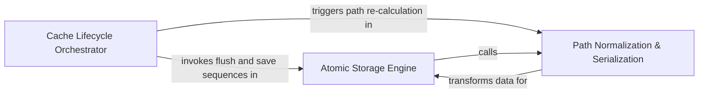

## Details

Manages physical storage, atomic writes, and serialization of cache files on disk.

### Atomic Storage Engine
Manages low-level physical persistence of analysis data using atomic write-then-swap patterns and file locking to ensure thread-safe, corruption-free cache updates.

**Related Classes/Methods**:

- `static_analyzer.analysis_cache.StaticAnalysisCache.save`:216-273

**Source Files:**

- [`diagram_analysis/diagram_generator.py`](https://github.com/CodeBoarding/CodeBoarding/blob/main/.codeboardingdiagram_analysis/diagram_generator.py)
  - `diagram_analysis.diagram_generator.DiagramGenerator._persist_static_analysis_artifact` ([L248-L255](https://github.com/CodeBoarding/CodeBoarding/blob/main/.codeboardingdiagram_analysis/diagram_generator.py#L248-L255)) - Method
- [`static_analyzer/__init__.py`](https://github.com/CodeBoarding/CodeBoarding/blob/main/.codeboardingstatic_analyzer/__init__.py)
  - `static_analyzer.__init__.StaticAnalyzer.flush_cache` ([L319-L335](https://github.com/CodeBoarding/CodeBoarding/blob/main/.codeboardingstatic_analyzer/__init__.py#L319-L335)) - Method
  - `static_analyzer.__init__.StaticAnalyzer.load_from_disk_cache` ([L355-L385](https://github.com/CodeBoarding/CodeBoarding/blob/main/.codeboardingstatic_analyzer/__init__.py#L355-L385)) - Method

### Path Normalization & Serialization
Ensures cache portability by converting absolute system paths to repository-relative paths during serialization and restoring them during loading.

**Related Classes/Methods**: _None_

**Source Files:**

- [`static_analyzer/analysis_cache.py`](https://github.com/CodeBoarding/CodeBoarding/blob/main/.codeboardingstatic_analyzer/analysis_cache.py)
  - `static_analyzer.analysis_cache.StaticAnalysisCache` ([L60-L273](https://github.com/CodeBoarding/CodeBoarding/blob/main/.codeboardingstatic_analyzer/analysis_cache.py#L60-L273)) - Class
  - `static_analyzer.analysis_cache.StaticAnalysisCache.pkl_path` ([L101-L102](https://github.com/CodeBoarding/CodeBoarding/blob/main/.codeboardingstatic_analyzer/analysis_cache.py#L101-L102)) - Method
  - `static_analyzer.analysis_cache.StaticAnalysisCache.save` ([L216-L273](https://github.com/CodeBoarding/CodeBoarding/blob/main/.codeboardingstatic_analyzer/analysis_cache.py#L216-L273)) - Method

### Cache Lifecycle Orchestrator
Coordinates high-level cache management, including version migrations, bulk file copying, and flushing in-memory state to disk.

**Related Classes/Methods**:

- `static_analyzer.analysis_cache.copy_cache_files`:276-315
- `static_analyzer.__init__.StaticAnalyzer.flush_cache`:319-335

**Source Files:**

- [`static_analyzer/analysis_cache.py`](https://github.com/CodeBoarding/CodeBoarding/blob/main/.codeboardingstatic_analyzer/analysis_cache.py)
  - `static_analyzer.analysis_cache.copy_cache_files` ([L276-L315](https://github.com/CodeBoarding/CodeBoarding/blob/main/.codeboardingstatic_analyzer/analysis_cache.py#L276-L315)) - Function
  - `static_analyzer.analysis_cache._atomic_copy` ([L318-L333](https://github.com/CodeBoarding/CodeBoarding/blob/main/.codeboardingstatic_analyzer/analysis_cache.py#L318-L333)) - Function

### [FAQ](https://github.com/CodeBoarding/GeneratedOnBoardings/tree/main?tab=readme-ov-file#faq)