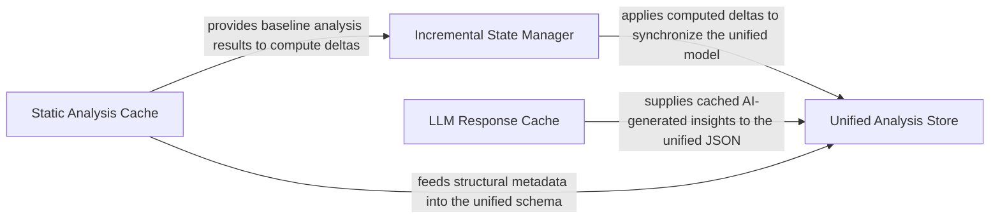

## Details

Central data repository managing unified analysis JSON, DuckDB job state, and caches for LLM responses and static analysis results.

### Unified Analysis Store
Acts as the final repository for the system's output, managing the unified analysis JSON schema and providing thread-safe, atomic I/O for persisting the project's architectural state.

**Related Classes/Methods**:

- `diagram_analysis.analysis_json.UnifiedAnalysisJson`:208-222
- `diagram_analysis.io_utils._AnalysisFileStore`:34-232
- `diagram_analysis.analysis_json.build_unified_analysis_json`:348-388

**Source Files:**

- [`agents/agent_responses.py`](https://github.com/CodeBoarding/CodeBoarding/blob/main/.codeboardingagents/agent_responses.py)
  - `agents.agent_responses.LLMBaseModel` ([L14-L45](https://github.com/CodeBoarding/CodeBoarding/blob/main/.codeboardingagents/agent_responses.py#L14-L45)) - Class
  - `agents.agent_responses.SourceCodeReference` ([L48-L87](https://github.com/CodeBoarding/CodeBoarding/blob/main/.codeboardingagents/agent_responses.py#L48-L87)) - Class
  - `agents.agent_responses.Relation` ([L90-L102](https://github.com/CodeBoarding/CodeBoarding/blob/main/.codeboardingagents/agent_responses.py#L90-L102)) - Class
  - `agents.agent_responses.ClustersComponent` ([L105-L120](https://github.com/CodeBoarding/CodeBoarding/blob/main/.codeboardingagents/agent_responses.py#L105-L120)) - Class
  - `agents.agent_responses.ClusterAnalysis` ([L123-L135](https://github.com/CodeBoarding/CodeBoarding/blob/main/.codeboardingagents/agent_responses.py#L123-L135)) - Class
  - `agents.agent_responses.MethodEntry` ([L138-L166](https://github.com/CodeBoarding/CodeBoarding/blob/main/.codeboardingagents/agent_responses.py#L138-L166)) - Class
  - `agents.agent_responses.FileMethodGroup` ([L169-L180](https://github.com/CodeBoarding/CodeBoarding/blob/main/.codeboardingagents/agent_responses.py#L169-L180)) - Class
  - `agents.agent_responses.FileEntry` ([L183-L193](https://github.com/CodeBoarding/CodeBoarding/blob/main/.codeboardingagents/agent_responses.py#L183-L193)) - Class
  - `agents.agent_responses.Component` ([L196-L240](https://github.com/CodeBoarding/CodeBoarding/blob/main/.codeboardingagents/agent_responses.py#L196-L240)) - Class
  - `agents.agent_responses.AnalysisInsights` ([L243-L267](https://github.com/CodeBoarding/CodeBoarding/blob/main/.codeboardingagents/agent_responses.py#L243-L267)) - Class
  - `agents.agent_responses.assign_component_ids` ([L270-L296](https://github.com/CodeBoarding/CodeBoarding/blob/main/.codeboardingagents/agent_responses.py#L270-L296)) - Function
  - `agents.agent_responses.CFGComponent` ([L299-L315](https://github.com/CodeBoarding/CodeBoarding/blob/main/.codeboardingagents/agent_responses.py#L299-L315)) - Class
  - `agents.agent_responses.CFGAnalysisInsights` ([L318-L330](https://github.com/CodeBoarding/CodeBoarding/blob/main/.codeboardingagents/agent_responses.py#L318-L330)) - Class
  - `agents.agent_responses.ExpandComponent` ([L333-L340](https://github.com/CodeBoarding/CodeBoarding/blob/main/.codeboardingagents/agent_responses.py#L333-L340)) - Class
  - `agents.agent_responses.ExpandComponent.llm_str` ([L339-L340](https://github.com/CodeBoarding/CodeBoarding/blob/main/.codeboardingagents/agent_responses.py#L339-L340)) - Method
  - `agents.agent_responses.ValidationInsights` ([L343-L353](https://github.com/CodeBoarding/CodeBoarding/blob/main/.codeboardingagents/agent_responses.py#L343-L353)) - Class
  - `agents.agent_responses.ValidationInsights.llm_str` ([L352-L353](https://github.com/CodeBoarding/CodeBoarding/blob/main/.codeboardingagents/agent_responses.py#L352-L353)) - Method
  - `agents.agent_responses.UpdateAnalysis` ([L356-L365](https://github.com/CodeBoarding/CodeBoarding/blob/main/.codeboardingagents/agent_responses.py#L356-L365)) - Class
  - `agents.agent_responses.UpdateAnalysis.llm_str` ([L364-L365](https://github.com/CodeBoarding/CodeBoarding/blob/main/.codeboardingagents/agent_responses.py#L364-L365)) - Method
  - `agents.agent_responses.MetaAnalysisInsights` ([L368-L394](https://github.com/CodeBoarding/CodeBoarding/blob/main/.codeboardingagents/agent_responses.py#L368-L394)) - Class
  - `agents.agent_responses.MetaAnalysisInsights.llm_str` ([L384-L394](https://github.com/CodeBoarding/CodeBoarding/blob/main/.codeboardingagents/agent_responses.py#L384-L394)) - Method
  - `agents.agent_responses.FileClassification` ([L397-L404](https://github.com/CodeBoarding/CodeBoarding/blob/main/.codeboardingagents/agent_responses.py#L397-L404)) - Class
  - `agents.agent_responses.FileClassification.llm_str` ([L403-L404](https://github.com/CodeBoarding/CodeBoarding/blob/main/.codeboardingagents/agent_responses.py#L403-L404)) - Method
  - `agents.agent_responses.ComponentFiles` ([L407-L419](https://github.com/CodeBoarding/CodeBoarding/blob/main/.codeboardingagents/agent_responses.py#L407-L419)) - Class
  - `agents.agent_responses.ComponentFiles.llm_str` ([L414-L419](https://github.com/CodeBoarding/CodeBoarding/blob/main/.codeboardingagents/agent_responses.py#L414-L419)) - Method
  - `agents.agent_responses.FilePath` ([L422-L436](https://github.com/CodeBoarding/CodeBoarding/blob/main/.codeboardingagents/agent_responses.py#L422-L436)) - Class
  - `agents.agent_responses.FilePath.llm_str` ([L435-L436](https://github.com/CodeBoarding/CodeBoarding/blob/main/.codeboardingagents/agent_responses.py#L435-L436)) - Method
- [`agents/change_status.py`](https://github.com/CodeBoarding/CodeBoarding/blob/main/.codeboardingagents/change_status.py)
  - `agents.change_status.ChangeStatus` ([L4-L9](https://github.com/CodeBoarding/CodeBoarding/blob/main/.codeboardingagents/change_status.py#L4-L9)) - Class
- [`agents/planner_agent.py`](https://github.com/CodeBoarding/CodeBoarding/blob/main/.codeboardingagents/planner_agent.py)
  - `agents.planner_agent.should_expand_component` ([L33-L91](https://github.com/CodeBoarding/CodeBoarding/blob/main/.codeboardingagents/planner_agent.py#L33-L91)) - Function
  - `agents.planner_agent.get_expandable_components` ([L94-L117](https://github.com/CodeBoarding/CodeBoarding/blob/main/.codeboardingagents/planner_agent.py#L94-L117)) - Function
- [`diagram_analysis/analysis_json.py`](https://github.com/CodeBoarding/CodeBoarding/blob/main/.codeboardingdiagram_analysis/analysis_json.py)
  - `diagram_analysis.analysis_json._build_files_index_from_analysis` ([L21-L23](https://github.com/CodeBoarding/CodeBoarding/blob/main/.codeboardingdiagram_analysis/analysis_json.py#L21-L23)) - Function
  - `diagram_analysis.analysis_json._method_key` ([L26-L27](https://github.com/CodeBoarding/CodeBoarding/blob/main/.codeboardingdiagram_analysis/analysis_json.py#L26-L27)) - Function
  - `diagram_analysis.analysis_json._to_method_qualified_name` ([L30-L31](https://github.com/CodeBoarding/CodeBoarding/blob/main/.codeboardingdiagram_analysis/analysis_json.py#L30-L31)) - Function
  - `diagram_analysis.analysis_json._to_component_file_method_refs` ([L34-L48](https://github.com/CodeBoarding/CodeBoarding/blob/main/.codeboardingdiagram_analysis/analysis_json.py#L34-L48)) - Function
  - `diagram_analysis.analysis_json._method_refs_to_placeholders` ([L51-L60](https://github.com/CodeBoarding/CodeBoarding/blob/main/.codeboardingdiagram_analysis/analysis_json.py#L51-L60)) - Function
  - `diagram_analysis.analysis_json._build_methods_index_from_files` ([L63-L75](https://github.com/CodeBoarding/CodeBoarding/blob/main/.codeboardingdiagram_analysis/analysis_json.py#L63-L75)) - Function
  - `diagram_analysis.analysis_json._hydrate_component_methods_from_refs` ([L78-L113](https://github.com/CodeBoarding/CodeBoarding/blob/main/.codeboardingdiagram_analysis/analysis_json.py#L78-L113)) - Function
  - `diagram_analysis.analysis_json.RelationJson` ([L116-L122](https://github.com/CodeBoarding/CodeBoarding/blob/main/.codeboardingdiagram_analysis/analysis_json.py#L116-L122)) - Class
  - `diagram_analysis.analysis_json.ComponentJson` ([L125-L149](https://github.com/CodeBoarding/CodeBoarding/blob/main/.codeboardingdiagram_analysis/analysis_json.py#L125-L149)) - Class
  - `diagram_analysis.analysis_json.NotAnalyzedFile` ([L152-L154](https://github.com/CodeBoarding/CodeBoarding/blob/main/.codeboardingdiagram_analysis/analysis_json.py#L152-L154)) - Class
  - `diagram_analysis.analysis_json.FileCoverageSummary` ([L157-L163](https://github.com/CodeBoarding/CodeBoarding/blob/main/.codeboardingdiagram_analysis/analysis_json.py#L157-L163)) - Class
  - `diagram_analysis.analysis_json.FileCoverageReport` ([L166-L171](https://github.com/CodeBoarding/CodeBoarding/blob/main/.codeboardingdiagram_analysis/analysis_json.py#L166-L171)) - Class
  - `diagram_analysis.analysis_json.AnalysisMetadata` ([L174-L184](https://github.com/CodeBoarding/CodeBoarding/blob/main/.codeboardingdiagram_analysis/analysis_json.py#L174-L184)) - Class
  - `diagram_analysis.analysis_json.MethodIndexEntry` ([L187-L193](https://github.com/CodeBoarding/CodeBoarding/blob/main/.codeboardingdiagram_analysis/analysis_json.py#L187-L193)) - Class
  - `diagram_analysis.analysis_json.ComponentFileMethodGroupJson` ([L196-L205](https://github.com/CodeBoarding/CodeBoarding/blob/main/.codeboardingdiagram_analysis/analysis_json.py#L196-L205)) - Class
  - `diagram_analysis.analysis_json.UnifiedAnalysisJson` ([L208-L222](https://github.com/CodeBoarding/CodeBoarding/blob/main/.codeboardingdiagram_analysis/analysis_json.py#L208-L222)) - Class
  - `diagram_analysis.analysis_json._relation_to_json` ([L225-L235](https://github.com/CodeBoarding/CodeBoarding/blob/main/.codeboardingdiagram_analysis/analysis_json.py#L225-L235)) - Function
  - `diagram_analysis.analysis_json.from_component_to_json_component` ([L238-L277](https://github.com/CodeBoarding/CodeBoarding/blob/main/.codeboardingdiagram_analysis/analysis_json.py#L238-L277)) - Function
  - `diagram_analysis.analysis_json.from_analysis_to_json` ([L280-L301](https://github.com/CodeBoarding/CodeBoarding/blob/main/.codeboardingdiagram_analysis/analysis_json.py#L280-L301)) - Function
  - `diagram_analysis.analysis_json._compute_depth_level` ([L304-L345](https://github.com/CodeBoarding/CodeBoarding/blob/main/.codeboardingdiagram_analysis/analysis_json.py#L304-L345)) - Function
  - `diagram_analysis.analysis_json._compute_depth_level.get_depth` ([L315-L325](https://github.com/CodeBoarding/CodeBoarding/blob/main/.codeboardingdiagram_analysis/analysis_json.py#L315-L325)) - Function
  - `diagram_analysis.analysis_json.build_unified_analysis_json` ([L348-L388](https://github.com/CodeBoarding/CodeBoarding/blob/main/.codeboardingdiagram_analysis/analysis_json.py#L348-L388)) - Function
  - `diagram_analysis.analysis_json.parse_unified_analysis` ([L391-L419](https://github.com/CodeBoarding/CodeBoarding/blob/main/.codeboardingdiagram_analysis/analysis_json.py#L391-L419)) - Function
  - `diagram_analysis.analysis_json.build_id_to_name_map` ([L422-L428](https://github.com/CodeBoarding/CodeBoarding/blob/main/.codeboardingdiagram_analysis/analysis_json.py#L422-L428)) - Function
  - `diagram_analysis.analysis_json._extract_analysis_recursive` ([L431-L505](https://github.com/CodeBoarding/CodeBoarding/blob/main/.codeboardingdiagram_analysis/analysis_json.py#L431-L505)) - Function
- [`diagram_analysis/io_utils.py`](https://github.com/CodeBoarding/CodeBoarding/blob/main/.codeboardingdiagram_analysis/io_utils.py)
  - `diagram_analysis.io_utils._AnalysisFileStore` ([L34-L232](https://github.com/CodeBoarding/CodeBoarding/blob/main/.codeboardingdiagram_analysis/io_utils.py#L34-L232)) - Class
  - `diagram_analysis.io_utils._AnalysisFileStore._compute_expandable_components` ([L44-L49](https://github.com/CodeBoarding/CodeBoarding/blob/main/.codeboardingdiagram_analysis/io_utils.py#L44-L49)) - Method
  - `diagram_analysis.io_utils._AnalysisFileStore._build_component_lookup` ([L52-L63](https://github.com/CodeBoarding/CodeBoarding/blob/main/.codeboardingdiagram_analysis/io_utils.py#L52-L63)) - Method
  - `diagram_analysis.io_utils._AnalysisFileStore.__init__` ([L65-L69](https://github.com/CodeBoarding/CodeBoarding/blob/main/.codeboardingdiagram_analysis/io_utils.py#L65-L69)) - Method
  - `diagram_analysis.io_utils._AnalysisFileStore.read` ([L71-L89](https://github.com/CodeBoarding/CodeBoarding/blob/main/.codeboardingdiagram_analysis/io_utils.py#L71-L89)) - Method
  - `diagram_analysis.io_utils._AnalysisFileStore.read_root` ([L91-L94](https://github.com/CodeBoarding/CodeBoarding/blob/main/.codeboardingdiagram_analysis/io_utils.py#L91-L94)) - Method
  - `diagram_analysis.io_utils._AnalysisFileStore.read_sub` ([L96-L106](https://github.com/CodeBoarding/CodeBoarding/blob/main/.codeboardingdiagram_analysis/io_utils.py#L96-L106)) - Method
  - `diagram_analysis.io_utils._AnalysisFileStore.write` ([L108-L125](https://github.com/CodeBoarding/CodeBoarding/blob/main/.codeboardingdiagram_analysis/io_utils.py#L108-L125)) - Method
  - `diagram_analysis.io_utils._AnalysisFileStore.write_sub` ([L127-L157](https://github.com/CodeBoarding/CodeBoarding/blob/main/.codeboardingdiagram_analysis/io_utils.py#L127-L157)) - Method
  - `diagram_analysis.io_utils._AnalysisFileStore.detect_expanded_components` ([L159-L166](https://github.com/CodeBoarding/CodeBoarding/blob/main/.codeboardingdiagram_analysis/io_utils.py#L159-L166)) - Method
  - `diagram_analysis.io_utils._AnalysisFileStore._write_with_lock_held` ([L168-L232](https://github.com/CodeBoarding/CodeBoarding/blob/main/.codeboardingdiagram_analysis/io_utils.py#L168-L232)) - Method
  - `diagram_analysis.io_utils._get_store` ([L242-L247](https://github.com/CodeBoarding/CodeBoarding/blob/main/.codeboardingdiagram_analysis/io_utils.py#L242-L247)) - Function
  - `diagram_analysis.io_utils.load_root_analysis` ([L255-L257](https://github.com/CodeBoarding/CodeBoarding/blob/main/.codeboardingdiagram_analysis/io_utils.py#L255-L257)) - Function
  - `diagram_analysis.io_utils.load_full_analysis` ([L260-L270](https://github.com/CodeBoarding/CodeBoarding/blob/main/.codeboardingdiagram_analysis/io_utils.py#L260-L270)) - Function
  - `diagram_analysis.io_utils.save_analysis` ([L273-L285](https://github.com/CodeBoarding/CodeBoarding/blob/main/.codeboardingdiagram_analysis/io_utils.py#L273-L285)) - Function
  - `diagram_analysis.io_utils.load_sub_analysis` ([L288-L290](https://github.com/CodeBoarding/CodeBoarding/blob/main/.codeboardingdiagram_analysis/io_utils.py#L288-L290)) - Function
  - `diagram_analysis.io_utils.save_sub_analysis` ([L293-L300](https://github.com/CodeBoarding/CodeBoarding/blob/main/.codeboardingdiagram_analysis/io_utils.py#L293-L300)) - Function
- [`static_analyzer/cluster_relations.py`](https://github.com/CodeBoarding/CodeBoarding/blob/main/.codeboardingstatic_analyzer/cluster_relations.py)
  - `static_analyzer.cluster_relations.ClusterRelation` ([L19-L25](https://github.com/CodeBoarding/CodeBoarding/blob/main/.codeboardingstatic_analyzer/cluster_relations.py#L19-L25)) - Class
  - `static_analyzer.cluster_relations.build_node_to_component_map` ([L28-L39](https://github.com/CodeBoarding/CodeBoarding/blob/main/.codeboardingstatic_analyzer/cluster_relations.py#L28-L39)) - Function
  - `static_analyzer.cluster_relations.build_component_relations` ([L42-L83](https://github.com/CodeBoarding/CodeBoarding/blob/main/.codeboardingstatic_analyzer/cluster_relations.py#L42-L83)) - Function
  - `static_analyzer.cluster_relations.merge_relations` ([L86-L175](https://github.com/CodeBoarding/CodeBoarding/blob/main/.codeboardingstatic_analyzer/cluster_relations.py#L86-L175)) - Function

### Static Analysis Cache
Manages long-term storage and serialization of static analysis results (class hierarchies, dependency graphs), using path-normalization for portability and avoiding redundant static re-analysis.

**Related Classes/Methods**:

- `static_analyzer.analysis_cache.AnalysisCacheManager`:33-761
- `static_analyzer.analysis_result.StaticAnalysisResults`:226-450
- `static_analyzer.analysis_result.StaticAnalysisCache`:123-223

**Source Files:**

- [`static_analyzer/analysis_cache.py`](https://github.com/CodeBoarding/CodeBoarding/blob/main/.codeboardingstatic_analyzer/analysis_cache.py)
  - `static_analyzer.analysis_cache.AnalysisCacheMetadata` ([L25-L30](https://github.com/CodeBoarding/CodeBoarding/blob/main/.codeboardingstatic_analyzer/analysis_cache.py#L25-L30)) - Class
  - `static_analyzer.analysis_cache.AnalysisCacheManager` ([L33-L761](https://github.com/CodeBoarding/CodeBoarding/blob/main/.codeboardingstatic_analyzer/analysis_cache.py#L33-L761)) - Class
  - `static_analyzer.analysis_cache.AnalysisCacheManager.__init__` ([L41-L48](https://github.com/CodeBoarding/CodeBoarding/blob/main/.codeboardingstatic_analyzer/analysis_cache.py#L41-L48)) - Method
  - `static_analyzer.analysis_cache.AnalysisCacheManager._to_relative_path` ([L50-L51](https://github.com/CodeBoarding/CodeBoarding/blob/main/.codeboardingstatic_analyzer/analysis_cache.py#L50-L51)) - Method
  - `static_analyzer.analysis_cache.AnalysisCacheManager._to_absolute_path` ([L53-L54](https://github.com/CodeBoarding/CodeBoarding/blob/main/.codeboardingstatic_analyzer/analysis_cache.py#L53-L54)) - Method
  - `static_analyzer.analysis_cache.AnalysisCacheManager.save_cache` ([L56-L125](https://github.com/CodeBoarding/CodeBoarding/blob/main/.codeboardingstatic_analyzer/analysis_cache.py#L56-L125)) - Method
  - `static_analyzer.analysis_cache.AnalysisCacheManager.load_cache` ([L127-L181](https://github.com/CodeBoarding/CodeBoarding/blob/main/.codeboardingstatic_analyzer/analysis_cache.py#L127-L181)) - Method
  - `static_analyzer.analysis_cache.AnalysisCacheManager.invalidate_files` ([L183-L334](https://github.com/CodeBoarding/CodeBoarding/blob/main/.codeboardingstatic_analyzer/analysis_cache.py#L183-L334)) - Method
  - `static_analyzer.analysis_cache.AnalysisCacheManager._validate_no_dangling_references` ([L336-L398](https://github.com/CodeBoarding/CodeBoarding/blob/main/.codeboardingstatic_analyzer/analysis_cache.py#L336-L398)) - Method
  - `static_analyzer.analysis_cache.AnalysisCacheManager.merge_results` ([L400-L485](https://github.com/CodeBoarding/CodeBoarding/blob/main/.codeboardingstatic_analyzer/analysis_cache.py#L400-L485)) - Method
  - `static_analyzer.analysis_cache.AnalysisCacheManager._serialize_call_graph` ([L487-L504](https://github.com/CodeBoarding/CodeBoarding/blob/main/.codeboardingstatic_analyzer/analysis_cache.py#L487-L504)) - Method
  - `static_analyzer.analysis_cache.AnalysisCacheManager._deserialize_call_graph` ([L506-L531](https://github.com/CodeBoarding/CodeBoarding/blob/main/.codeboardingstatic_analyzer/analysis_cache.py#L506-L531)) - Method
  - `static_analyzer.analysis_cache.AnalysisCacheManager._serialize_class_hierarchies` ([L533-L541](https://github.com/CodeBoarding/CodeBoarding/blob/main/.codeboardingstatic_analyzer/analysis_cache.py#L533-L541)) - Method
  - `static_analyzer.analysis_cache.AnalysisCacheManager._deserialize_class_hierarchies` ([L543-L551](https://github.com/CodeBoarding/CodeBoarding/blob/main/.codeboardingstatic_analyzer/analysis_cache.py#L543-L551)) - Method
  - `static_analyzer.analysis_cache.AnalysisCacheManager._serialize_package_relations` ([L553-L561](https://github.com/CodeBoarding/CodeBoarding/blob/main/.codeboardingstatic_analyzer/analysis_cache.py#L553-L561)) - Method
  - `static_analyzer.analysis_cache.AnalysisCacheManager._deserialize_package_relations` ([L563-L571](https://github.com/CodeBoarding/CodeBoarding/blob/main/.codeboardingstatic_analyzer/analysis_cache.py#L563-L571)) - Method
  - `static_analyzer.analysis_cache.AnalysisCacheManager._serialize_references` ([L573-L584](https://github.com/CodeBoarding/CodeBoarding/blob/main/.codeboardingstatic_analyzer/analysis_cache.py#L573-L584)) - Method
  - `static_analyzer.analysis_cache.AnalysisCacheManager._deserialize_references` ([L586-L597](https://github.com/CodeBoarding/CodeBoarding/blob/main/.codeboardingstatic_analyzer/analysis_cache.py#L586-L597)) - Method
  - `static_analyzer.analysis_cache.AnalysisCacheManager._serialize_diagnostics` ([L599-L616](https://github.com/CodeBoarding/CodeBoarding/blob/main/.codeboardingstatic_analyzer/analysis_cache.py#L599-L616)) - Method
  - `static_analyzer.analysis_cache.AnalysisCacheManager._deserialize_diagnostics` ([L618-L623](https://github.com/CodeBoarding/CodeBoarding/blob/main/.codeboardingstatic_analyzer/analysis_cache.py#L618-L623)) - Method
  - `static_analyzer.analysis_cache.AnalysisCacheManager._validate_cache_structure` ([L625-L649](https://github.com/CodeBoarding/CodeBoarding/blob/main/.codeboardingstatic_analyzer/analysis_cache.py#L625-L649)) - Method
  - `static_analyzer.analysis_cache.AnalysisCacheManager._serialize_cluster_results` ([L651-L667](https://github.com/CodeBoarding/CodeBoarding/blob/main/.codeboardingstatic_analyzer/analysis_cache.py#L651-L667)) - Method
  - `static_analyzer.analysis_cache.AnalysisCacheManager._deserialize_cluster_results` ([L669-L687](https://github.com/CodeBoarding/CodeBoarding/blob/main/.codeboardingstatic_analyzer/analysis_cache.py#L669-L687)) - Method
  - `static_analyzer.analysis_cache.AnalysisCacheManager.save_cache_with_clusters` ([L689-L727](https://github.com/CodeBoarding/CodeBoarding/blob/main/.codeboardingstatic_analyzer/analysis_cache.py#L689-L727)) - Method
  - `static_analyzer.analysis_cache.AnalysisCacheManager.load_cache_with_clusters` ([L729-L761](https://github.com/CodeBoarding/CodeBoarding/blob/main/.codeboardingstatic_analyzer/analysis_cache.py#L729-L761)) - Method
- [`static_analyzer/analysis_result.py`](https://github.com/CodeBoarding/CodeBoarding/blob/main/.codeboardingstatic_analyzer/analysis_result.py)
  - `static_analyzer.analysis_result._strip_java_generics` ([L38-L89](https://github.com/CodeBoarding/CodeBoarding/blob/main/.codeboardingstatic_analyzer/analysis_result.py#L38-L89)) - Function
  - `static_analyzer.analysis_result._strip_java_generics._replace_in_parens` ([L72-L78](https://github.com/CodeBoarding/CodeBoarding/blob/main/.codeboardingstatic_analyzer/analysis_result.py#L72-L78)) - Function
  - `static_analyzer.analysis_result._strip_java_generics._replace_in_parens._subst` ([L75-L76](https://github.com/CodeBoarding/CodeBoarding/blob/main/.codeboardingstatic_analyzer/analysis_result.py#L75-L76)) - Function
  - `static_analyzer.analysis_result._reference_key` ([L92-L120](https://github.com/CodeBoarding/CodeBoarding/blob/main/.codeboardingstatic_analyzer/analysis_result.py#L92-L120)) - Function
  - `static_analyzer.analysis_result.StaticAnalysisCache` ([L123-L223](https://github.com/CodeBoarding/CodeBoarding/blob/main/.codeboardingstatic_analyzer/analysis_result.py#L123-L223)) - Class
  - `static_analyzer.analysis_result.StaticAnalysisCache.__init__` ([L124-L126](https://github.com/CodeBoarding/CodeBoarding/blob/main/.codeboardingstatic_analyzer/analysis_result.py#L124-L126)) - Method
  - `static_analyzer.analysis_result.StaticAnalysisCache._to_relative` ([L128-L129](https://github.com/CodeBoarding/CodeBoarding/blob/main/.codeboardingstatic_analyzer/analysis_result.py#L128-L129)) - Method
  - `static_analyzer.analysis_result.StaticAnalysisCache._to_absolute` ([L131-L132](https://github.com/CodeBoarding/CodeBoarding/blob/main/.codeboardingstatic_analyzer/analysis_result.py#L131-L132)) - Method
  - `static_analyzer.analysis_result.StaticAnalysisCache._relativize` ([L134-L160](https://github.com/CodeBoarding/CodeBoarding/blob/main/.codeboardingstatic_analyzer/analysis_result.py#L134-L160)) - Method
  - `static_analyzer.analysis_result.StaticAnalysisCache._absolutize` ([L162-L187](https://github.com/CodeBoarding/CodeBoarding/blob/main/.codeboardingstatic_analyzer/analysis_result.py#L162-L187)) - Method
  - `static_analyzer.analysis_result.StaticAnalysisCache.get` ([L189-L203](https://github.com/CodeBoarding/CodeBoarding/blob/main/.codeboardingstatic_analyzer/analysis_result.py#L189-L203)) - Method
  - `static_analyzer.analysis_result.StaticAnalysisCache.save` ([L205-L223](https://github.com/CodeBoarding/CodeBoarding/blob/main/.codeboardingstatic_analyzer/analysis_result.py#L205-L223)) - Method
  - `static_analyzer.analysis_result.StaticAnalysisResults` ([L226-L450](https://github.com/CodeBoarding/CodeBoarding/blob/main/.codeboardingstatic_analyzer/analysis_result.py#L226-L450)) - Class
  - `static_analyzer.analysis_result.StaticAnalysisResults.__init__` ([L227-L229](https://github.com/CodeBoarding/CodeBoarding/blob/main/.codeboardingstatic_analyzer/analysis_result.py#L227-L229)) - Method
  - `static_analyzer.analysis_result.StaticAnalysisResults.add_class_hierarchy` ([L231-L252](https://github.com/CodeBoarding/CodeBoarding/blob/main/.codeboardingstatic_analyzer/analysis_result.py#L231-L252)) - Method
  - `static_analyzer.analysis_result.StaticAnalysisResults.add_cfg` ([L254-L277](https://github.com/CodeBoarding/CodeBoarding/blob/main/.codeboardingstatic_analyzer/analysis_result.py#L254-L277)) - Method
  - `static_analyzer.analysis_result.StaticAnalysisResults.add_package_dependencies` ([L279-L295](https://github.com/CodeBoarding/CodeBoarding/blob/main/.codeboardingstatic_analyzer/analysis_result.py#L279-L295)) - Method
  - `static_analyzer.analysis_result.StaticAnalysisResults.add_references` ([L297-L314](https://github.com/CodeBoarding/CodeBoarding/blob/main/.codeboardingstatic_analyzer/analysis_result.py#L297-L314)) - Method
  - `static_analyzer.analysis_result.StaticAnalysisResults.get_cfg` ([L316-L325](https://github.com/CodeBoarding/CodeBoarding/blob/main/.codeboardingstatic_analyzer/analysis_result.py#L316-L325)) - Method
  - `static_analyzer.analysis_result.StaticAnalysisResults.get_hierarchy` ([L327-L343](https://github.com/CodeBoarding/CodeBoarding/blob/main/.codeboardingstatic_analyzer/analysis_result.py#L327-L343)) - Method
  - `static_analyzer.analysis_result.StaticAnalysisResults.get_package_dependencies` ([L345-L354](https://github.com/CodeBoarding/CodeBoarding/blob/main/.codeboardingstatic_analyzer/analysis_result.py#L345-L354)) - Method
  - `static_analyzer.analysis_result.StaticAnalysisResults.get_reference` ([L356-L385](https://github.com/CodeBoarding/CodeBoarding/blob/main/.codeboardingstatic_analyzer/analysis_result.py#L356-L385)) - Method
  - `static_analyzer.analysis_result.StaticAnalysisResults.get_loose_reference` ([L387-L403](https://github.com/CodeBoarding/CodeBoarding/blob/main/.codeboardingstatic_analyzer/analysis_result.py#L387-L403)) - Method
  - `static_analyzer.analysis_result.StaticAnalysisResults.get_languages` ([L405-L411](https://github.com/CodeBoarding/CodeBoarding/blob/main/.codeboardingstatic_analyzer/analysis_result.py#L405-L411)) - Method
  - `static_analyzer.analysis_result.StaticAnalysisResults.add_source_files` ([L413-L428](https://github.com/CodeBoarding/CodeBoarding/blob/main/.codeboardingstatic_analyzer/analysis_result.py#L413-L428)) - Method
  - `static_analyzer.analysis_result.StaticAnalysisResults.get_source_files` ([L430-L439](https://github.com/CodeBoarding/CodeBoarding/blob/main/.codeboardingstatic_analyzer/analysis_result.py#L430-L439)) - Method
  - `static_analyzer.analysis_result.StaticAnalysisResults.get_all_source_files` ([L441-L450](https://github.com/CodeBoarding/CodeBoarding/blob/main/.codeboardingstatic_analyzer/analysis_result.py#L441-L450)) - Method

### Incremental State Manager
Orchestrates transitions between successive analysis runs by computing deltas (added/modified/removed entities) and applying them to existing state to minimize re-processing.

**Related Classes/Methods**:

- `diagram_analysis.incremental_updater.IncrementalUpdater`:30-247
- `diagram_analysis.incremental_types.IncrementalDelta`:56-70
- `diagram_analysis.incremental_updater.apply_delta`:377-411

**Source Files:**

- [`agents/agent_responses.py`](https://github.com/CodeBoarding/CodeBoarding/blob/main/.codeboardingagents/agent_responses.py)
  - `agents.agent_responses.SourceCodeReference.llm_str` ([L69-L77](https://github.com/CodeBoarding/CodeBoarding/blob/main/.codeboardingagents/agent_responses.py#L69-L77)) - Method
  - `agents.agent_responses.SourceCodeReference.__str__` ([L79-L87](https://github.com/CodeBoarding/CodeBoarding/blob/main/.codeboardingagents/agent_responses.py#L79-L87)) - Method
  - `agents.agent_responses.Relation.llm_str` ([L101-L102](https://github.com/CodeBoarding/CodeBoarding/blob/main/.codeboardingagents/agent_responses.py#L101-L102)) - Method
  - `agents.agent_responses.MethodEntry.__hash__` ([L150-L151](https://github.com/CodeBoarding/CodeBoarding/blob/main/.codeboardingagents/agent_responses.py#L150-L151)) - Method
  - `agents.agent_responses.MethodEntry.__eq__` ([L153-L156](https://github.com/CodeBoarding/CodeBoarding/blob/main/.codeboardingagents/agent_responses.py#L153-L156)) - Method
  - `agents.agent_responses.MethodEntry.from_method_change` ([L159-L166](https://github.com/CodeBoarding/CodeBoarding/blob/main/.codeboardingagents/agent_responses.py#L159-L166)) - Method
  - `agents.agent_responses.Component.llm_str` ([L230-L240](https://github.com/CodeBoarding/CodeBoarding/blob/main/.codeboardingagents/agent_responses.py#L230-L240)) - Method
  - `agents.agent_responses.AnalysisInsights.llm_str` ([L257-L263](https://github.com/CodeBoarding/CodeBoarding/blob/main/.codeboardingagents/agent_responses.py#L257-L263)) - Method
  - `agents.agent_responses.AnalysisInsights.file_to_component` ([L265-L267](https://github.com/CodeBoarding/CodeBoarding/blob/main/.codeboardingagents/agent_responses.py#L265-L267)) - Method
  - `agents.agent_responses.CFGComponent.llm_str` ([L308-L315](https://github.com/CodeBoarding/CodeBoarding/blob/main/.codeboardingagents/agent_responses.py#L308-L315)) - Method
  - `agents.agent_responses.CFGAnalysisInsights.llm_str` ([L324-L330](https://github.com/CodeBoarding/CodeBoarding/blob/main/.codeboardingagents/agent_responses.py#L324-L330)) - Method
- [`diagram_analysis/incremental_types.py`](https://github.com/CodeBoarding/CodeBoarding/blob/main/.codeboardingdiagram_analysis/incremental_types.py)
  - `diagram_analysis.incremental_types.MethodChange` ([L10-L26](https://github.com/CodeBoarding/CodeBoarding/blob/main/.codeboardingdiagram_analysis/incremental_types.py#L10-L26)) - Class
  - `diagram_analysis.incremental_types.MethodChange.to_dict` ([L18-L26](https://github.com/CodeBoarding/CodeBoarding/blob/main/.codeboardingdiagram_analysis/incremental_types.py#L18-L26)) - Method
  - `diagram_analysis.incremental_types.FileDelta` ([L30-L52](https://github.com/CodeBoarding/CodeBoarding/blob/main/.codeboardingdiagram_analysis/incremental_types.py#L30-L52)) - Class
  - `diagram_analysis.incremental_types.FileDelta.to_dict` ([L40-L52](https://github.com/CodeBoarding/CodeBoarding/blob/main/.codeboardingdiagram_analysis/incremental_types.py#L40-L52)) - Method
  - `diagram_analysis.incremental_types.IncrementalDelta` ([L56-L70](https://github.com/CodeBoarding/CodeBoarding/blob/main/.codeboardingdiagram_analysis/incremental_types.py#L56-L70)) - Class
  - `diagram_analysis.incremental_types.IncrementalDelta.has_changes` ([L62-L63](https://github.com/CodeBoarding/CodeBoarding/blob/main/.codeboardingdiagram_analysis/incremental_types.py#L62-L63)) - Method
  - `diagram_analysis.incremental_types.IncrementalDelta.to_dict` ([L65-L70](https://github.com/CodeBoarding/CodeBoarding/blob/main/.codeboardingdiagram_analysis/incremental_types.py#L65-L70)) - Method
- [`diagram_analysis/incremental_updater.py`](https://github.com/CodeBoarding/CodeBoarding/blob/main/.codeboardingdiagram_analysis/incremental_updater.py)
  - `diagram_analysis.incremental_updater.IncrementalUpdater` ([L30-L247](https://github.com/CodeBoarding/CodeBoarding/blob/main/.codeboardingdiagram_analysis/incremental_updater.py#L30-L247)) - Class
  - `diagram_analysis.incremental_updater.IncrementalUpdater.__init__` ([L41-L52](https://github.com/CodeBoarding/CodeBoarding/blob/main/.codeboardingdiagram_analysis/incremental_updater.py#L41-L52)) - Method
  - `diagram_analysis.incremental_updater.IncrementalUpdater._get_current_methods` ([L54-L55](https://github.com/CodeBoarding/CodeBoarding/blob/main/.codeboardingdiagram_analysis/incremental_updater.py#L54-L55)) - Method
  - `diagram_analysis.incremental_updater.IncrementalUpdater._get_previous_methods` ([L57-L61](https://github.com/CodeBoarding/CodeBoarding/blob/main/.codeboardingdiagram_analysis/incremental_updater.py#L57-L61)) - Method
  - `diagram_analysis.incremental_updater.IncrementalUpdater._get_previous_active_methods` ([L63-L64](https://github.com/CodeBoarding/CodeBoarding/blob/main/.codeboardingdiagram_analysis/incremental_updater.py#L63-L64)) - Method
  - `diagram_analysis.incremental_updater.IncrementalUpdater._apply_method_diff_statuses` ([L66-L69](https://github.com/CodeBoarding/CodeBoarding/blob/main/.codeboardingdiagram_analysis/incremental_updater.py#L66-L69)) - Method
  - `diagram_analysis.incremental_updater.IncrementalUpdater._to_method_change` ([L72-L85](https://github.com/CodeBoarding/CodeBoarding/blob/main/.codeboardingdiagram_analysis/incremental_updater.py#L72-L85)) - Method
  - `diagram_analysis.incremental_updater.IncrementalUpdater._compute_file_delta` ([L87-L184](https://github.com/CodeBoarding/CodeBoarding/blob/main/.codeboardingdiagram_analysis/incremental_updater.py#L87-L184)) - Method
  - `diagram_analysis.incremental_updater.IncrementalUpdater._compute_reset_delta` ([L186-L209](https://github.com/CodeBoarding/CodeBoarding/blob/main/.codeboardingdiagram_analysis/incremental_updater.py#L186-L209)) - Method
  - `diagram_analysis.incremental_updater.IncrementalUpdater.compute_delta` ([L211-L247](https://github.com/CodeBoarding/CodeBoarding/blob/main/.codeboardingdiagram_analysis/incremental_updater.py#L211-L247)) - Method
  - `diagram_analysis.incremental_updater._component_lookup` ([L250-L255](https://github.com/CodeBoarding/CodeBoarding/blob/main/.codeboardingdiagram_analysis/incremental_updater.py#L250-L255)) - Function
  - `diagram_analysis.incremental_updater._ensure_file_entry` ([L258-L263](https://github.com/CodeBoarding/CodeBoarding/blob/main/.codeboardingdiagram_analysis/incremental_updater.py#L258-L263)) - Function
  - `diagram_analysis.incremental_updater._apply_method_changes` ([L266-L276](https://github.com/CodeBoarding/CodeBoarding/blob/main/.codeboardingdiagram_analysis/incremental_updater.py#L266-L276)) - Function
  - `diagram_analysis.incremental_updater._sorted_methods` ([L279-L280](https://github.com/CodeBoarding/CodeBoarding/blob/main/.codeboardingdiagram_analysis/incremental_updater.py#L279-L280)) - Function
  - `diagram_analysis.incremental_updater._apply_file_delta_to_index` ([L283-L308](https://github.com/CodeBoarding/CodeBoarding/blob/main/.codeboardingdiagram_analysis/incremental_updater.py#L283-L308)) - Function
  - `diagram_analysis.incremental_updater._sync_component_methods` ([L311-L374](https://github.com/CodeBoarding/CodeBoarding/blob/main/.codeboardingdiagram_analysis/incremental_updater.py#L311-L374)) - Function
  - `diagram_analysis.incremental_updater.apply_delta` ([L377-L411](https://github.com/CodeBoarding/CodeBoarding/blob/main/.codeboardingdiagram_analysis/incremental_updater.py#L377-L411)) - Function

### LLM Response Cache
Provides persistent, signature-based caching for LLM interactions (backed by DuckDB) to avoid redundant API calls by mapping prompt and model settings to previous agent responses.

**Related Classes/Methods**:

- `caching.cache.BaseCache`:30-268
- `caching.cache.ModelSettings`:271-310
- `agents.agent_responses.LLMBaseModel`:14-45

**Source Files:**

- [`agents/agent_responses.py`](https://github.com/CodeBoarding/CodeBoarding/blob/main/.codeboardingagents/agent_responses.py)
  - `agents.agent_responses.LLMBaseModel.llm_str` ([L18-L19](https://github.com/CodeBoarding/CodeBoarding/blob/main/.codeboardingagents/agent_responses.py#L18-L19)) - Method
  - `agents.agent_responses.LLMBaseModel.extractor_str` ([L22-L45](https://github.com/CodeBoarding/CodeBoarding/blob/main/.codeboardingagents/agent_responses.py#L22-L45)) - Method
  - `agents.agent_responses.ClustersComponent.llm_str` ([L118-L120](https://github.com/CodeBoarding/CodeBoarding/blob/main/.codeboardingagents/agent_responses.py#L118-L120)) - Method
  - `agents.agent_responses.ClusterAnalysis.llm_str` ([L130-L135](https://github.com/CodeBoarding/CodeBoarding/blob/main/.codeboardingagents/agent_responses.py#L130-L135)) - Method
- [`caching/cache.py`](https://github.com/CodeBoarding/CodeBoarding/blob/main/.codeboardingcaching/cache.py)
  - `caching.cache.BaseCache` ([L30-L268](https://github.com/CodeBoarding/CodeBoarding/blob/main/.codeboardingcaching/cache.py#L30-L268)) - Class
  - `caching.cache.BaseCache.__init__` ([L36-L63](https://github.com/CodeBoarding/CodeBoarding/blob/main/.codeboardingcaching/cache.py#L36-L63)) - Method
  - `caching.cache.BaseCache._open_sqlite` ([L65-L73](https://github.com/CodeBoarding/CodeBoarding/blob/main/.codeboardingcaching/cache.py#L65-L73)) - Method
  - `caching.cache.BaseCache._configure_sqlite_connection` ([L76-L83](https://github.com/CodeBoarding/CodeBoarding/blob/main/.codeboardingcaching/cache.py#L76-L83)) - Method
  - `caching.cache.BaseCache._open_sqlite_unlocked` ([L85-L119](https://github.com/CodeBoarding/CodeBoarding/blob/main/.codeboardingcaching/cache.py#L85-L119)) - Method
  - `caching.cache.BaseCache._reset_if_incompatible_schema` ([L121-L135](https://github.com/CodeBoarding/CodeBoarding/blob/main/.codeboardingcaching/cache.py#L121-L135)) - Method
  - `caching.cache.BaseCache.signature` ([L137-L139](https://github.com/CodeBoarding/CodeBoarding/blob/main/.codeboardingcaching/cache.py#L137-L139)) - Method
  - `caching.cache.BaseCache._lookup` ([L141-L157](https://github.com/CodeBoarding/CodeBoarding/blob/main/.codeboardingcaching/cache.py#L141-L157)) - Method
  - `caching.cache.BaseCache._upsert_conn` ([L159-L174](https://github.com/CodeBoarding/CodeBoarding/blob/main/.codeboardingcaching/cache.py#L159-L174)) - Method
  - `caching.cache.BaseCache._clear_conn` ([L176-L183](https://github.com/CodeBoarding/CodeBoarding/blob/main/.codeboardingcaching/cache.py#L176-L183)) - Method
  - `caching.cache.BaseCache.load` ([L185-L197](https://github.com/CodeBoarding/CodeBoarding/blob/main/.codeboardingcaching/cache.py#L185-L197)) - Method
  - `caching.cache.BaseCache.store` ([L199-L216](https://github.com/CodeBoarding/CodeBoarding/blob/main/.codeboardingcaching/cache.py#L199-L216)) - Method
  - `caching.cache.BaseCache.clear` ([L218-L229](https://github.com/CodeBoarding/CodeBoarding/blob/main/.codeboardingcaching/cache.py#L218-L229)) - Method
  - `caching.cache.BaseCache.load_most_recent_run` ([L231-L257](https://github.com/CodeBoarding/CodeBoarding/blob/main/.codeboardingcaching/cache.py#L231-L257)) - Method
  - `caching.cache.BaseCache.close` ([L259-L268](https://github.com/CodeBoarding/CodeBoarding/blob/main/.codeboardingcaching/cache.py#L259-L268)) - Method
  - `caching.cache.ModelSettings` ([L271-L310](https://github.com/CodeBoarding/CodeBoarding/blob/main/.codeboardingcaching/cache.py#L271-L310)) - Class
  - `caching.cache.ModelSettings.canonical_json` ([L284-L286](https://github.com/CodeBoarding/CodeBoarding/blob/main/.codeboardingcaching/cache.py#L284-L286)) - Method
  - `caching.cache.ModelSettings.signature` ([L288-L289](https://github.com/CodeBoarding/CodeBoarding/blob/main/.codeboardingcaching/cache.py#L288-L289)) - Method
  - `caching.cache.ModelSettings.from_chat_model` ([L292-L310](https://github.com/CodeBoarding/CodeBoarding/blob/main/.codeboardingcaching/cache.py#L292-L310)) - Method

### [FAQ](https://github.com/CodeBoarding/GeneratedOnBoardings/tree/main?tab=readme-ov-file#faq)