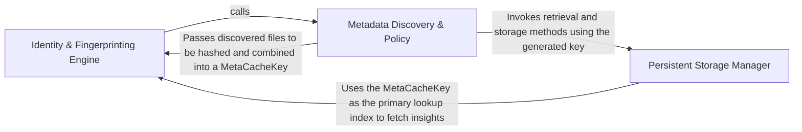

## Details

Handles the persistence and retrieval of analysis results using a fingerprinting mechanism to enable incremental analysis.

### Identity & Fingerprinting Engine
Generates a unique, deterministic signature for the analysis context by combining file-system state and model configurations.

**Related Classes/Methods**:

- `caching.meta_cache.MetaCacheKey`:29-37
- `caching.cache.ModelSettings`:271-310
- `utils.fingerprint_file`:63-71

**Source Files:**

- [`caching/cache.py`](https://github.com/CodeBoarding/CodeBoarding/blob/main/.codeboardingcaching/cache.py)
  - `caching.cache.ModelSettings.from_chat_model` ([L292-L310](https://github.com/CodeBoarding/CodeBoarding/blob/main/.codeboardingcaching/cache.py#L292-L310)) - Method
- [`caching/meta_cache.py`](https://github.com/CodeBoarding/CodeBoarding/blob/main/.codeboardingcaching/meta_cache.py)
  - `caching.meta_cache.MetaCache._compute_metadata_content_hash` ([L96-L111](https://github.com/CodeBoarding/CodeBoarding/blob/main/.codeboardingcaching/meta_cache.py#L96-L111)) - Method

### Metadata Discovery & Policy
Orchestrates the identification of significant files and applies filtering rules to determine what influences the cache state.

**Related Classes/Methods**:

- `caching.meta_cache.MetaCache.build_key`:71-94

**Source Files:**

- [`caching/meta_cache.py`](https://github.com/CodeBoarding/CodeBoarding/blob/main/.codeboardingcaching/meta_cache.py)
  - `caching.meta_cache.MetaCache.build_key` ([L71-L94](https://github.com/CodeBoarding/CodeBoarding/blob/main/.codeboardingcaching/meta_cache.py#L71-L94)) - Method
- [`utils.py`](https://github.com/CodeBoarding/CodeBoarding/blob/main/.codeboardingutils.py)
  - `utils.fingerprint_file` ([L63-L71](https://github.com/CodeBoarding/CodeBoarding/blob/main/.codeboardingutils.py#L63-L71)) - Function

### Persistent Storage Manager
Manages the physical lifecycle of cached analysis results using a SQLite backend to store and retrieve insights.

**Related Classes/Methods**:

- `caching.meta_cache.MetaCache`:40-111

**Source Files:**

- [`caching/meta_cache.py`](https://github.com/CodeBoarding/CodeBoarding/blob/main/.codeboardingcaching/meta_cache.py)
  - `caching.meta_cache.MetaCacheKey` ([L29-L37](https://github.com/CodeBoarding/CodeBoarding/blob/main/.codeboardingcaching/meta_cache.py#L29-L37)) - Class

### [FAQ](https://github.com/CodeBoarding/GeneratedOnBoardings/tree/main?tab=readme-ov-file#faq)