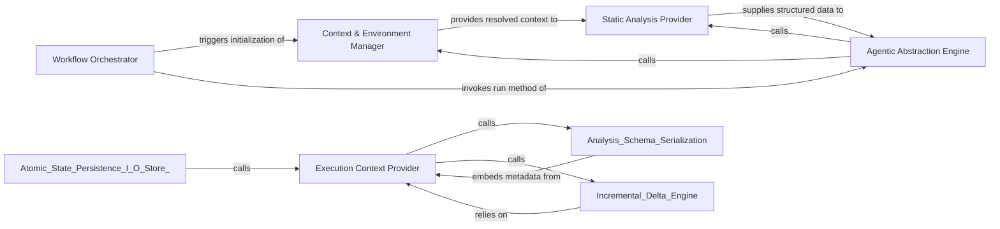

## Details

The core execution engine that manages the analysis lifecycle, initializes the RunContext, and sequences pipeline steps.

### Execution Context Provider
Supplies runtime environment metadata, such as repository names and commit hashes, to uniquely tie analysis artifacts to specific code revisions.

**Related Classes/Methods**: _None_

**Source Files:**

- [`diagram_analysis/io_utils.py`](https://github.com/CodeBoarding/CodeBoarding/blob/main/.codeboardingdiagram_analysis/io_utils.py)
  - `diagram_analysis.io_utils.load_root_analysis` ([L296-L298](https://github.com/CodeBoarding/CodeBoarding/blob/main/.codeboardingdiagram_analysis/io_utils.py#L296-L298)) - Function
  - `diagram_analysis.io_utils.load_full_analysis` ([L301-L311](https://github.com/CodeBoarding/CodeBoarding/blob/main/.codeboardingdiagram_analysis/io_utils.py#L301-L311)) - Function
  - `diagram_analysis.io_utils.load_sub_analysis` ([L399-L401](https://github.com/CodeBoarding/CodeBoarding/blob/main/.codeboardingdiagram_analysis/io_utils.py#L399-L401)) - Function
  - `diagram_analysis.io_utils.save_sub_analysis` ([L404-L411](https://github.com/CodeBoarding/CodeBoarding/blob/main/.codeboardingdiagram_analysis/io_utils.py#L404-L411)) - Function

### Workflow Orchestrator
The top-level execution engine that defines the sequence of operations for the analysis pipeline and manages the transition between static analysis and agentic reasoning.

**Related Classes/Methods**:

- `codeboarding_workflows.orchestration.run_analysis_pipeline`:25-48

**Source Files:**

- [`codeboarding_workflows/orchestration.py`](https://github.com/CodeBoarding/CodeBoarding/blob/main/.codeboardingcodeboarding_workflows/orchestration.py)
  - `codeboarding_workflows.orchestration.run_analysis_pipeline` ([L25-L48](https://github.com/CodeBoarding/CodeBoarding/blob/main/.codeboardingcodeboarding_workflows/orchestration.py#L25-L48)) - Function

### Context & Environment Manager
Responsible for initializing the execution environment, generating unique identifiers, and resolving configuration paths and exclusions into a unified state object.

**Related Classes/Methods**:

- `diagram_analysis.run_context.RunContext`:13-40
- `diagram_analysis.run_context.RunContext.resolve`:21-36
- `utils.generate_run_id`:113-114

**Source Files:**

- [`diagram_analysis/run_context.py`](https://github.com/CodeBoarding/CodeBoarding/blob/main/.codeboardingdiagram_analysis/run_context.py)
  - `diagram_analysis.run_context.RunContext.finalize` ([L38-L40](https://github.com/CodeBoarding/CodeBoarding/blob/main/.codeboardingdiagram_analysis/run_context.py#L38-L40)) - Method
- [`monitoring/paths.py`](https://github.com/CodeBoarding/CodeBoarding/blob/main/.codeboardingmonitoring/paths.py)
  - `monitoring.paths.generate_log_path` ([L25-L27](https://github.com/CodeBoarding/CodeBoarding/blob/main/.codeboardingmonitoring/paths.py#L25-L27)) - Function

### Static Analysis Provider
Extracts the structural ground truth from the source code, mapping files, methods, and their static relationships to provide raw data for LLM abstraction.

**Related Classes/Methods**: _None_

**Source Files:**

- [`utils.py`](https://github.com/CodeBoarding/CodeBoarding/blob/main/.codeboardingutils.py)
  - `utils.generate_run_id` ([L113-L114](https://github.com/CodeBoarding/CodeBoarding/blob/main/.codeboardingutils.py#L113-L114)) - Function

### Agentic Abstraction Engine
The reasoning layer that utilizes LLMs to interpret static analysis data, grouping code into logical clusters and synthesizing architectural insights.

**Related Classes/Methods**: _None_

**Source Files:**

- [`diagram_analysis/run_context.py`](https://github.com/CodeBoarding/CodeBoarding/blob/main/.codeboardingdiagram_analysis/run_context.py)
  - `diagram_analysis.run_context.RunContext.resolve` ([L21-L36](https://github.com/CodeBoarding/CodeBoarding/blob/main/.codeboardingdiagram_analysis/run_context.py#L21-L36)) - Method

### [FAQ](https://github.com/CodeBoarding/GeneratedOnBoardings/tree/main?tab=readme-ov-file#faq)