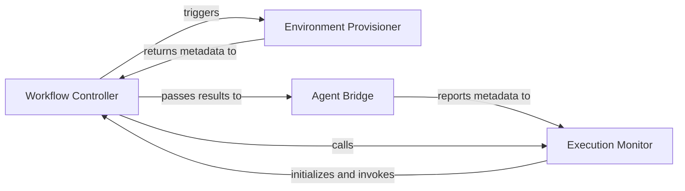

## Details

Manages the high-level execution flow and lifecycle of the analysis process, coordinating the transition from repository setup to full analysis execution.

### Workflow Controller
The primary entry point and state machine of the subsystem, defining the linear progression of the analysis pipeline.

**Related Classes/Methods**:

- `codeboarding_workflows.analysis.run_full`:61-92

**Source Files:**

- [`codeboarding_cli/commands/full_analysis.py`](https://github.com/CodeBoarding/CodeBoarding/blob/main/.codeboardingcodeboarding_cli/commands/full_analysis.py)
  - `codeboarding_cli.commands.full_analysis._run_local.scope` ([L92-L103](https://github.com/CodeBoarding/CodeBoarding/blob/main/.codeboardingcodeboarding_cli/commands/full_analysis.py#L92-L103)) - Function
  - `codeboarding_cli.commands.full_analysis._process_one_remote.scope` ([L164-L200](https://github.com/CodeBoarding/CodeBoarding/blob/main/.codeboardingcodeboarding_cli/commands/full_analysis.py#L164-L200)) - Function

### Execution Monitor
Provides a managed execution environment that tracks the progress, telemetry, and state of the pipeline.

**Related Classes/Methods**:

- `monitoring.context.monitor_execution.MonitorContext`:73-91

**Source Files:**

- [`codeboarding_workflows/analysis.py`](https://github.com/CodeBoarding/CodeBoarding/blob/main/.codeboardingcodeboarding_workflows/analysis.py)
  - `codeboarding_workflows.analysis.run_full` ([L61-L92](https://github.com/CodeBoarding/CodeBoarding/blob/main/.codeboardingcodeboarding_workflows/analysis.py#L61-L92)) - Function
- [`repo_utils/__init__.py`](https://github.com/CodeBoarding/CodeBoarding/blob/main/.codeboardingrepo_utils/__init__.py)
  - `repo_utils.__init__.get_branch` ([L227-L232](https://github.com/CodeBoarding/CodeBoarding/blob/main/.codeboardingrepo_utils/__init__.py#L227-L232)) - Function

### Environment Provisioner
Handles the physical preparation of the codebase, including repository cloning and path resolution.

**Related Classes/Methods**: _None_

**Source Files:**

- [`monitoring/context.py`](https://github.com/CodeBoarding/CodeBoarding/blob/main/.codeboardingmonitoring/context.py)
  - `monitoring.context.monitor_execution.DummyContext.step` ([L33-L34](https://github.com/CodeBoarding/CodeBoarding/blob/main/.codeboardingmonitoring/context.py#L33-L34)) - Method
- [`repo_utils/git_ops.py`](https://github.com/CodeBoarding/CodeBoarding/blob/main/.codeboardingrepo_utils/git_ops.py)
  - `repo_utils.git_ops.get_current_commit` ([L47-L64](https://github.com/CodeBoarding/CodeBoarding/blob/main/.codeboardingrepo_utils/git_ops.py#L47-L64)) - Function

### Agent Bridge
Acts as the translation layer between static analysis output and the LLM-driven reasoning engine.

**Related Classes/Methods**: _None_

**Source Files:**

- [`monitoring/context.py`](https://github.com/CodeBoarding/CodeBoarding/blob/main/.codeboardingmonitoring/context.py)
  - `monitoring.context.monitor_execution.MonitorContext.step` ([L77-L81](https://github.com/CodeBoarding/CodeBoarding/blob/main/.codeboardingmonitoring/context.py#L77-L81)) - Method

### [FAQ](https://github.com/CodeBoarding/GeneratedOnBoardings/tree/main?tab=readme-ov-file#faq)