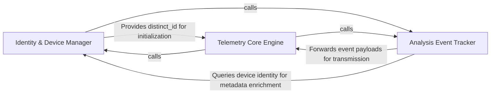

## Details

Manages the identity of the installation and tracks high-level product events for usage analytics and error reporting.

### Identity & Device Manager [[Expand]](./Identity_Device_Manager.md)
Manages the persistent identity of the tool installation by resolving unique device identifiers and ensuring event continuity across sessions.

**Related Classes/Methods**:

- `telemetry.device_id.generate_device_id`:85-91
- `telemetry.service.ProductTelemetry.user_id`:52-58

**Source Files:**

- [`telemetry/device_id.py`](https://github.com/CodeBoarding/CodeBoarding/blob/main/.codeboardingtelemetry/device_id.py)
  - `telemetry.device_id._shell` ([L14-L16](https://github.com/CodeBoarding/CodeBoarding/blob/main/.codeboardingtelemetry/device_id.py#L14-L16)) - Function
  - `telemetry.device_id._linux_machine_id` ([L19-L24](https://github.com/CodeBoarding/CodeBoarding/blob/main/.codeboardingtelemetry/device_id.py#L19-L24)) - Function
- [`telemetry/events.py`](https://github.com/CodeBoarding/CodeBoarding/blob/main/.codeboardingtelemetry/events.py)
  - `telemetry.events._app_version` ([L41-L45](https://github.com/CodeBoarding/CodeBoarding/blob/main/.codeboardingtelemetry/events.py#L41-L45)) - Function
  - `telemetry.events.track_tech_stack` ([L73-L91](https://github.com/CodeBoarding/CodeBoarding/blob/main/.codeboardingtelemetry/events.py#L73-L91)) - Function
  - `telemetry.events.capture_error` ([L225-L240](https://github.com/CodeBoarding/CodeBoarding/blob/main/.codeboardingtelemetry/events.py#L225-L240)) - Function
- [`telemetry/schemas.py`](https://github.com/CodeBoarding/CodeBoarding/blob/main/.codeboardingtelemetry/schemas.py)
  - `telemetry.schemas.LanguageStat` ([L10-L13](https://github.com/CodeBoarding/CodeBoarding/blob/main/.codeboardingtelemetry/schemas.py#L10-L13)) - Class
  - `telemetry.schemas.RepoScanned` ([L16-L22](https://github.com/CodeBoarding/CodeBoarding/blob/main/.codeboardingtelemetry/schemas.py#L16-L22)) - Class

### Telemetry Core Engine [[Expand]](./Telemetry_Core_Engine.md)
Acts as the central orchestrator and singleton wrapper for the telemetry SDK, handling connection lifecycle, event queuing, and data flushing.

**Related Classes/Methods**:

- `telemetry.service.ProductTelemetry`:21-94
- `telemetry.service.ProductTelemetry.capture`:60-73
- `telemetry.service.ProductTelemetry.capture_exception`:75-87

**Source Files:**

- [`telemetry/device_id.py`](https://github.com/CodeBoarding/CodeBoarding/blob/main/.codeboardingtelemetry/device_id.py)
  - `telemetry.device_id._system_uuid` ([L27-L42](https://github.com/CodeBoarding/CodeBoarding/blob/main/.codeboardingtelemetry/device_id.py#L27-L42)) - Function
  - `telemetry.device_id._disk_serial` ([L45-L60](https://github.com/CodeBoarding/CodeBoarding/blob/main/.codeboardingtelemetry/device_id.py#L45-L60)) - Function
  - `telemetry.device_id._raw_cpu_model` ([L63-L82](https://github.com/CodeBoarding/CodeBoarding/blob/main/.codeboardingtelemetry/device_id.py#L63-L82)) - Function
- [`telemetry/events.py`](https://github.com/CodeBoarding/CodeBoarding/blob/main/.codeboardingtelemetry/events.py)
  - `telemetry.events.track_analysis.wrapper` ([L170-L220](https://github.com/CodeBoarding/CodeBoarding/blob/main/.codeboardingtelemetry/events.py#L170-L220)) - Function
  - `telemetry.events._exception_properties` ([L243-L246](https://github.com/CodeBoarding/CodeBoarding/blob/main/.codeboardingtelemetry/events.py#L243-L246)) - Function
- [`telemetry/schemas.py`](https://github.com/CodeBoarding/CodeBoarding/blob/main/.codeboardingtelemetry/schemas.py)
  - `telemetry.schemas.AnalysisStarted` ([L43-L47](https://github.com/CodeBoarding/CodeBoarding/blob/main/.codeboardingtelemetry/schemas.py#L43-L47)) - Class
  - `telemetry.schemas.AnalysisCompleted` ([L50-L60](https://github.com/CodeBoarding/CodeBoarding/blob/main/.codeboardingtelemetry/schemas.py#L50-L60)) - Class
- [`telemetry/service.py`](https://github.com/CodeBoarding/CodeBoarding/blob/main/.codeboardingtelemetry/service.py)
  - `telemetry.service._telemetry_disabled` ([L15-L18](https://github.com/CodeBoarding/CodeBoarding/blob/main/.codeboardingtelemetry/service.py#L15-L18)) - Function
  - `telemetry.service.ProductTelemetry` ([L21-L94](https://github.com/CodeBoarding/CodeBoarding/blob/main/.codeboardingtelemetry/service.py#L21-L94)) - Class
  - `telemetry.service.ProductTelemetry.__new__` ([L26-L30](https://github.com/CodeBoarding/CodeBoarding/blob/main/.codeboardingtelemetry/service.py#L26-L30)) - Method
  - `telemetry.service.ProductTelemetry.capture_exception` ([L75-L87](https://github.com/CodeBoarding/CodeBoarding/blob/main/.codeboardingtelemetry/service.py#L75-L87)) - Method

### Analysis Event Tracker [[Expand]](./Analysis_Event_Tracker.md)
Translates static analysis outcomes into telemetry events, capturing performance metrics and domain-specific data.

**Related Classes/Methods**:

- `telemetry.events.track_analysis`:160-222
- `telemetry.events.track_tech_stack`:73-91
- `telemetry.events.track_lsp_result`:94-157

**Source Files:**

- [`telemetry/device_id.py`](https://github.com/CodeBoarding/CodeBoarding/blob/main/.codeboardingtelemetry/device_id.py)
  - `telemetry.device_id._sha256` ([L10-L11](https://github.com/CodeBoarding/CodeBoarding/blob/main/.codeboardingtelemetry/device_id.py#L10-L11)) - Function
  - `telemetry.device_id.generate_device_id` ([L85-L91](https://github.com/CodeBoarding/CodeBoarding/blob/main/.codeboardingtelemetry/device_id.py#L85-L91)) - Function
- [`telemetry/events.py`](https://github.com/CodeBoarding/CodeBoarding/blob/main/.codeboardingtelemetry/events.py)
  - `telemetry.events._resolve_run_id` ([L53-L55](https://github.com/CodeBoarding/CodeBoarding/blob/main/.codeboardingtelemetry/events.py#L53-L55)) - Function
  - `telemetry.events.track_lsp_result` ([L94-L157](https://github.com/CodeBoarding/CodeBoarding/blob/main/.codeboardingtelemetry/events.py#L94-L157)) - Function
- [`telemetry/schemas.py`](https://github.com/CodeBoarding/CodeBoarding/blob/main/.codeboardingtelemetry/schemas.py)
  - `telemetry.schemas.LspAnalysisResult` ([L25-L40](https://github.com/CodeBoarding/CodeBoarding/blob/main/.codeboardingtelemetry/schemas.py#L25-L40)) - Class
- [`telemetry/service.py`](https://github.com/CodeBoarding/CodeBoarding/blob/main/.codeboardingtelemetry/service.py)
  - `telemetry.service.ProductTelemetry._init` ([L32-L49](https://github.com/CodeBoarding/CodeBoarding/blob/main/.codeboardingtelemetry/service.py#L32-L49)) - Method
  - `telemetry.service.ProductTelemetry.user_id` ([L52-L58](https://github.com/CodeBoarding/CodeBoarding/blob/main/.codeboardingtelemetry/service.py#L52-L58)) - Method
  - `telemetry.service.ProductTelemetry.capture` ([L60-L73](https://github.com/CodeBoarding/CodeBoarding/blob/main/.codeboardingtelemetry/service.py#L60-L73)) - Method
  - `telemetry.service.ProductTelemetry.flush` ([L89-L94](https://github.com/CodeBoarding/CodeBoarding/blob/main/.codeboardingtelemetry/service.py#L89-L94)) - Method

### [FAQ](https://github.com/CodeBoarding/GeneratedOnBoardings/tree/main?tab=readme-ov-file#faq)