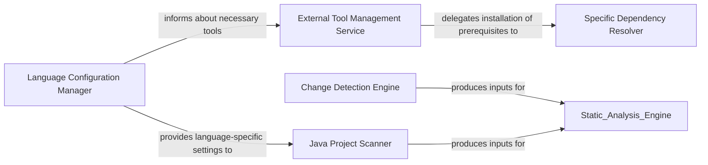

## Details

Handles the initial project setup, language-specific configurations, installation of necessary tools, and detection of code changes within the repository to prepare for analysis. It ensures the application is correctly configured and capable of supporting various programming languages.

### Change Detection Engine
Identifies, categorizes, and provides detailed information about code changes within a repository (e.g., added, modified, deleted, renamed files, structural changes, uncommitted changes, commit-based changes). It leverages git diff utilities to produce `ChangeSet` objects, which define the scope for subsequent analysis.

**Related Classes/Methods**:

- <a href="https://github.com/CodeBoarding/CodeBoarding/blob/main/.codeboardingstatic_analyzer/programming_language.py" target="_blank" rel="noopener noreferrer">`repo_utils.change_set.ChangeSet`</a>

### Language Configuration Manager
Defines and manages the properties and configurations for various programming languages supported by the system. This includes mapping file extensions, providing language IDs, and configuring parameters for associated Language Server Protocols (LSPs), ensuring the utility can handle diverse language requirements.

**Related Classes/Methods**:

- <a href="https://github.com/CodeBoarding/CodeBoarding/blob/main/.codeboardingstatic_analyzer/programming_language.py" target="_blank" rel="noopener noreferrer">`static_analyzer.programming_language.ProgrammingLanguageBuilder`</a>

### External Tool Management Service
Manages the download, installation, and verification of external binaries and tools (e.g., JDTLS for Java, npm for JavaScript) that are required for language support and static analysis. It also updates the system's static analysis configuration based on the installed tools, ensuring the analysis environment is fully operational.

**Related Classes/Methods**:

- <a href="https://github.com/CodeBoarding/CodeBoarding/blob/main/.codeboardingstatic_analyzer/programming_language.py" target="_blank" rel="noopener noreferrer">`static_analyzer.install.install`</a>

### Specific Dependency Resolver
A specialized sub-component of the `External Tool Management Service` that handles the resolution and installation of specific, common external dependencies like npm (Node.js package manager) and Visual C++ Redistributable. These are often prerequisites for other language tools, ensuring a robust setup for various language analysis capabilities.

**Related Classes/Methods**: _None_

### Java Project Scanner
Specializes in scanning Java projects to identify their build systems (e.g., Maven, Gradle, Eclipse) and extracting relevant project configurations, dependencies, and structural information. This enables the utility to understand the intricate structures of Java projects for accurate codebase analysis.

**Related Classes/Methods**:

- <a href="https://github.com/CodeBoarding/CodeBoarding/blob/main/.codeboardingstatic_analyzer/java_config_scanner.py" target="_blank" rel="noopener noreferrer">`static_analyzer.java_config_scanner.JavaConfigScanner`</a>

### [FAQ](https://github.com/CodeBoarding/GeneratedOnBoardings/tree/main?tab=readme-ov-file#faq)
