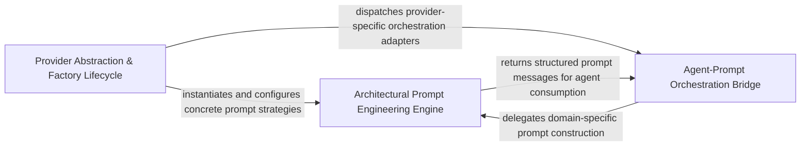

## Details

Centralized entry point and lifecycle manager that routes prompt requests to model-specific factories, decoupling agents from provider-specific logic.

### Provider Abstraction & Factory Lifecycle
Acts as the subsystem's gateway, implementing a factory pattern to instantiate the correct prompt generator based on the configured LLM provider, ensuring provider-agnostic operations.

**Related Classes/Methods**:

- `agents.prompts.prompt_factory.PromptFactory._create_prompt_factory`:59-82

**Source Files:**

- [`agents/prompts/prompt_factory.py`](https://github.com/CodeBoarding/CodeBoarding/blob/main/.codeboardingagents/prompts/prompt_factory.py)
  - `agents.prompts.prompt_factory.PromptFactory.__init__` ([L55-L57](https://github.com/CodeBoarding/CodeBoarding/blob/main/.codeboardingagents/prompts/prompt_factory.py#L55-L57)) - Method
  - `agents.prompts.prompt_factory.PromptFactory._create_prompt_factory` ([L59-L82](https://github.com/CodeBoarding/CodeBoarding/blob/main/.codeboardingagents/prompts/prompt_factory.py#L59-L82)) - Method

### Architectural Prompt Engineering Engine
The core logic center that transforms raw project metadata, static analysis results, and component clusters into structured, multi-turn prompt messages for architectural analysis.

**Related Classes/Methods**: _None_

**Source Files:**

- [`agents/prompts/claude_prompts.py`](https://github.com/CodeBoarding/CodeBoarding/blob/main/.codeboardingagents/prompts/claude_prompts.py)
  - `agents.prompts.claude_prompts.ClaudePromptFactory` ([L416-L471](https://github.com/CodeBoarding/CodeBoarding/blob/main/.codeboardingagents/prompts/claude_prompts.py#L416-L471)) - Class
- [`agents/prompts/deepseek_prompts.py`](https://github.com/CodeBoarding/CodeBoarding/blob/main/.codeboardingagents/prompts/deepseek_prompts.py)
  - `agents.prompts.deepseek_prompts.DeepSeekPromptFactory` ([L418-L473](https://github.com/CodeBoarding/CodeBoarding/blob/main/.codeboardingagents/prompts/deepseek_prompts.py#L418-L473)) - Class
- [`agents/prompts/gemini_flash_prompts.py`](https://github.com/CodeBoarding/CodeBoarding/blob/main/.codeboardingagents/prompts/gemini_flash_prompts.py)
  - `agents.prompts.gemini_flash_prompts.GeminiFlashPromptFactory` ([L369-L424](https://github.com/CodeBoarding/CodeBoarding/blob/main/.codeboardingagents/prompts/gemini_flash_prompts.py#L369-L424)) - Class
- [`agents/prompts/prompt_factory.py`](https://github.com/CodeBoarding/CodeBoarding/blob/main/.codeboardingagents/prompts/prompt_factory.py)
  - `agents.prompts.prompt_factory.PromptFactory.get_prompt` ([L84-L90](https://github.com/CodeBoarding/CodeBoarding/blob/main/.codeboardingagents/prompts/prompt_factory.py#L84-L90)) - Method
  - `agents.prompts.prompt_factory.PromptFactory.get_all_prompts` ([L92-L102](https://github.com/CodeBoarding/CodeBoarding/blob/main/.codeboardingagents/prompts/prompt_factory.py#L92-L102)) - Method

### Agent-Prompt Orchestration Bridge
Manages the stateful interaction between high-level agents and prompt factories, mapping agent context and analysis goals to appropriate factory methods.

**Related Classes/Methods**: _None_

**Source Files:**

- [`agents/prompts/glm_prompts.py`](https://github.com/CodeBoarding/CodeBoarding/blob/main/.codeboardingagents/prompts/glm_prompts.py)
  - `agents.prompts.glm_prompts.GLMPromptFactory` ([L449-L504](https://github.com/CodeBoarding/CodeBoarding/blob/main/.codeboardingagents/prompts/glm_prompts.py#L449-L504)) - Class
- [`agents/prompts/gpt_prompts.py`](https://github.com/CodeBoarding/CodeBoarding/blob/main/.codeboardingagents/prompts/gpt_prompts.py)
  - `agents.prompts.gpt_prompts.GPTPromptFactory` ([L479-L534](https://github.com/CodeBoarding/CodeBoarding/blob/main/.codeboardingagents/prompts/gpt_prompts.py#L479-L534)) - Class
- [`agents/prompts/kimi_prompts.py`](https://github.com/CodeBoarding/CodeBoarding/blob/main/.codeboardingagents/prompts/kimi_prompts.py)
  - `agents.prompts.kimi_prompts.KimiPromptFactory` ([L405-L460](https://github.com/CodeBoarding/CodeBoarding/blob/main/.codeboardingagents/prompts/kimi_prompts.py#L405-L460)) - Class

### [FAQ](https://github.com/CodeBoarding/GeneratedOnBoardings/tree/main?tab=readme-ov-file#faq)