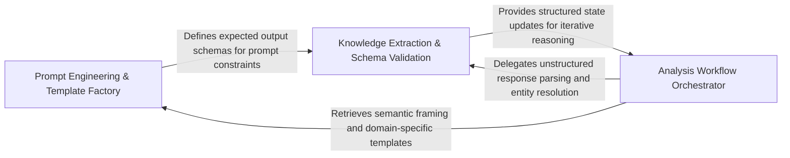

## Details

Encapsulates the architectural expertise of the system through specialized prompt templates and system messages that guide the LLM's reasoning process.

### Prompt Engineering & Template Factory
Acts as the central repository for architectural domain knowledge, encapsulating the logic for generating specialized system and user messages that guide the LLM through complex tasks.

**Related Classes/Methods**: _None_

**Source Files:**

- [`agents/details_agent.py`](https://github.com/CodeBoarding/CodeBoarding/blob/main/.codeboardingagents/details_agent.py)
  - `agents.details_agent.DetailsAgent.step_clusters_grouping` ([L87-L97](https://github.com/CodeBoarding/CodeBoarding/blob/main/.codeboardingagents/details_agent.py#L87-L97)) - Method
  - `agents.details_agent.DetailsAgent.step_final_analysis` ([L100-L175](https://github.com/CodeBoarding/CodeBoarding/blob/main/.codeboardingagents/details_agent.py#L100-L175)) - Method
  - `agents.details_agent.DetailsAgent.step_relation_analysis` ([L188-L223](https://github.com/CodeBoarding/CodeBoarding/blob/main/.codeboardingagents/details_agent.py#L188-L223)) - Method
- [`agents/file_index_models.py`](https://github.com/CodeBoarding/CodeBoarding/blob/main/.codeboardingagents/file_index_models.py)
  - `agents.file_index_models.FileEntry.merge_method_spans` ([L105-L114](https://github.com/CodeBoarding/CodeBoarding/blob/main/.codeboardingagents/file_index_models.py#L105-L114)) - Method
- [`agents/incremental_agent.py`](https://github.com/CodeBoarding/CodeBoarding/blob/main/.codeboardingagents/incremental_agent.py)
  - `agents.incremental_agent.IncrementalAgent.__init__` ([L54-L86](https://github.com/CodeBoarding/CodeBoarding/blob/main/.codeboardingagents/incremental_agent.py#L54-L86)) - Method

### Analysis Workflow Orchestrator
Manages the stateful execution of the architectural analysis process, defining sequential reasoning steps and ensuring correct prompt templates are applied throughout the agent's lifecycle.

**Related Classes/Methods**: _None_

**Source Files:**

- [`agents/incremental_agent.py`](https://github.com/CodeBoarding/CodeBoarding/blob/main/.codeboardingagents/incremental_agent.py)
  - `agents.incremental_agent.IncrementalAgent.step_api_surfaces` ([L250-L259](https://github.com/CodeBoarding/CodeBoarding/blob/main/.codeboardingagents/incremental_agent.py#L250-L259)) - Method
  - `agents.incremental_agent.IncrementalAgent.generate_scope_relations` ([L305-L326](https://github.com/CodeBoarding/CodeBoarding/blob/main/.codeboardingagents/incremental_agent.py#L305-L326)) - Method
  - `agents.incremental_agent.IncrementalAgent.generate_all_scope_relations` ([L329-L350](https://github.com/CodeBoarding/CodeBoarding/blob/main/.codeboardingagents/incremental_agent.py#L329-L350)) - Method

### Knowledge Extraction & Schema Validation
Handles the return path of the prompt lifecycle, parsing unstructured LLM responses into structured Pydantic models and assigning stable identifiers to discovered architectural components.

**Related Classes/Methods**: _None_

**Source Files:**

- [`agents/incremental_agent.py`](https://github.com/CodeBoarding/CodeBoarding/blob/main/.codeboardingagents/incremental_agent.py)
  - `agents.incremental_agent.IncrementalAgent.step_relation_analysis` ([L262-L302](https://github.com/CodeBoarding/CodeBoarding/blob/main/.codeboardingagents/incremental_agent.py#L262-L302)) - Method
  - `agents.incremental_agent._cluster_analysis_for_scope` ([L353-L375](https://github.com/CodeBoarding/CodeBoarding/blob/main/.codeboardingagents/incremental_agent.py#L353-L375)) - Function

### [FAQ](https://github.com/CodeBoarding/GeneratedOnBoardings/tree/main?tab=readme-ov-file#faq)