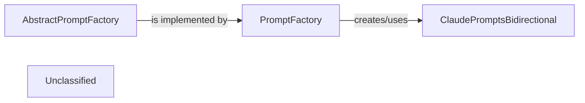

## Details

The Prompt Management Layer subsystem focuses on the dynamic creation and management of prompts for various LLMs, aligning with the 'AI Interpretation Layer' and 'Modular Design' aspects of the project. This subsystem exhibits a Factory design pattern. The AbstractPromptFactory defines the interface, which PromptFactory implements. PromptFactory then acts as the client that instantiates concrete prompt products, such as ClaudePromptsBidirectional, based on runtime conditions. This structure ensures modularity and allows for easy addition of new LLM-specific prompt implementations without modifying the core PromptFactory logic, aligning with the project's emphasis on extensibility and modular design.

### AbstractPromptFactory
Defines the abstract interface or contract for creating prompts. It establishes a common blueprint for all concrete prompt factories, ensuring consistency and extensibility in prompt generation.

**Related Classes/Methods**:

- <a href="https://github.com/CodeBoarding/CodeBoarding/blob/main/.codeboardingagents/prompts/abstract_prompt_factory.py" target="_blank" rel="noopener noreferrer">`agents.prompts.abstract_prompt_factory`</a>

### PromptFactory
A concrete implementation of the AbstractPromptFactory. This component is responsible for the dynamic creation and selection of appropriate prompts based on the current analysis context and the target LLM. It acts as the primary orchestrator within the prompt management layer.

**Related Classes/Methods**:

- <a href="https://github.com/CodeBoarding/CodeBoarding/blob/main/.codeboardingagents/prompts/prompt_factory.py" target="_blank" rel="noopener noreferrer">`agents.prompts.prompt_factory`</a>

### ClaudePromptsBidirectional
A concrete prompt implementation specifically designed for the Claude LLM. It encapsulates the prompt templates and any specific formatting or interaction logic required for effective communication with Claude.

**Related Classes/Methods**:

- <a href="https://github.com/CodeBoarding/CodeBoarding/blob/main/.codeboardingagents/prompts/claude_prompts_bidirectional.py" target="_blank" rel="noopener noreferrer">`agents.prompts.claude_prompts_bidirectional`</a>

### Unclassified
Component for all unclassified files and utility functions (Utility functions/External Libraries/Dependencies)

**Related Classes/Methods**: _None_

### [FAQ](https://github.com/CodeBoarding/GeneratedOnBoardings/tree/main?tab=readme-ov-file#faq)
