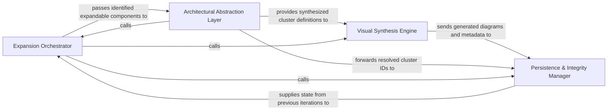

## Details

The core execution logic that performs depth-first or breadth-first expansion of the software architecture and synthesizes final visual representations.

### Expansion Orchestrator
Manages the iterative traversal logic of the codebase, determining which components require deeper analysis based on complexity or depth constraints.

**Related Classes/Methods**:

- `agents.planner_agent.get_expandable_components`:94-117

**Source Files:**

- [`agents/planner_agent.py`](https://github.com/CodeBoarding/CodeBoarding/blob/main/.codeboardingagents/planner_agent.py)
  - `agents.planner_agent.get_expandable_components` ([L94-L117](https://github.com/CodeBoarding/CodeBoarding/blob/main/.codeboardingagents/planner_agent.py#L94-L117)) - Function
- [`diagram_analysis/diagram_generator.py`](https://github.com/CodeBoarding/CodeBoarding/blob/main/.codeboardingdiagram_analysis/diagram_generator.py)
  - `diagram_analysis.diagram_generator.DiagramGenerator._generate_subcomponents` ([L378-L455](https://github.com/CodeBoarding/CodeBoarding/blob/main/.codeboardingdiagram_analysis/diagram_generator.py#L378-L455)) - Method
  - `diagram_analysis.diagram_generator.DiagramGenerator._generate_subcomponents.submit_component` ([L396-L400](https://github.com/CodeBoarding/CodeBoarding/blob/main/.codeboardingdiagram_analysis/diagram_generator.py#L396-L400)) - Function

### Architectural Abstraction Layer
Uses LLM-driven reasoning to group raw code entities into logical functional blocks and synthesizes high-level descriptions.

**Related Classes/Methods**: _None_

**Source Files:**

- [`diagram_analysis/analysis_json.py`](https://github.com/CodeBoarding/CodeBoarding/blob/main/.codeboardingdiagram_analysis/analysis_json.py)
  - `diagram_analysis.analysis_json.NotAnalyzedFile` ([L56-L58](https://github.com/CodeBoarding/CodeBoarding/blob/main/.codeboardingdiagram_analysis/analysis_json.py#L56-L58)) - Class
  - `diagram_analysis.analysis_json.FileCoverageReport` ([L70-L75](https://github.com/CodeBoarding/CodeBoarding/blob/main/.codeboardingdiagram_analysis/analysis_json.py#L70-L75)) - Class
- [`diagram_analysis/diagram_generator.py`](https://github.com/CodeBoarding/CodeBoarding/blob/main/.codeboardingdiagram_analysis/diagram_generator.py)
  - `diagram_analysis.diagram_generator.DiagramGenerator.process_component` ([L123-L126](https://github.com/CodeBoarding/CodeBoarding/blob/main/.codeboardingdiagram_analysis/diagram_generator.py#L123-L126)) - Method
  - `diagram_analysis.diagram_generator.DiagramGenerator._process_component` ([L128-L146](https://github.com/CodeBoarding/CodeBoarding/blob/main/.codeboardingdiagram_analysis/diagram_generator.py#L128-L146)) - Method
  - `diagram_analysis.diagram_generator.DiagramGenerator._strip_ignored` ([L168-L188](https://github.com/CodeBoarding/CodeBoarding/blob/main/.codeboardingdiagram_analysis/diagram_generator.py#L168-L188)) - Method
  - `diagram_analysis.diagram_generator.DiagramGenerator._write_file_coverage` ([L201-L217](https://github.com/CodeBoarding/CodeBoarding/blob/main/.codeboardingdiagram_analysis/diagram_generator.py#L201-L217)) - Method
  - `diagram_analysis.diagram_generator.DiagramGenerator.generate_analysis` ([L458-L501](https://github.com/CodeBoarding/CodeBoarding/blob/main/.codeboardingdiagram_analysis/diagram_generator.py#L458-L501)) - Method

### Visual Synthesis Engine
Translates abstracted architectural models into visual representations like Mermaid.js diagrams by mapping static relationships.

**Related Classes/Methods**:

- `diagram_analysis.diagram_generator.DiagramGenerator.generate_analysis`:458-501

**Source Files:**

- [`diagram_analysis/diagram_generator.py`](https://github.com/CodeBoarding/CodeBoarding/blob/main/.codeboardingdiagram_analysis/diagram_generator.py)
  - `diagram_analysis.diagram_generator._component_depth` ([L56-L60](https://github.com/CodeBoarding/CodeBoarding/blob/main/.codeboardingdiagram_analysis/diagram_generator.py#L56-L60)) - Function
  - `diagram_analysis.diagram_generator._component_expansion_seeds` ([L63-L69](https://github.com/CodeBoarding/CodeBoarding/blob/main/.codeboardingdiagram_analysis/diagram_generator.py#L63-L69)) - Function
- [`diagram_analysis/io_utils.py`](https://github.com/CodeBoarding/CodeBoarding/blob/main/.codeboardingdiagram_analysis/io_utils.py)
  - `diagram_analysis.io_utils.load_analysis_commit_hash` ([L322-L349](https://github.com/CodeBoarding/CodeBoarding/blob/main/.codeboardingdiagram_analysis/io_utils.py#L322-L349)) - Function
  - `diagram_analysis.io_utils.save_analysis` ([L377-L396](https://github.com/CodeBoarding/CodeBoarding/blob/main/.codeboardingdiagram_analysis/io_utils.py#L377-L396)) - Function

### Persistence & Integrity Manager
Ensures synthesized data is correctly mapped back to physical source code and handles resolution of shifting line numbers and file references.

**Related Classes/Methods**:

- `diagram_analysis.io_utils.save_analysis`:377-396

**Source Files:**

- [`repo_utils/__init__.py`](https://github.com/CodeBoarding/CodeBoarding/blob/main/.codeboardingrepo_utils/__init__.py)
  - `repo_utils.__init__.get_git_commit_hash` ([L177-L182](https://github.com/CodeBoarding/CodeBoarding/blob/main/.codeboardingrepo_utils/__init__.py#L177-L182)) - Function
  - `repo_utils.__init__.get_branch` ([L227-L232](https://github.com/CodeBoarding/CodeBoarding/blob/main/.codeboardingrepo_utils/__init__.py#L227-L232)) - Function
- [`telemetry/events.py`](https://github.com/CodeBoarding/CodeBoarding/blob/main/.codeboardingtelemetry/events.py)
  - `telemetry.events.track_analysis` ([L160-L222](https://github.com/CodeBoarding/CodeBoarding/blob/main/.codeboardingtelemetry/events.py#L160-L222)) - Function

### [FAQ](https://github.com/CodeBoarding/GeneratedOnBoardings/tree/main?tab=readme-ov-file#faq)