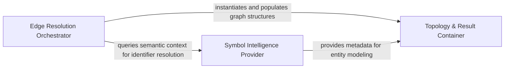

## Details

The engine responsible for connecting symbols by mapping call sites to definitions and instantiating formal Edge objects.

### Edge Resolution Orchestrator
The functional heart of the subsystem responsible for high-level edge discovery and transforming call sites into formal relationships.

**Related Classes/Methods**:

- `static_analyzer.engine.call_graph_builder.CallGraphBuilder._build_edges`:120-124
- `static_analyzer.engine.edge_builder.build_edges_via_definitions`:247-276
- `static_analyzer.engine.edge_builder._resolve_definitions`:300-388

**Source Files:**

- [`static_analyzer/engine/call_graph_builder.py`](https://github.com/CodeBoarding/CodeBoarding/blob/main/.codeboardingstatic_analyzer/engine/call_graph_builder.py)
  - `static_analyzer.engine.call_graph_builder.CallGraphBuilder._build_edges` ([L120-L124](https://github.com/CodeBoarding/CodeBoarding/blob/main/.codeboardingstatic_analyzer/engine/call_graph_builder.py#L120-L124)) - Method
  - `static_analyzer.engine.call_graph_builder.CallGraphBuilder._postprocess_edges` ([L218-L292](https://github.com/CodeBoarding/CodeBoarding/blob/main/.codeboardingstatic_analyzer/engine/call_graph_builder.py#L218-L292)) - Method
- [`static_analyzer/engine/edge_builder.py`](https://github.com/CodeBoarding/CodeBoarding/blob/main/.codeboardingstatic_analyzer/engine/edge_builder.py)
  - `static_analyzer.engine.edge_builder.ImplementationQuery` ([L33-L38](https://github.com/CodeBoarding/CodeBoarding/blob/main/.codeboardingstatic_analyzer/engine/edge_builder.py#L33-L38)) - Class
  - `static_analyzer.engine.edge_builder.DefinitionResolution` ([L42-L46](https://github.com/CodeBoarding/CodeBoarding/blob/main/.codeboardingstatic_analyzer/engine/edge_builder.py#L42-L46)) - Class
  - `static_analyzer.engine.edge_builder._prepare_trackable_symbols` ([L146-L177](https://github.com/CodeBoarding/CodeBoarding/blob/main/.codeboardingstatic_analyzer/engine/edge_builder.py#L146-L177)) - Function
  - `static_analyzer.engine.edge_builder.build_edges_via_definitions` ([L247-L276](https://github.com/CodeBoarding/CodeBoarding/blob/main/.codeboardingstatic_analyzer/engine/edge_builder.py#L247-L276)) - Function
  - `static_analyzer.engine.edge_builder._build_definition_lookups` ([L279-L297](https://github.com/CodeBoarding/CodeBoarding/blob/main/.codeboardingstatic_analyzer/engine/edge_builder.py#L279-L297)) - Function
  - `static_analyzer.engine.edge_builder._resolve_definitions` ([L300-L388](https://github.com/CodeBoarding/CodeBoarding/blob/main/.codeboardingstatic_analyzer/engine/edge_builder.py#L300-L388)) - Function
  - `static_analyzer.engine.edge_builder._call_site` ([L459-L461](https://github.com/CodeBoarding/CodeBoarding/blob/main/.codeboardingstatic_analyzer/engine/edge_builder.py#L459-L461)) - Function
  - `static_analyzer.engine.edge_builder._add_edge_site` ([L464-L465](https://github.com/CodeBoarding/CodeBoarding/blob/main/.codeboardingstatic_analyzer/engine/edge_builder.py#L464-L465)) - Function
  - `static_analyzer.engine.edge_builder._add_edge_call_site` ([L468-L471](https://github.com/CodeBoarding/CodeBoarding/blob/main/.codeboardingstatic_analyzer/engine/edge_builder.py#L468-L471)) - Function
  - `static_analyzer.engine.edge_builder._is_valid_edge` ([L474-L486](https://github.com/CodeBoarding/CodeBoarding/blob/main/.codeboardingstatic_analyzer/engine/edge_builder.py#L474-L486)) - Function
  - `static_analyzer.engine.edge_builder._resolve_definition_to_symbol` ([L489-L520](https://github.com/CodeBoarding/CodeBoarding/blob/main/.codeboardingstatic_analyzer/engine/edge_builder.py#L489-L520)) - Function
  - `static_analyzer.engine.edge_builder._best_candidate` ([L523-L531](https://github.com/CodeBoarding/CodeBoarding/blob/main/.codeboardingstatic_analyzer/engine/edge_builder.py#L523-L531)) - Function
- [`static_analyzer/engine/language_adapter.py`](https://github.com/CodeBoarding/CodeBoarding/blob/main/.codeboardingstatic_analyzer/engine/language_adapter.py)
  - `static_analyzer.engine.language_adapter.LanguageAdapter.edge_strategy` ([L294-L300](https://github.com/CodeBoarding/CodeBoarding/blob/main/.codeboardingstatic_analyzer/engine/language_adapter.py#L294-L300)) - Method
- [`static_analyzer/engine/models.py`](https://github.com/CodeBoarding/CodeBoarding/blob/main/.codeboardingstatic_analyzer/engine/models.py)
  - `static_analyzer.engine.models.CallSite.from_lsp_position` ([L42-L43](https://github.com/CodeBoarding/CodeBoarding/blob/main/.codeboardingstatic_analyzer/engine/models.py#L42-L43)) - Method
  - `static_analyzer.engine.models.CallSite.human_line` ([L46-L47](https://github.com/CodeBoarding/CodeBoarding/blob/main/.codeboardingstatic_analyzer/engine/models.py#L46-L47)) - Method
  - `static_analyzer.engine.models.CallSite.human_column` ([L50-L51](https://github.com/CodeBoarding/CodeBoarding/blob/main/.codeboardingstatic_analyzer/engine/models.py#L50-L51)) - Method
- [`static_analyzer/engine/protocols.py`](https://github.com/CodeBoarding/CodeBoarding/blob/main/.codeboardingstatic_analyzer/engine/protocols.py)
  - `static_analyzer.engine.protocols.EdgeBuildAdapter.should_track_for_edges` ([L44-L44](https://github.com/CodeBoarding/CodeBoarding/blob/main/.codeboardingstatic_analyzer/engine/protocols.py#L44-L44)) - Method
  - `static_analyzer.engine.protocols.EdgeBuildAdapter.is_callable` ([L48-L48](https://github.com/CodeBoarding/CodeBoarding/blob/main/.codeboardingstatic_analyzer/engine/protocols.py#L48-L48)) - Method

### Symbol Intelligence Provider
Provides the semantic source of truth for identifier resolution, managing symbol lookups and scope validation.

**Related Classes/Methods**:

- `static_analyzer.engine.symbol_table.SymbolTable.is_local_variable`:296-328
- `static_analyzer.engine.models.SymbolInfo.definition_location`:28-30

**Source Files:**

- [`static_analyzer/engine/models.py`](https://github.com/CodeBoarding/CodeBoarding/blob/main/.codeboardingstatic_analyzer/engine/models.py)
  - `static_analyzer.engine.models.SymbolInfo.definition_location` ([L28-L30](https://github.com/CodeBoarding/CodeBoarding/blob/main/.codeboardingstatic_analyzer/engine/models.py#L28-L30)) - Method
- [`static_analyzer/engine/symbol_table.py`](https://github.com/CodeBoarding/CodeBoarding/blob/main/.codeboardingstatic_analyzer/engine/symbol_table.py)
  - `static_analyzer.engine.symbol_table.SymbolTable.symbols` ([L42-L44](https://github.com/CodeBoarding/CodeBoarding/blob/main/.codeboardingstatic_analyzer/engine/symbol_table.py#L42-L44)) - Method
  - `static_analyzer.engine.symbol_table.SymbolTable.class_to_ctors` ([L57-L59](https://github.com/CodeBoarding/CodeBoarding/blob/main/.codeboardingstatic_analyzer/engine/symbol_table.py#L57-L59)) - Method
  - `static_analyzer.engine.symbol_table.SymbolTable.is_local_variable` ([L296-L328](https://github.com/CodeBoarding/CodeBoarding/blob/main/.codeboardingstatic_analyzer/engine/symbol_table.py#L296-L328)) - Method

### Topology & Result Container
Defines the data structures and schemas for resolved relationships, serving as the persistence and aggregation layer for the Call Flow Graph.

**Related Classes/Methods**:

- `static_analyzer.engine.models.CallFlowGraph`:72-87
- `static_analyzer.engine.models.AnalysisResults`:101-131
- `static_analyzer.engine.models.CallSite`:34-59

**Source Files:**

- [`static_analyzer/engine/models.py`](https://github.com/CodeBoarding/CodeBoarding/blob/main/.codeboardingstatic_analyzer/engine/models.py)
  - `static_analyzer.engine.models.CallSite` ([L34-L59](https://github.com/CodeBoarding/CodeBoarding/blob/main/.codeboardingstatic_analyzer/engine/models.py#L34-L59)) - Class
  - `static_analyzer.engine.models.CallFlowGraph` ([L72-L87](https://github.com/CodeBoarding/CodeBoarding/blob/main/.codeboardingstatic_analyzer/engine/models.py#L72-L87)) - Class
  - `static_analyzer.engine.models.AnalysisResults` ([L101-L131](https://github.com/CodeBoarding/CodeBoarding/blob/main/.codeboardingstatic_analyzer/engine/models.py#L101-L131)) - Class
  - `static_analyzer.engine.models.AnalysisResults.__init__` ([L104-L105](https://github.com/CodeBoarding/CodeBoarding/blob/main/.codeboardingstatic_analyzer/engine/models.py#L104-L105)) - Method
  - `static_analyzer.engine.models.AnalysisResults.add_language_result` ([L107-L108](https://github.com/CodeBoarding/CodeBoarding/blob/main/.codeboardingstatic_analyzer/engine/models.py#L107-L108)) - Method
  - `static_analyzer.engine.models.AnalysisResults.get_languages` ([L110-L111](https://github.com/CodeBoarding/CodeBoarding/blob/main/.codeboardingstatic_analyzer/engine/models.py#L110-L111)) - Method
  - `static_analyzer.engine.models.AnalysisResults.get_hierarchy` ([L113-L116](https://github.com/CodeBoarding/CodeBoarding/blob/main/.codeboardingstatic_analyzer/engine/models.py#L113-L116)) - Method
  - `static_analyzer.engine.models.AnalysisResults.get_cfg` ([L118-L121](https://github.com/CodeBoarding/CodeBoarding/blob/main/.codeboardingstatic_analyzer/engine/models.py#L118-L121)) - Method
  - `static_analyzer.engine.models.AnalysisResults.get_package_dependencies` ([L123-L126](https://github.com/CodeBoarding/CodeBoarding/blob/main/.codeboardingstatic_analyzer/engine/models.py#L123-L126)) - Method
  - `static_analyzer.engine.models.AnalysisResults.get_source_files` ([L128-L131](https://github.com/CodeBoarding/CodeBoarding/blob/main/.codeboardingstatic_analyzer/engine/models.py#L128-L131)) - Method

### [FAQ](https://github.com/CodeBoarding/GeneratedOnBoardings/tree/main?tab=readme-ov-file#faq)