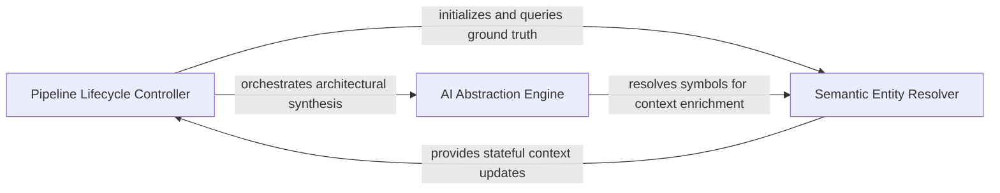

## Details

Acts as the primary controller for the visualization pipeline, managing the sequence of operations from receiving analyzed project data to writing the final HTML file.

### Pipeline Lifecycle Controller
Acts as the central coordinator for the report generation workflow, managing the execution sequence and data flow from initial analysis to final output.

**Related Classes/Methods**: _None_

**Source Files:**

- [`agents/agent_responses.py`](https://github.com/CodeBoarding/CodeBoarding/blob/main/.codeboardingagents/agent_responses.py)
  - `agents.agent_responses.ComponentApiSurface.llm_str` ([L575-L587](https://github.com/CodeBoarding/CodeBoarding/blob/main/.codeboardingagents/agent_responses.py#L575-L587)) - Method

### AI Abstraction Engine
Uses LLM-driven agents to perform high-level reasoning over static analysis data, grouping code clusters into logical architectural components and identifying API surfaces.

**Related Classes/Methods**: _None_

**Source Files:**

- [`agents/agent_responses.py`](https://github.com/CodeBoarding/CodeBoarding/blob/main/.codeboardingagents/agent_responses.py)
  - `agents.agent_responses.SourceCodeReference.llm_str` ([L153-L161](https://github.com/CodeBoarding/CodeBoarding/blob/main/.codeboardingagents/agent_responses.py#L153-L161)) - Method

### Semantic Entity Resolver
Provides the deterministic foundation for the report by managing unique identifiers, cross-references, and reconciling source code locations for accurate navigation.

**Related Classes/Methods**: _None_

**Source Files:**

- [`output_generators/html.py`](https://github.com/CodeBoarding/CodeBoarding/blob/main/.codeboardingoutput_generators/html.py)
  - `output_generators.html.generate_cytoscape_data` ([L10-L56](https://github.com/CodeBoarding/CodeBoarding/blob/main/.codeboardingoutput_generators/html.py#L10-L56)) - Function

### [FAQ](https://github.com/CodeBoarding/GeneratedOnBoardings/tree/main?tab=readme-ov-file#faq)