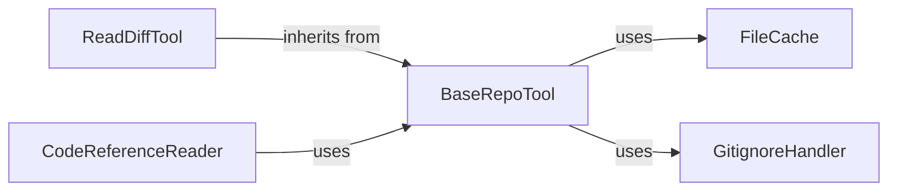

## Details

Supplies shared utilities such as file caching, .gitignore handling, and path resolution. It ensures consistent and optimized repository interaction across all analysis components, acting as a foundational service.

### BaseRepoTool
Core repository context manager that provides file caching, .gitignore filtering, and normalized path resolution for all analysis components.

**Related Classes/Methods**:

- <a href="https://github.com/CodeBoarding/CodeBoarding/blob/main/.codeboardingagents/tools/read_source.py" target="_blank" rel="noopener noreferrer">`agents.tools.read_source.BaseRepoTool`</a>

### FileCache
Utility that stores and retrieves file contents to reduce redundant I/O and speed up repository interactions.

**Related Classes/Methods**:

- <a href="https://github.com/CodeBoarding/CodeBoarding/blob/main/.codeboardingagents/tools/read_source.py" target="_blank" rel="noopener noreferrer">`agents.tools.read_source.FileCache`</a>

### GitignoreHandler
Parses .gitignore files and provides filtering logic to exclude irrelevant paths from analysis.

**Related Classes/Methods**:

- <a href="https://github.com/CodeBoarding/CodeBoarding/blob/main/.codeboardingagents/tools/read_source.py" target="_blank" rel="noopener noreferrer">`agents.tools.read_source.GitignoreHandler`</a>

### ReadDiffTool
Tool that extends BaseRepoTool to read and parse git diff output, exposing structured change information for incremental analysis.

**Related Classes/Methods**:

- <a href="https://github.com/CodeBoarding/CodeBoarding/blob/main/.codeboardingagents/tools/read_source.py" target="_blank" rel="noopener noreferrer">`agents.tools.read_source.ReadDiffTool`</a>

### CodeReferenceReader
Component that resolves abstract code references to concrete file paths and returns raw source code strings for downstream processing.

**Related Classes/Methods**:

- <a href="https://github.com/CodeBoarding/CodeBoarding/blob/main/.codeboardingagents/tools/read_source.py" target="_blank" rel="noopener noreferrer">`agents.tools.read_source.CodeReferenceReader`</a>

### [FAQ](https://github.com/CodeBoarding/GeneratedOnBoardings/tree/main?tab=readme-ov-file#faq)