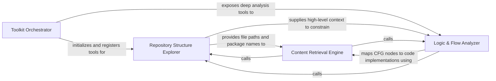

## Details

Provides tools for the agent to interact directly with source code and static analysis results.

### Toolkit Orchestrator
Manages the lifecycle and registration of all tools available to the agent, acting as a central registry for tool discovery and execution.

**Related Classes/Methods**: _None_

**Source Files:**

- [`agents/agent.py`](https://github.com/CodeBoarding/CodeBoarding/blob/main/.codeboardingagents/agent.py)
  - `agents.agent.CodeBoardingAgent._invoke_with_timeout` ([L164-L202](https://github.com/CodeBoarding/CodeBoarding/blob/main/.codeboardingagents/agent.py#L164-L202)) - Method
  - `agents.agent.CodeBoardingAgent._invoke_with_timeout.invoke_target` ([L172-L180](https://github.com/CodeBoarding/CodeBoarding/blob/main/.codeboardingagents/agent.py#L172-L180)) - Function

### Repository Structure Explorer
Provides high-level architectural context by mapping the physical and logical organization of the project, including file hierarchies and dependencies.

**Related Classes/Methods**: _None_

**Source Files:**

- [`agents/agent.py`](https://github.com/CodeBoarding/CodeBoarding/blob/main/.codeboardingagents/agent.py)
  - `agents.agent.CodeBoardingAgent._parse_invoke` ([L204-L207](https://github.com/CodeBoarding/CodeBoarding/blob/main/.codeboardingagents/agent.py#L204-L207)) - Method
  - `agents.agent.CodeBoardingAgent._parse_response.classify` ([L357-L365](https://github.com/CodeBoarding/CodeBoarding/blob/main/.codeboardingagents/agent.py#L357-L365)) - Function
  - `agents.agent.CodeBoardingAgent._structured_parse` ([L382-L407](https://github.com/CodeBoarding/CodeBoarding/blob/main/.codeboardingagents/agent.py#L382-L407)) - Method

### Content Retrieval Engine
Handles the direct extraction of textual data from the repository, including source code, docstrings, and configuration files.

**Related Classes/Methods**: _None_

**Source Files:**

- [`agents/agent.py`](https://github.com/CodeBoarding/CodeBoarding/blob/main/.codeboardingagents/agent.py)
  - `agents.agent.CodeBoardingAgent._validation_invoke` ([L236-L331](https://github.com/CodeBoarding/CodeBoarding/blob/main/.codeboardingagents/agent.py#L236-L331)) - Method
  - `agents.agent.CodeBoardingAgent._parse_response` ([L333-L380](https://github.com/CodeBoarding/CodeBoarding/blob/main/.codeboardingagents/agent.py#L333-L380)) - Method
  - `agents.agent.CodeBoardingAgent._parse_response.on_exhausted` ([L367-L372](https://github.com/CodeBoarding/CodeBoarding/blob/main/.codeboardingagents/agent.py#L367-L372)) - Function

### Logic & Flow Analyzer
Exposes deep semantic relationships within the code by querying the Control Flow Graph and call trees to trace execution paths.

**Related Classes/Methods**: _None_

**Source Files:**

- [`agents/agent.py`](https://github.com/CodeBoarding/CodeBoarding/blob/main/.codeboardingagents/agent.py)
  - `agents.agent.CodeBoardingAgent._score_result` ([L209-L234](https://github.com/CodeBoarding/CodeBoarding/blob/main/.codeboardingagents/agent.py#L209-L234)) - Method
  - `agents.agent.CodeBoardingAgent._parse_response.call_once` ([L348-L355](https://github.com/CodeBoarding/CodeBoarding/blob/main/.codeboardingagents/agent.py#L348-L355)) - Function

### [FAQ](https://github.com/CodeBoarding/GeneratedOnBoardings/tree/main?tab=readme-ov-file#faq)