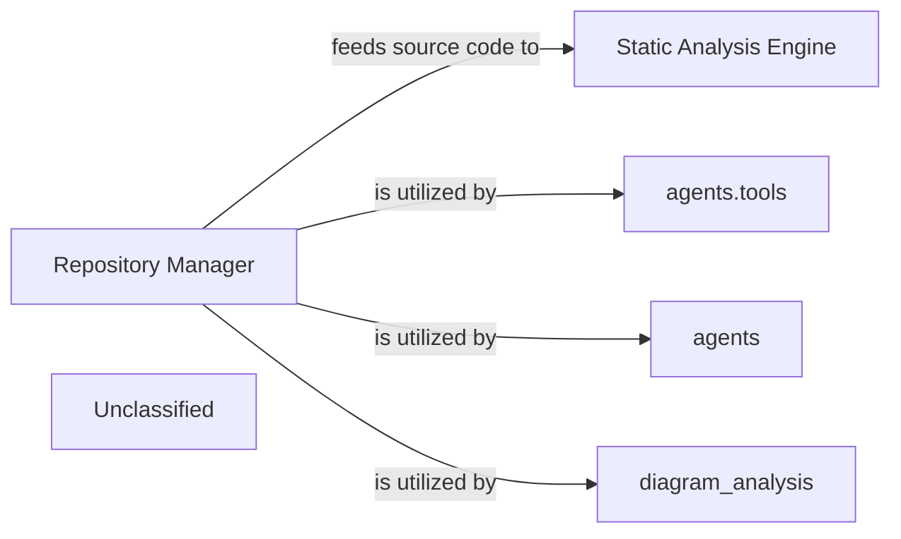

## Details

The core of this subsystem is the `Repository Manager`, which serves as the central gateway for all interactions with code repositories. It provides essential functionalities such as cloning, updating, and reading repository contents, making raw source code and metadata accessible. This information is then consumed by the `Static Analysis Engine` for in-depth code examination. Intelligent `agents` and their specialized `agents.tools` rely on the `Repository Manager` to access and manipulate codebase information, facilitating their operational tasks. Furthermore, the `diagram_analysis` component leverages the `Repository Manager` to retrieve necessary data for generating and analyzing architectural diagrams. This design establishes a clear, centralized mechanism for managing and distributing repository data across various analytical and operational components.

### Repository Manager [[Expand]](./Repository_Manager.md)
This component is responsible for all interactions with code repositories. It handles fundamental operations such as cloning repositories, updating their state, reading specific files, and navigating the project's directory structure. It serves as the primary source for raw source code and repository-specific metadata (e.g., Git diffs), making this information available for subsequent analysis stages. Its role is crucial for ingesting the initial data into the codebase analysis pipeline.

**Related Classes/Methods**:

- <a href="https://github.com/CodeBoarding/CodeBoarding/blob/main/.codeboardingrepo_utils/__init__.py" target="_blank" rel="noopener noreferrer">`/home/ubuntu/CodeBoarding/repo/CodeBoarding/repo_utils/__init__.py`</a>
- <a href="https://github.com/CodeBoarding/CodeBoarding/blob/main/.codeboardingrepo_utils/git_diff.py" target="_blank" rel="noopener noreferrer">`/home/ubuntu/CodeBoarding/repo/CodeBoarding/repo_utils/git_diff.py`</a>

### Static Analysis Engine [[Expand]](./Static_Analysis_Engine.md)
This component is responsible for performing various static analyses on the source code provided by the `Repository Manager`. It processes the code to identify patterns, potential issues, or extract structural information without executing it.

**Related Classes/Methods**:

- `Static Analysis Engine`

### agents.tools
This component represents a collection of specialized tools used by intelligent agents. These tools interact with the `Repository Manager` to access and manipulate repository data, enabling agents to perform tasks requiring code or repository information.

**Related Classes/Methods**:

- <a href="https://github.com/CodeBoarding/CodeBoarding/blob/main/.codeboardingagents/tools" target="_blank" rel="noopener noreferrer">`agents.tools`</a>

### agents
This component encompasses the intelligent agents within the system. These agents utilize the `Repository Manager` (potentially through `agents.tools`) to interact with the codebase, retrieve information, and execute operations based on their objectives.

**Related Classes/Methods**:

- <a href="https://github.com/CodeBoarding/CodeBoarding/blob/main/.codeboardingagents/__init__.py" target="_blank" rel="noopener noreferrer">`agents`</a>

### diagram_analysis
This component is responsible for analyzing and potentially generating diagrams based on the project's codebase. It utilizes the `Repository Manager` to access file structures and source code necessary for diagrammatic representation and analysis.

**Related Classes/Methods**:

- <a href="https://github.com/CodeBoarding/CodeBoarding/blob/main/.codeboardingdiagram_analysis" target="_blank" rel="noopener noreferrer">`diagram_analysis`</a>

### Unclassified
Component for all unclassified files and utility functions (Utility functions/External Libraries/Dependencies)

**Related Classes/Methods**: _None_

### [FAQ](https://github.com/CodeBoarding/GeneratedOnBoardings/tree/main?tab=readme-ov-file#faq)
