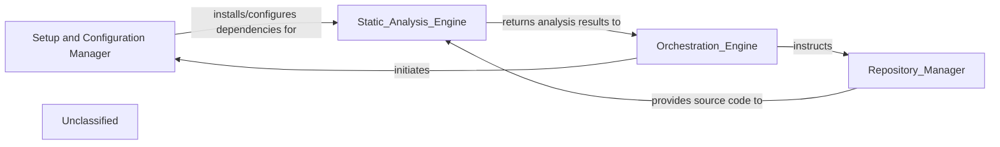

## Details

The system is orchestrated by the Orchestration Engine, which manages the entire analysis workflow. Before any code analysis begins, the Orchestration Engine delegates to the Setup and Configuration Manager to prepare the environment by installing essential language servers (e.g., Pyright, TypeScript Language Server) and static analysis tools (e.g., Tokei, Gopls), and configuring their paths. Once the environment is ready, the Orchestration Engine directs the Repository Manager to handle all interactions with code repositories, including cloning and fetching updates. The Repository Manager then provides the retrieved source code to the Static Analysis Engine, which performs in-depth code analysis using the pre-configured tools and language servers. This modular architecture ensures a clear separation of concerns, enabling efficient setup, repository management, and static code analysis.

### Setup and Configuration Manager
responsible for preparing the environment and configuring external tools and language servers that are essential for the Static Analysis Engine.

**Related Classes/Methods**:

- <a href="https://github.com/CodeBoarding/CodeBoarding/blob/main/.codeboardingsetup.py" target="_blank" rel="noopener noreferrer">`check_uv_environment`</a>
- <a href="https://github.com/CodeBoarding/CodeBoarding/blob/main/.codeboardingsetup.py" target="_blank" rel="noopener noreferrer">`check_npm`</a>
- <a href="https://github.com/CodeBoarding/CodeBoarding/blob/main/.codeboardingsetup.py" target="_blank" rel="noopener noreferrer">`install_node_servers`</a>
- <a href="https://github.com/CodeBoarding/CodeBoarding/blob/main/.codeboardingsetup.py" target="_blank" rel="noopener noreferrer">`download_binary_from_gdrive`</a>
- <a href="https://github.com/CodeBoarding/CodeBoarding/blob/main/.codeboardingsetup.py" target="_blank" rel="noopener noreferrer">`update_static_analysis_config`</a>
- <a href="https://github.com/CodeBoarding/CodeBoarding/blob/main/.codeboardingsetup.py" target="_blank" rel="noopener noreferrer">`init_dot_env_file`</a>

### Unclassified
Component for all unclassified files and utility functions (Utility functions/External Libraries/Dependencies)

**Related Classes/Methods**: _None_

### [FAQ](https://github.com/CodeBoarding/GeneratedOnBoardings/tree/main?tab=readme-ov-file#faq)
