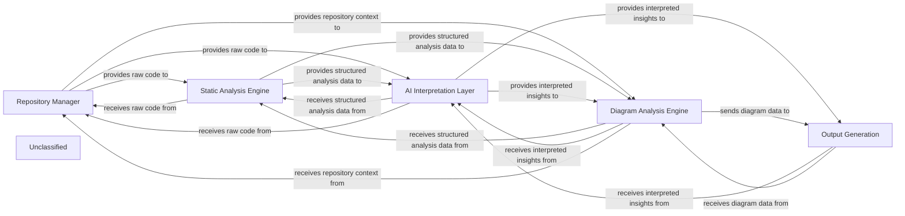

## Details

The system is structured around a core set of components designed for comprehensive code analysis, interpretation, and visualization. The Repository Manager serves as the foundational layer, providing access to the codebase. The Static Analysis Engine then processes this code to extract structural and relational information using an enhanced Language Server Protocol (LSP) client. This static analysis data is fed into the AI Interpretation Layer for deeper, AI-driven insights. A dedicated Diagram Analysis Engine leverages both static analysis and AI interpretations to generate visual representations of the codebase. Finally, the Output Generation component is responsible for formatting and presenting all analysis results, interpretations, and diagrams in various user-friendly formats. The overall application flow is orchestrated to ensure seamless data progression and transformation across these specialized components.

### Repository Manager [[Expand]](./Repository_Manager.md)
Manages local copies of code repositories, provides access to raw source code content, facilitates navigation within the repository's file system, and handles Git-specific operations, including diff generation. It acts as the primary interface for all repository-related data and operations, feeding raw code to subsequent analysis stages.

**Related Classes/Methods**:

- <a href="https://github.com/CodeBoarding/CodeBoarding/blob/main/.codeboardingrepo_utils/__init__.py" target="_blank" rel="noopener noreferrer">`repo_utils`</a>
- <a href="https://github.com/CodeBoarding/CodeBoarding/blob/main/.codeboardingrepo_utils/git_diff.py" target="_blank" rel="noopener noreferrer">`repo_utils.git_diff`</a>
- <a href="https://github.com/CodeBoarding/CodeBoarding/blob/main/.codeboardingrepo_utils/errors.py" target="_blank" rel="noopener noreferrer">`repo_utils.errors`</a>

### Static Analysis Engine [[Expand]](./Static_Analysis_Engine.md)
This component is responsible for performing various static code analyses on the source code provided by the Repository Manager. It utilizes an enhanced Language Server Protocol (LSP) client (static_analyzer/lsp_client/client.py) to extract symbols, generate call graphs, identify class hierarchies, and perform other structural analyses without executing the code.

**Related Classes/Methods**:

- <a href="https://github.com/CodeBoarding/CodeBoarding/blob/main/.codeboardingstatic_analyzer/lsp_client/client.py" target="_blank" rel="noopener noreferrer">`static_analyzer.lsp_client.client.LSPClient`</a>
- <a href="https://github.com/CodeBoarding/CodeBoarding/blob/main/.codeboardingstatic_analyzer/graph.py" target="_blank" rel="noopener noreferrer">`static_analyzer.graph.CallGraph`</a>

### AI Interpretation Layer [[Expand]](./AI_Interpretation_Layer.md)
This component consumes the output from the Static Analysis Engine and potentially raw code from the Repository Manager to apply AI/ML models for deeper understanding, code summarization, vulnerability prediction, and other intelligent insights. It has undergone significant refinement and feature development.

**Related Classes/Methods**:

- <a href="https://github.com/CodeBoarding/CodeBoarding/blob/main/.codeboardingagents/agent.py" target="_blank" rel="noopener noreferrer">`agents.agent`</a>
- <a href="https://github.com/CodeBoarding/CodeBoarding/blob/main/.codeboardingagents/details_agent.py" target="_blank" rel="noopener noreferrer">`agents.details_agent`</a>

### Diagram Analysis Engine
This newly identified component is responsible for generating or analyzing diagrams based on the structured analysis data from the Static Analysis Engine and the interpreted insights from the AI Interpretation Layer. It aims to provide visual representations that enhance the understanding of the codebase's architecture and relationships.

**Related Classes/Methods**:

- <a href="https://github.com/CodeBoarding/CodeBoarding/blob/main/.codeboardingdiagram_analysis/__init__.py" target="_blank" rel="noopener noreferrer">`diagram_analysis`</a>
- <a href="https://github.com/CodeBoarding/CodeBoarding/blob/main/.codeboardingtests/diagram_analysis/test_diagram_analysis.py" target="_blank" rel="noopener noreferrer">`tests.diagram_analysis.test_diagram_analysis`</a>

### Output Generation
This component is responsible for formatting and presenting the analysis results, AI-interpreted insights, and generated diagrams into various output formats, including HTML, MDX, and Sphinx documentation. It ensures that the system's findings are clearly and effectively communicated.

**Related Classes/Methods**:

- <a href="https://github.com/CodeBoarding/CodeBoarding/blob/main/.codeboardingoutput_generators/html.py" target="_blank" rel="noopener noreferrer">`output_generators.html`</a>
- <a href="https://github.com/CodeBoarding/CodeBoarding/blob/main/.codeboardingoutput_generators/mdx.py" target="_blank" rel="noopener noreferrer">`output_generators.mdx`</a>
- <a href="https://github.com/CodeBoarding/CodeBoarding/blob/main/.codeboardingoutput_generators/sphinx.py" target="_blank" rel="noopener noreferrer">`output_generators.sphinx`</a>

### Unclassified
Component for all unclassified files and utility functions (Utility functions/External Libraries/Dependencies)

**Related Classes/Methods**: _None_

### [FAQ](https://github.com/CodeBoarding/GeneratedOnBoardings/tree/main?tab=readme-ov-file#faq)
