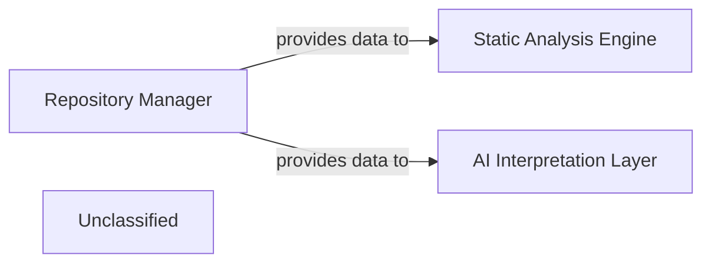

## Details

The core of this code analysis system revolves around the Repository Manager, which serves as the primary interface for all code repository operations. It is responsible for cloning, managing, and providing access to local copies of code from Remote Git Services, storing them on the Local File System. The raw code and repository data managed by the Repository Manager are then fed into two subsequent processing stages: the Static Analysis Engine, which performs automated code analysis, and the AI Interpretation Layer, which applies advanced AI/ML models for deeper insights. This architecture ensures a clear separation of concerns, with the Repository Manager handling all source code acquisition and management, enabling other components to focus on analysis and interpretation.

### Repository Manager [[Expand]](./Repository_Manager.md)
Manages the local copies of code repositories, provides access to raw source code content, facilitates navigation within the repository's file system, and handles Git-specific operations, including diff generation. It acts as the primary interface for all repository-related data and operations, feeding raw code to subsequent analysis stages. This component is fundamental for a code analysis tool, providing the essential input data.

**Related Classes/Methods**:

- <a href="https://github.com/CodeBoarding/CodeBoarding/blob/main/.codeboardingrepo_utils/__init__.py" target="_blank" rel="noopener noreferrer">`repo_utils`</a>
- <a href="https://github.com/CodeBoarding/CodeBoarding/blob/main/.codeboardingrepo_utils/git_diff.py" target="_blank" rel="noopener noreferrer">`repo_utils.git_diff`</a>
- <a href="https://github.com/CodeBoarding/CodeBoarding/blob/main/.codeboardingrepo_utils/errors.py" target="_blank" rel="noopener noreferrer">`repo_utils.errors`</a>

### Static Analysis Engine [[Expand]](./Static_Analysis_Engine.md)
This component is responsible for performing various static code analyses on the source code provided by the Repository Manager. It identifies patterns, potential issues, and extracts structural information without executing the code.

**Related Classes/Methods**:

- `StaticAnalysisEngine.conceptual_interface`:1-10

### AI Interpretation Layer [[Expand]](./AI_Interpretation_Layer.md)
This component consumes the output from the Static Analysis Engine and potentially raw code from the Repository Manager to apply AI/ML models for deeper understanding, code summarization, or vulnerability prediction.

**Related Classes/Methods**:

- `AIInterpretationLayer.conceptual_interface`

### Unclassified
Component for all unclassified files and utility functions (Utility functions/External Libraries/Dependencies)

**Related Classes/Methods**: _None_

### [FAQ](https://github.com/CodeBoarding/GeneratedOnBoardings/tree/main?tab=readme-ov-file#faq)
