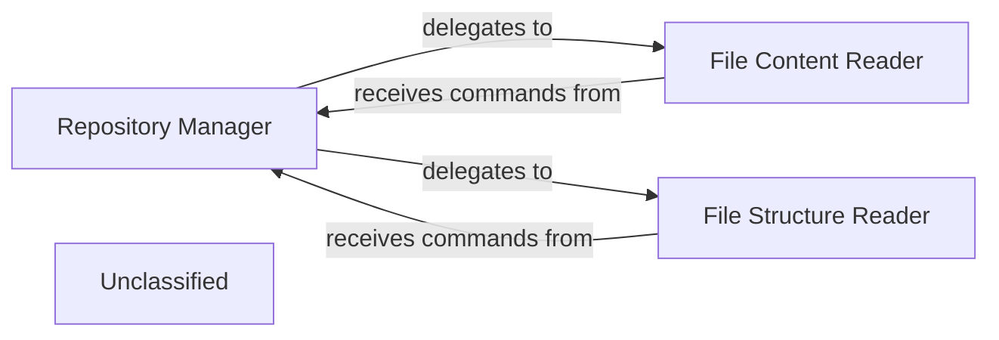

## Details

The Repository Manager subsystem is responsible for managing all interactions with code repositories, encompassing fetching source code and handling file system access. It acts as the primary interface for the project to retrieve and navigate the codebase under analysis. Within this subsystem, the File Content Reader and File Structure Reader are specialized tools that perform distinct but complementary functions. The Repository Manager itself acts as the coordinating entity, routing requests to the appropriate reader component. Both reader components directly interface with the underlying file system to fulfill their responsibilities, providing the foundational data necessary for the broader code analysis and documentation generation process.

### Repository Manager [[Expand]](./Repository_Manager.md)
Orchestrates and abstracts all file system and repository interactions, ensuring efficient and controlled access to project code and structure. It acts as a facade for external components needing repository data.

**Related Classes/Methods**:

- <a href="https://github.com/CodeBoarding/CodeBoarding/blob/main/.codeboardingagents/tools/read_file.py" target="_blank" rel="noopener noreferrer">`File Content Reader`</a>
- <a href="https://github.com/CodeBoarding/CodeBoarding/blob/main/.codeboardingagents/tools/read_file_structure.py" target="_blank" rel="noopener noreferrer">`File Structure Reader`</a>

### File Content Reader
This component is dedicated to retrieving the raw content of individual files from the code repository. It serves as the direct access point for obtaining the textual data of source code files.

**Related Classes/Methods**:

- <a href="https://github.com/CodeBoarding/CodeBoarding/blob/main/.codeboardingagents/tools/read_file.py" target="_blank" rel="noopener noreferrer">`File Content Reader`</a>

### File Structure Reader
This component is responsible for providing a hierarchical representation of the repository's file system. It enables the system to understand the project's layout, including directories and files, which is crucial for contextual analysis and navigation.

**Related Classes/Methods**:

- <a href="https://github.com/CodeBoarding/CodeBoarding/blob/main/.codeboardingagents/tools/read_file_structure.py" target="_blank" rel="noopener noreferrer">`File Structure Reader`</a>

### Unclassified
Component for all unclassified files and utility functions (Utility functions/External Libraries/Dependencies)

**Related Classes/Methods**: _None_

### [FAQ](https://github.com/CodeBoarding/GeneratedOnBoardings/tree/main?tab=readme-ov-file#faq)
