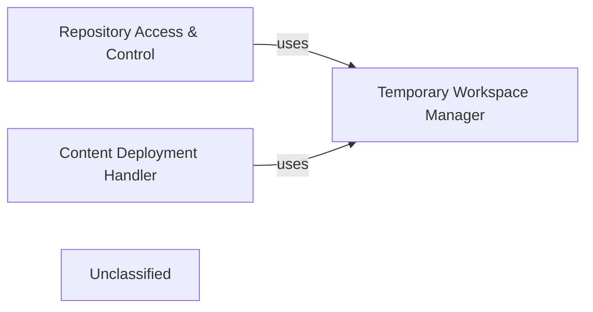

## Details

The system is designed around three core components: Repository Access & Control, Temporary Workspace Manager, and Content Deployment Handler. The Repository Access & Control component is responsible for fetching and managing code from remote repositories, ensuring the correct version is available for processing. It interacts with the Temporary Workspace Manager to establish isolated environments for these operations. The Temporary Workspace Manager handles the lifecycle of temporary file system locations, creating them as needed and ensuring their proper cleanup. Finally, the Content Deployment Handler takes the generated output and deploys it back to a specified repository, also leveraging the Temporary Workspace Manager for any temporary file handling during this process. This architecture ensures a clear separation of concerns, with dedicated components for repository interaction, temporary resource management, and content delivery.

### Repository Access & Control
Manages the core operations of interacting with remote code repositories, including cloning repositories and managing specific branches or commits. It ensures that the correct version of the source code is available for analysis.

**Related Classes/Methods**:

- <a href="https://github.com/CodeBoarding/CodeBoarding/blob/main/.codeboardingrepo_utils/__init__.py" target="_blank" rel="noopener noreferrer">`repo_utils.clone_repository`</a>
- <a href="https://github.com/CodeBoarding/CodeBoarding/blob/main/.codeboardingrepo_utils/__init__.py#L114-L122" target="_blank" rel="noopener noreferrer">`repo_utils.checkout_repo`:114-122</a>

### Temporary Workspace Manager
Responsible for creating and cleaning up temporary file system locations where cloned repositories or intermediate files can be stored. It ensures isolated and clean environments for each analysis job.

**Related Classes/Methods**:

- <a href="https://github.com/CodeBoarding/CodeBoarding/blob/main/.codeboardingutils.py#L18-L22" target="_blank" rel="noopener noreferrer">`utils.create_temp_repo_folder`:18-22</a>
- <a href="https://github.com/CodeBoarding/CodeBoarding/blob/main/.codeboardingutils.py#L25-L29" target="_blank" rel="noopener noreferrer">`utils.remove_temp_repo_folder`:25-29</a>

### Content Deployment Handler
Facilitates the uploading or pushing of generated content (e.g., documentation, analysis reports, onboarding materials) back to a specified repository. It handles the final step of delivering the tool's output.

**Related Classes/Methods**:

- <a href="https://github.com/CodeBoarding/CodeBoarding/blob/main/.codeboardingrepo_utils/__init__.py#L136-L163" target="_blank" rel="noopener noreferrer">`repo_utils.upload_onboarding_materials`:136-163</a>

### Unclassified
Component for all unclassified files and utility functions (Utility functions/External Libraries/Dependencies)

**Related Classes/Methods**: _None_

### [FAQ](https://github.com/CodeBoarding/GeneratedOnBoardings/tree/main?tab=readme-ov-file#faq)
