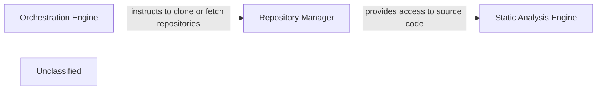

## Details

The system's architecture is centered around three core components: the Orchestration Engine, the Repository Manager, and the Static Analysis Engine. The Orchestration Engine acts as the central coordinator, initiating and managing the overall analysis workflow. It instructs the Repository Manager to handle all interactions with code repositories, including cloning and fetching updates, and managing temporary repository folders. Once the source code is available, the Repository Manager provides access to it for the Static Analysis Engine. The Static Analysis Engine then performs a detailed examination of the code, generating analysis results that can be used for various downstream tasks. This clear separation of concerns ensures a modular and maintainable system, with each component focusing on its specialized functionality.

### Orchestration Engine
The Orchestration Engine serves as the central control unit, managing the overall workflow of the analysis process. It initiates tasks such as cloning repositories, triggering static analysis, and coordinating the activities of other components. Its primary responsibility is to ensure the smooth and efficient execution of the entire system, from input to output.

**Related Classes/Methods**: _None_

### Repository Manager [[Expand]](./Repository_Manager.md)
The Repository Manager is a crucial component responsible for all interactions with code repositories. Its primary functions include cloning repositories, fetching updates, and providing a standardized interface for other components to access the source code. It also manages the lifecycle of temporary repository folders, ensuring they are created and removed as needed during the analysis process. This component isolates the complexities of version control systems and file system operations from the core analysis logic.

**Related Classes/Methods**:

- <a href="https://github.com/CodeBoarding/CodeBoarding/blob/main/.codeboardingutils.py#L17-L21" target="_blank" rel="noopener noreferrer">`utils.create_temp_repo_folder`:17-21</a>
- <a href="https://github.com/CodeBoarding/CodeBoarding/blob/main/.codeboardingutils.py#L24-L28" target="_blank" rel="noopener noreferrer">`utils.remove_temp_repo_folder`:24-28</a>

### Static Analysis Engine
The Static Analysis Engine is responsible for performing in-depth analysis of the source code provided by the Repository Manager. It processes the code to identify patterns, dependencies, and potential issues without executing the code. This component generates structured analysis results that can be used for various purposes, such as documentation generation or code quality assessment.

**Related Classes/Methods**: _None_

### Unclassified
Component for all unclassified files and utility functions (Utility functions/External Libraries/Dependencies)

**Related Classes/Methods**: _None_

### [FAQ](https://github.com/CodeBoarding/GeneratedOnBoardings/tree/main?tab=readme-ov-file#faq)
