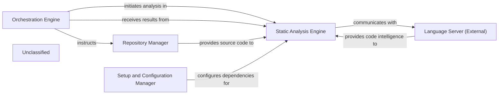

## Details

The system's architecture is driven by the Orchestration Engine, which coordinates the entire static analysis workflow. It directs the Repository Manager to provide project source code and then instructs the Static Analysis Engine to perform the analysis. The Static Analysis Engine is the central component for code intelligence, leveraging an internal LspClient to interact with external Language Servers via the Language Server Protocol. These Language Servers supply language-specific details, enabling the Static Analysis Engine to construct comprehensive call graphs, class hierarchies, and package relationships. Prior to analysis, the Setup and Configuration Manager ensures that the environment is prepared and all necessary external Language Servers are correctly installed and configured. Finally, the Static Analysis Engine delivers its detailed analysis results back to the Orchestration Engine for further processing or reporting.

### Orchestration Engine
Coordinates the entire static analysis workflow, directing other components and receiving final results.

**Related Classes/Methods**:

- `OrchestrationEngine`

### Repository Manager [[Expand]](./Repository_Manager.md)
Provides project source files and context to the Static Analysis Engine.

**Related Classes/Methods**:

- `RepositoryManager`:10-20

### Static Analysis Engine [[Expand]](./Static_Analysis_Engine.md)
The Static Analysis Engine's core functionality for gathering code intelligence is encapsulated within the LspClient class. This client acts as an intermediary, establishing and managing communication with external Language Servers (e.g., for Python, TypeScript) using the Language Server Protocol (LSP). The LspClient initiates a language server process, sends JSON-RPC requests for various code analysis tasks (such as retrieving document symbols, preparing call hierarchies, finding incoming/outgoing calls, and resolving definitions/references), and processes the responses. It orchestrates the building of a comprehensive static analysis by concurrently analyzing source files, extracting package relations, identifying symbol references, constructing call graphs, and determining class hierarchies. This involves a continuous exchange of messages with the external Language Server to gather detailed, language-specific code information.

**Related Classes/Methods**:

- <a href="https://github.com/CodeBoarding/CodeBoarding/blob/main/.codeboardingstatic_analyzer/lsp_client/client.py" target="_blank" rel="noopener noreferrer">`LspClient`</a>

### Setup and Configuration Manager
Ensures that necessary external Language Server dependencies are installed and configured for the Static Analysis Engine.

**Related Classes/Methods**:

- `SetupAndConfigurationManager`:1-10

### Language Server (External)
An external component that provides language-specific code intelligence via the Language Server Protocol.

**Related Classes/Methods**:

- `LanguageServer`:1-10

### Unclassified
Component for all unclassified files and utility functions (Utility functions/External Libraries/Dependencies)

**Related Classes/Methods**: _None_

### [FAQ](https://github.com/CodeBoarding/GeneratedOnBoardings/tree/main?tab=readme-ov-file#faq)
