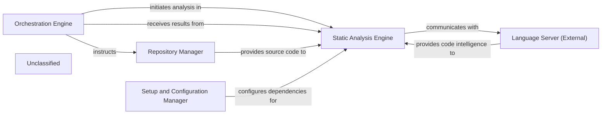

## Details

The system is designed around a core `Orchestration Engine` that manages the entire static analysis workflow. This engine directs the `Repository Manager` to access project source files, which are then provided to the `Static Analysis Engine`. The `Static Analysis Engine` is responsible for performing detailed code analysis by interacting with an external `Language Server` through the Language Server Protocol. The `Setup and Configuration Manager` plays a crucial role in ensuring all necessary external dependencies for the analysis process are correctly installed and configured. Ultimately, the `Orchestration Engine` aggregates and processes the results from the `Static Analysis Engine`, completing the analysis cycle. Recent internal updates to agents managed by the `Orchestration Engine` and dependency configurations handled by the `Setup and Configuration Manager` have enhanced the system's capabilities without altering its fundamental high-level architecture.

### Orchestration Engine
Coordinates the entire static analysis workflow, directing and managing various internal agents to perform specific tasks, and receiving final results.

**Related Classes/Methods**:

- `OrchestrationEngine`

### Repository Manager [[Expand]](./Repository_Manager.md)
Manages and provides project source files and context to the Static Analysis Engine.

**Related Classes/Methods**:

- `RepositoryManager`:1-10

### Static Analysis Engine [[Expand]](./Static_Analysis_Engine.md)
The core component for gathering code intelligence, primarily through its `LspClient` which communicates with external Language Servers using the Language Server Protocol (LSP) to perform detailed code analysis.

**Related Classes/Methods**:

- <a href="https://github.com/CodeBoarding/CodeBoarding/blob/main/.codeboardingstatic_analyzer/lsp_client/client.py" target="_blank" rel="noopener noreferrer">`LspClient`</a>

### Setup and Configuration Manager
Responsible for ensuring that all necessary external Language Server dependencies and project configurations are correctly installed and maintained for the Static Analysis Engine.

**Related Classes/Methods**:

### Language Server (External)
An external component that provides language-specific code intelligence and analysis capabilities via the Language Server Protocol.

**Related Classes/Methods**:

- `LanguageServer`:1-10

### Unclassified
Component for all unclassified files and utility functions (Utility functions/External Libraries/Dependencies)

**Related Classes/Methods**: _None_

### [FAQ](https://github.com/CodeBoarding/GeneratedOnBoardings/tree/main?tab=readme-ov-file#faq)
