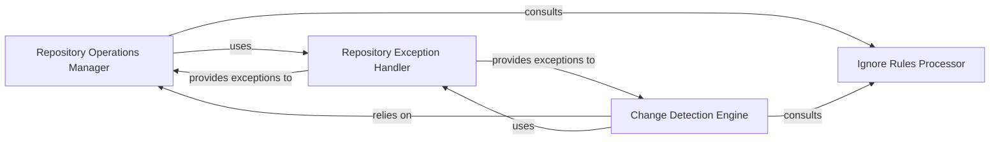

## Details

Handles all interactions with code repositories, including cloning, updating, fetching branches, committing changes, and managing token storage. It also processes ignore rules and normalizes file system paths for consistent access across the system.

### Repository Operations Manager
Primary interface for all fundamental Git repository interactions, handling cloning, checkout, fetching updates, committing changes, token management, and path normalization.

**Related Classes/Methods**:

- <a href="https://github.com/CodeBoarding/CodeBoarding/blob/main/.codeboardingrepo_utils/__init__.py" target="_blank" rel="noopener noreferrer">`repo_utils.__init__`</a>

### Change Detection Engine
Identifies modifications within a repository by performing diff analysis between commits or the working directory, categorizing changes as added, modified, deleted, renamed, or type‑changed files.

**Related Classes/Methods**:

- <a href="https://github.com/CodeBoarding/CodeBoarding/blob/main/.codeboardingrepo_utils/change_detector.py" target="_blank" rel="noopener noreferrer">`repo_utils.change_detector`</a>

### Ignore Rules Processor
Parses .gitignore‑style and custom .codeboardingignore files, providing filtering logic to exclude irrelevant files and directories from repository operations and analysis.

**Related Classes/Methods**:

- <a href="https://github.com/CodeBoarding/CodeBoarding/blob/main/.codeboardingrepo_utils/ignore.py" target="_blank" rel="noopener noreferrer">`repo_utils.ignore`</a>

### Repository Exception Handler
Defines and manages custom exception types for repository‑related failures, such as missing tokens, non‑existent repositories, or Git operation errors, enabling structured error reporting.

**Related Classes/Methods**:

- <a href="https://github.com/CodeBoarding/CodeBoarding/blob/main/.codeboardingrepo_utils/errors.py" target="_blank" rel="noopener noreferrer">`repo_utils.errors`</a>

### [FAQ](https://github.com/CodeBoarding/GeneratedOnBoardings/tree/main?tab=readme-ov-file#faq)