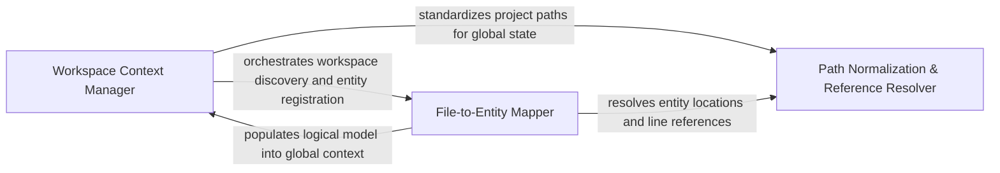

## Details

Manages translation between Git-tracked paths and local file structures, handling path normalization and .gitignore rules.

### Workspace Context Manager
Manages the global state of the project workspace, including the resolution of project-wide system messages and the initial discovery of file structures.

**Related Classes/Methods**: _None_

### Path Normalization & Reference Resolver
Handles the translation of raw file paths into normalized formats and corrects line-level references within source code to maintain static analysis integrity.

**Related Classes/Methods**: _None_

### File-to-Entity Mapper
Responsible for the logical grouping of file-system artifacts into code entities, populating the internal registry with methods and classes discovered during the workspace scan.

**Related Classes/Methods**: _None_

**Source Files:**

- [`repo_utils/change_detector.py`](https://github.com/CodeBoarding/CodeBoarding/blob/main/.codeboardingrepo_utils/change_detector.py)
  - `repo_utils.change_detector._overlaps` ([L310-L314](https://github.com/CodeBoarding/CodeBoarding/blob/main/.codeboardingrepo_utils/change_detector.py#L310-L314)) - Function

### [FAQ](https://github.com/CodeBoarding/GeneratedOnBoardings/tree/main?tab=readme-ov-file#faq)