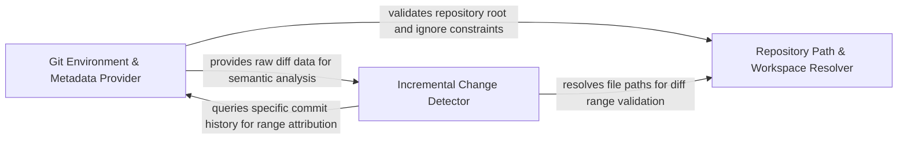

## Details

Tracks file-level changes and git metadata to optimize performance by focusing on relevant codebase portions.

### Git Environment & Metadata Provider [[Expand]](./Git_Environment_Metadata_Provider.md)
Foundational layer that validates repository integrity and extracts global state information such as commits and branches.

**Related Classes/Methods**:

- `repo_utils.__init__.require_git_import`:30-61

**Source Files:**

- [`repo_utils/__init__.py`](https://github.com/CodeBoarding/CodeBoarding/blob/main/.codeboardingrepo_utils/__init__.py)
  - `repo_utils.__init__.require_git_import` ([L30-L61](https://github.com/CodeBoarding/CodeBoarding/blob/main/.codeboardingrepo_utils/__init__.py#L30-L61)) - Function
  - `repo_utils.__init__.require_git_import.decorator` ([L37-L59](https://github.com/CodeBoarding/CodeBoarding/blob/main/.codeboardingrepo_utils/__init__.py#L37-L59)) - Function
- [`repo_utils/change_detector.py`](https://github.com/CodeBoarding/CodeBoarding/blob/main/.codeboardingrepo_utils/change_detector.py)
  - `repo_utils.change_detector.FileChange.classify_method_statuses` ([L180-L221](https://github.com/CodeBoarding/CodeBoarding/blob/main/.codeboardingrepo_utils/change_detector.py#L180-L221)) - Method
  - `repo_utils.change_detector._fully_inside` ([L317-L327](https://github.com/CodeBoarding/CodeBoarding/blob/main/.codeboardingrepo_utils/change_detector.py#L317-L327)) - Function

### Incremental Change Detector [[Expand]](./Incremental_Change_Detector.md)
Core logic engine responsible for calculating deltas between repository states and providing granular line-range analysis.

**Related Classes/Methods**: _None_

**Source Files:**

- [`repo_utils/__init__.py`](https://github.com/CodeBoarding/CodeBoarding/blob/main/.codeboardingrepo_utils/__init__.py)
  - `repo_utils.__init__.require_git_import.decorator.wrapper` ([L39-L57](https://github.com/CodeBoarding/CodeBoarding/blob/main/.codeboardingrepo_utils/__init__.py#L39-L57)) - Function
- [`repo_utils/change_detector.py`](https://github.com/CodeBoarding/CodeBoarding/blob/main/.codeboardingrepo_utils/change_detector.py)
  - `repo_utils.change_detector.ChangedLineRanges` ([L58-L68](https://github.com/CodeBoarding/CodeBoarding/blob/main/.codeboardingrepo_utils/change_detector.py#L58-L68)) - Class
  - `repo_utils.change_detector.FileChange.changed_line_ranges` ([L97-L178](https://github.com/CodeBoarding/CodeBoarding/blob/main/.codeboardingrepo_utils/change_detector.py#L97-L178)) - Method
  - `repo_utils.change_detector.FileChange.changed_line_ranges._flush` ([L123-L150](https://github.com/CodeBoarding/CodeBoarding/blob/main/.codeboardingrepo_utils/change_detector.py#L123-L150)) - Function

### Repository Path & Workspace Resolver [[Expand]](./Repository_Path_Workspace_Resolver.md)
Manages translation between Git-tracked paths and local file structures, handling path normalization and .gitignore rules.

**Related Classes/Methods**: _None_

**Source Files:**

- [`repo_utils/change_detector.py`](https://github.com/CodeBoarding/CodeBoarding/blob/main/.codeboardingrepo_utils/change_detector.py)
  - `repo_utils.change_detector._overlaps` ([L310-L314](https://github.com/CodeBoarding/CodeBoarding/blob/main/.codeboardingrepo_utils/change_detector.py#L310-L314)) - Function

### [FAQ](https://github.com/CodeBoarding/GeneratedOnBoardings/tree/main?tab=readme-ov-file#faq)