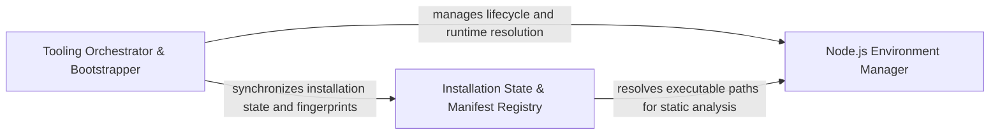

## Details

Manages the physical acquisition and setup of core execution runtimes, focusing on Node.js/NPM environments and safe archive extraction.

### Node.js Environment Manager
Manages the low-level installation and health monitoring of the embedded Node.js runtime, handling platform-specific logic and path resolution.

**Related Classes/Methods**:

- `tool_registry.installers.install_embedded_node`:621-703
- `tool_registry.installers.embedded_node_is_healthy`:548-574
- `tool_registry.paths.node_is_acceptable`:175-196
- `tool_registry.paths.nodeenv_bin_dir`:96-99

**Source Files:**

- [`install.py`](https://github.com/CodeBoarding/CodeBoarding/blob/main/.codeboardinginstall.py)
  - `install.install_node_servers` ([L296-L321](https://github.com/CodeBoarding/CodeBoarding/blob/main/.codeboardinginstall.py#L296-L321)) - Function
- [`tool_registry/installers.py`](https://github.com/CodeBoarding/CodeBoarding/blob/main/.codeboardingtool_registry/installers.py)
  - `tool_registry.installers.install_node_tools` ([L429-L469](https://github.com/CodeBoarding/CodeBoarding/blob/main/.codeboardingtool_registry/installers.py#L429-L469)) - Function
  - `tool_registry.installers.embedded_node_is_healthy` ([L548-L574](https://github.com/CodeBoarding/CodeBoarding/blob/main/.codeboardingtool_registry/installers.py#L548-L574)) - Function
  - `tool_registry.installers.initialize_nodeenv_globals` ([L577-L600](https://github.com/CodeBoarding/CodeBoarding/blob/main/.codeboardingtool_registry/installers.py#L577-L600)) - Function
  - `tool_registry.installers.nodeenv_needs_unofficial_builds` ([L603-L618](https://github.com/CodeBoarding/CodeBoarding/blob/main/.codeboardingtool_registry/installers.py#L603-L618)) - Function
  - `tool_registry.installers.install_embedded_node` ([L621-L703](https://github.com/CodeBoarding/CodeBoarding/blob/main/.codeboardingtool_registry/installers.py#L621-L703)) - Function
- [`tool_registry/paths.py`](https://github.com/CodeBoarding/CodeBoarding/blob/main/.codeboardingtool_registry/paths.py)
  - `tool_registry.paths.nodeenv_root_dir` ([L91-L93](https://github.com/CodeBoarding/CodeBoarding/blob/main/.codeboardingtool_registry/paths.py#L91-L93)) - Function
  - `tool_registry.paths.nodeenv_bin_dir` ([L96-L99](https://github.com/CodeBoarding/CodeBoarding/blob/main/.codeboardingtool_registry/paths.py#L96-L99)) - Function
  - `tool_registry.paths.embedded_node_path` ([L102-L106](https://github.com/CodeBoarding/CodeBoarding/blob/main/.codeboardingtool_registry/paths.py#L102-L106)) - Function
  - `tool_registry.paths.embedded_npm_path` ([L109-L113](https://github.com/CodeBoarding/CodeBoarding/blob/main/.codeboardingtool_registry/paths.py#L109-L113)) - Function
  - `tool_registry.paths.embedded_npm_cli_path` ([L116-L119](https://github.com/CodeBoarding/CodeBoarding/blob/main/.codeboardingtool_registry/paths.py#L116-L119)) - Function
  - `tool_registry.paths.node_version_tuple` ([L126-L172](https://github.com/CodeBoarding/CodeBoarding/blob/main/.codeboardingtool_registry/paths.py#L126-L172)) - Function
  - `tool_registry.paths.node_is_acceptable` ([L175-L196](https://github.com/CodeBoarding/CodeBoarding/blob/main/.codeboardingtool_registry/paths.py#L175-L196)) - Function
  - `tool_registry.paths.preferred_node_path` ([L202-L217](https://github.com/CodeBoarding/CodeBoarding/blob/main/.codeboardingtool_registry/paths.py#L202-L217)) - Function
  - `tool_registry.paths.sibling_npm_path` ([L220-L231](https://github.com/CodeBoarding/CodeBoarding/blob/main/.codeboardingtool_registry/paths.py#L220-L231)) - Function
  - `tool_registry.paths.preferred_npm_command` ([L234-L252](https://github.com/CodeBoarding/CodeBoarding/blob/main/.codeboardingtool_registry/paths.py#L234-L252)) - Function
  - `tool_registry.paths.npm_subprocess_env` ([L255-L264](https://github.com/CodeBoarding/CodeBoarding/blob/main/.codeboardingtool_registry/paths.py#L255-L264)) - Function

### Tooling Orchestrator & Bootstrapper
Serves as the primary entry point for the installation process, orchestrating tool presence, NPM bootstrapping, and safe asset extraction.

**Related Classes/Methods**:

- `install.ensure_tools`:680-713
- `install.bootstrap_npm`:120-169
- `install.ensure_node_runtime`:181-234
- `install.extract_tarball_safely`:109-117
- `install.run_install`:716-763

**Source Files:**

- [`install.py`](https://github.com/CodeBoarding/CodeBoarding/blob/main/.codeboardinginstall.py)
  - `install.check_npm` ([L81-L101](https://github.com/CodeBoarding/CodeBoarding/blob/main/.codeboardinginstall.py#L81-L101)) - Function
  - `install.bootstrapped_npm_cli_path` ([L104-L106](https://github.com/CodeBoarding/CodeBoarding/blob/main/.codeboardinginstall.py#L104-L106)) - Function
  - `install.extract_tarball_safely` ([L109-L117](https://github.com/CodeBoarding/CodeBoarding/blob/main/.codeboardinginstall.py#L109-L117)) - Function
  - `install.bootstrap_npm` ([L120-L169](https://github.com/CodeBoarding/CodeBoarding/blob/main/.codeboardinginstall.py#L120-L169)) - Function
  - `install.ensure_node_runtime` ([L181-L234](https://github.com/CodeBoarding/CodeBoarding/blob/main/.codeboardinginstall.py#L181-L234)) - Function
  - `install.resolve_missing_npm` ([L237-L262](https://github.com/CodeBoarding/CodeBoarding/blob/main/.codeboardinginstall.py#L237-L262)) - Function
  - `install.resolve_npm_availability` ([L265-L272](https://github.com/CodeBoarding/CodeBoarding/blob/main/.codeboardinginstall.py#L265-L272)) - Function
  - `install.parse_args` ([L275-L288](https://github.com/CodeBoarding/CodeBoarding/blob/main/.codeboardinginstall.py#L275-L288)) - Function
  - `install.BinaryStatus` ([L328-L333](https://github.com/CodeBoarding/CodeBoarding/blob/main/.codeboardinginstall.py#L328-L333)) - Class
  - `install.install_pre_commit_hooks` ([L537-L572](https://github.com/CodeBoarding/CodeBoarding/blob/main/.codeboardinginstall.py#L537-L572)) - Function
  - `install.ensure_tools` ([L680-L713](https://github.com/CodeBoarding/CodeBoarding/blob/main/.codeboardinginstall.py#L680-L713)) - Function
  - `install.run_install` ([L716-L763](https://github.com/CodeBoarding/CodeBoarding/blob/main/.codeboardinginstall.py#L716-L763)) - Function
  - `install.run_install.unified_progress` ([L748-L752](https://github.com/CodeBoarding/CodeBoarding/blob/main/.codeboardinginstall.py#L748-L752)) - Function
  - `install.main` ([L766-L791](https://github.com/CodeBoarding/CodeBoarding/blob/main/.codeboardinginstall.py#L766-L791)) - Function
- [`tool_registry/manifest.py`](https://github.com/CodeBoarding/CodeBoarding/blob/main/.codeboardingtool_registry/manifest.py)
  - `tool_registry.manifest.acquire_lock` ([L134-L160](https://github.com/CodeBoarding/CodeBoarding/blob/main/.codeboardingtool_registry/manifest.py#L134-L160)) - Function
- [`user_config.py`](https://github.com/CodeBoarding/CodeBoarding/blob/main/.codeboardinguser_config.py)
  - `user_config.ensure_config_template` ([L165-L171](https://github.com/CodeBoarding/CodeBoarding/blob/main/.codeboardinguser_config.py#L165-L171)) - Function
  - `user_config._append_commented_key` ([L174-L183](https://github.com/CodeBoarding/CodeBoarding/blob/main/.codeboardinguser_config.py#L174-L183)) - Function

### Installation State & Manifest Registry
Maintains the source of truth for the installed state, tracking versions, detecting drift, and resolving system-level commands.

**Related Classes/Methods**:

- `tool_registry.manifest.write_manifest`:94-116
- `tool_registry.manifest.needs_install`:119-128
- `tool_registry.manifest.tools_fingerprint`:71-91
- `static_analyzer.typescript_config_scanner._resolve_system_tsc`:215-218

**Source Files:**

- [`static_analyzer/typescript_config_scanner.py`](https://github.com/CodeBoarding/CodeBoarding/blob/main/.codeboardingstatic_analyzer/typescript_config_scanner.py)
  - `static_analyzer.typescript_config_scanner._resolve_system_tsc` ([L215-L218](https://github.com/CodeBoarding/CodeBoarding/blob/main/.codeboardingstatic_analyzer/typescript_config_scanner.py#L215-L218)) - Function
  - `static_analyzer.typescript_config_scanner._resolve_tsc_command` ([L221-L235](https://github.com/CodeBoarding/CodeBoarding/blob/main/.codeboardingstatic_analyzer/typescript_config_scanner.py#L221-L235)) - Function
- [`tool_registry/manifest.py`](https://github.com/CodeBoarding/CodeBoarding/blob/main/.codeboardingtool_registry/manifest.py)
  - `tool_registry.manifest.installed_version` ([L40-L44](https://github.com/CodeBoarding/CodeBoarding/blob/main/.codeboardingtool_registry/manifest.py#L40-L44)) - Function
  - `tool_registry.manifest.manifest_path` ([L47-L48](https://github.com/CodeBoarding/CodeBoarding/blob/main/.codeboardingtool_registry/manifest.py#L47-L48)) - Function
  - `tool_registry.manifest.read_manifest` ([L51-L55](https://github.com/CodeBoarding/CodeBoarding/blob/main/.codeboardingtool_registry/manifest.py#L51-L55)) - Function
  - `tool_registry.manifest.npm_specs_fingerprint` ([L58-L68](https://github.com/CodeBoarding/CodeBoarding/blob/main/.codeboardingtool_registry/manifest.py#L58-L68)) - Function
  - `tool_registry.manifest.tools_fingerprint` ([L71-L91](https://github.com/CodeBoarding/CodeBoarding/blob/main/.codeboardingtool_registry/manifest.py#L71-L91)) - Function
  - `tool_registry.manifest.write_manifest` ([L94-L116](https://github.com/CodeBoarding/CodeBoarding/blob/main/.codeboardingtool_registry/manifest.py#L94-L116)) - Function
  - `tool_registry.manifest.needs_install` ([L119-L128](https://github.com/CodeBoarding/CodeBoarding/blob/main/.codeboardingtool_registry/manifest.py#L119-L128)) - Function
  - `tool_registry.manifest.build_config` ([L166-L186](https://github.com/CodeBoarding/CodeBoarding/blob/main/.codeboardingtool_registry/manifest.py#L166-L186)) - Function
  - `tool_registry.manifest.resolve_config_from_path` ([L252-L275](https://github.com/CodeBoarding/CodeBoarding/blob/main/.codeboardingtool_registry/manifest.py#L252-L275)) - Function
- [`tool_registry/paths.py`](https://github.com/CodeBoarding/CodeBoarding/blob/main/.codeboardingtool_registry/paths.py)
  - `tool_registry.paths.get_servers_dir` ([L83-L85](https://github.com/CodeBoarding/CodeBoarding/blob/main/.codeboardingtool_registry/paths.py#L83-L85)) - Function

### [FAQ](https://github.com/CodeBoarding/GeneratedOnBoardings/tree/main?tab=readme-ov-file#faq)