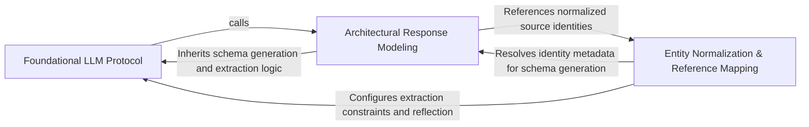

## Details

Defines structural contracts for LLM communication using Pydantic models to ensure predictable inputs and outputs.

### Foundational LLM Protocol
Defines base structural contracts and reflection mechanisms for LLM communication, including logic for converting Python type hints into JSON schemas.

**Related Classes/Methods**: _None_

**Source Files:**

- [`agents/agent_responses.py`](https://github.com/CodeBoarding/CodeBoarding/blob/main/.codeboardingagents/agent_responses.py)
  - `agents.agent_responses.LLMBaseModel._excluded_fields` ([L41-L50](https://github.com/CodeBoarding/CodeBoarding/blob/main/.codeboardingagents/agent_responses.py#L41-L50)) - Method
  - `agents.agent_responses.LLMBaseModel._extractor_fields` ([L75-L94](https://github.com/CodeBoarding/CodeBoarding/blob/main/.codeboardingagents/agent_responses.py#L75-L94)) - Method

### Architectural Response Modeling
Encapsulates domain-specific schemas for architectural analysis, transforming raw LLM text into validated Python objects for component definitions and insights.

**Related Classes/Methods**: _None_

**Source Files:**

- [`agents/agent_responses.py`](https://github.com/CodeBoarding/CodeBoarding/blob/main/.codeboardingagents/agent_responses.py)
  - `agents.agent_responses.LLMBaseModel._is_field_hidden` ([L32-L38](https://github.com/CodeBoarding/CodeBoarding/blob/main/.codeboardingagents/agent_responses.py#L32-L38)) - Method
  - `agents.agent_responses.LLMBaseModel._resolve_excluded_by_title` ([L53-L72](https://github.com/CodeBoarding/CodeBoarding/blob/main/.codeboardingagents/agent_responses.py#L53-L72)) - Method
  - `agents.agent_responses.LLMBaseModel._resolve_excluded_by_title.walk` ([L57-L69](https://github.com/CodeBoarding/CodeBoarding/blob/main/.codeboardingagents/agent_responses.py#L57-L69)) - Function

### Entity Normalization & Reference Mapping
Ensures integrity of architectural identities and source code alignment by reconciling LLM-identified components with stable identifiers and line-level source references.

**Related Classes/Methods**: _None_

**Source Files:**

- [`agents/agent_responses.py`](https://github.com/CodeBoarding/CodeBoarding/blob/main/.codeboardingagents/agent_responses.py)
  - `agents.agent_responses.LLMBaseModel.llm_str` ([L28-L29](https://github.com/CodeBoarding/CodeBoarding/blob/main/.codeboardingagents/agent_responses.py#L28-L29)) - Method
  - `agents.agent_responses.LLMBaseModel.extractor_str` ([L97-L104](https://github.com/CodeBoarding/CodeBoarding/blob/main/.codeboardingagents/agent_responses.py#L97-L104)) - Method
  - `agents.agent_responses.LLMBaseModel.model_json_schema` ([L107-L129](https://github.com/CodeBoarding/CodeBoarding/blob/main/.codeboardingagents/agent_responses.py#L107-L129)) - Method

### [FAQ](https://github.com/CodeBoarding/GeneratedOnBoardings/tree/main?tab=readme-ov-file#faq)