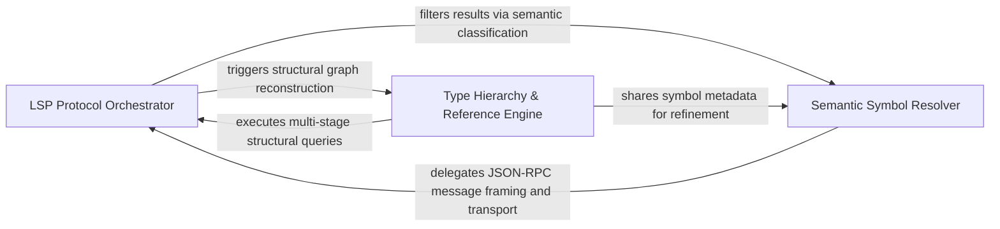

## Details

Implements the standard LSP feature set for synchronous semantic queries, translating high-level requests into protocol-compliant messages.

### LSP Protocol Orchestrator
Manages the low-level lifecycle of the Language Server connection, including session initialization, JSON-RPC message framing, and the synchronous request-response loop.

**Related Classes/Methods**: _None_

**Source Files:**

- [`static_analyzer/engine/hierarchy_builder.py`](https://github.com/CodeBoarding/CodeBoarding/blob/main/.codeboardingstatic_analyzer/engine/hierarchy_builder.py)
  - `static_analyzer.engine.hierarchy_builder.HierarchyBuilder.build` ([L34-L111](https://github.com/CodeBoarding/CodeBoarding/blob/main/.codeboardingstatic_analyzer/engine/hierarchy_builder.py#L34-L111)) - Method
  - `static_analyzer.engine.hierarchy_builder.HierarchyBuilder._resolve_type_hierarchy_item` ([L113-L135](https://github.com/CodeBoarding/CodeBoarding/blob/main/.codeboardingstatic_analyzer/engine/hierarchy_builder.py#L113-L135)) - Method

### Semantic Symbol Resolver
Implements core LSP navigation features to traverse source code, translating requests for symbol locations, definitions, and documentation into specific LSP method calls.

**Related Classes/Methods**:

- `static_analyzer.engine.lsp_client.LSPClient.definition`:325-339

**Source Files:**

- [`static_analyzer/engine/language_adapter.py`](https://github.com/CodeBoarding/CodeBoarding/blob/main/.codeboardingstatic_analyzer/engine/language_adapter.py)
  - `static_analyzer.engine.language_adapter.LanguageAdapter.is_class_like` ([L281-L282](https://github.com/CodeBoarding/CodeBoarding/blob/main/.codeboardingstatic_analyzer/engine/language_adapter.py#L281-L282)) - Method
- [`static_analyzer/engine/lsp_client.py`](https://github.com/CodeBoarding/CodeBoarding/blob/main/.codeboardingstatic_analyzer/engine/lsp_client.py)
  - `static_analyzer.engine.lsp_client.MethodNotFoundError` ([L40-L41](https://github.com/CodeBoarding/CodeBoarding/blob/main/.codeboardingstatic_analyzer/engine/lsp_client.py#L40-L41)) - Class
  - `static_analyzer.engine.lsp_client.LSPClient.definition` ([L343-L357](https://github.com/CodeBoarding/CodeBoarding/blob/main/.codeboardingstatic_analyzer/engine/lsp_client.py#L343-L357)) - Method
  - `static_analyzer.engine.lsp_client.LSPClient.implementation` ([L368-L382](https://github.com/CodeBoarding/CodeBoarding/blob/main/.codeboardingstatic_analyzer/engine/lsp_client.py#L368-L382)) - Method
  - `static_analyzer.engine.lsp_client.LSPClient._send_request` ([L559-L595](https://github.com/CodeBoarding/CodeBoarding/blob/main/.codeboardingstatic_analyzer/engine/lsp_client.py#L559-L595)) - Method

### Type Hierarchy & Reference Engine
Handles complex structural analysis by resolving inheritance patterns and refining raw reference data through multi-stage workflows and post-processing logic.

**Related Classes/Methods**:

- `static_analyzer.engine.lsp_client.LSPClient.type_hierarchy_prepare`:375-386
- `static_analyzer.engine.lsp_client.LSPClient.type_hierarchy_supertypes`:388-393

**Source Files:**

- [`static_analyzer/engine/lsp_client.py`](https://github.com/CodeBoarding/CodeBoarding/blob/main/.codeboardingstatic_analyzer/engine/lsp_client.py)
  - `static_analyzer.engine.lsp_client.LSPClient.type_hierarchy_prepare` ([L393-L404](https://github.com/CodeBoarding/CodeBoarding/blob/main/.codeboardingstatic_analyzer/engine/lsp_client.py#L393-L404)) - Method
  - `static_analyzer.engine.lsp_client.LSPClient.type_hierarchy_supertypes` ([L406-L411](https://github.com/CodeBoarding/CodeBoarding/blob/main/.codeboardingstatic_analyzer/engine/lsp_client.py#L406-L411)) - Method
  - `static_analyzer.engine.lsp_client.LSPClient.type_hierarchy_subtypes` ([L413-L418](https://github.com/CodeBoarding/CodeBoarding/blob/main/.codeboardingstatic_analyzer/engine/lsp_client.py#L413-L418)) - Method
- [`static_analyzer/engine/symbol_table.py`](https://github.com/CodeBoarding/CodeBoarding/blob/main/.codeboardingstatic_analyzer/engine/symbol_table.py)
  - `static_analyzer.engine.symbol_table.SymbolTable.file_symbols` ([L52-L54](https://github.com/CodeBoarding/CodeBoarding/blob/main/.codeboardingstatic_analyzer/engine/symbol_table.py#L52-L54)) - Method

### [FAQ](https://github.com/CodeBoarding/GeneratedOnBoardings/tree/main?tab=readme-ov-file#faq)