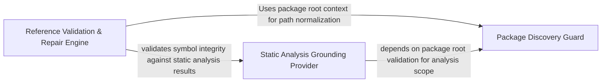

## Details

Resolves internal references and validates the semantic truth of edges between components by grounding architectural connections in the CFG.

### Reference Validation & Repair Engine
Orchestrates the identification and correction of internal symbol references using token-based anchoring and repair mechanisms for key entities.

**Related Classes/Methods**:

- `static_analyzer.reference_resolver.StaticReferenceResolver`:35-480
- `static_analyzer.internal_references.InternalReferenceSource`:14-17
- `static_analyzer.reference_resolver.KeyEntityRepair`:27-32
- `agents.validation._valid_key_edge_descriptions`:430-448

**Source Files:**

- [`agents/agent_responses.py`](https://github.com/CodeBoarding/CodeBoarding/blob/main/.codeboardingagents/agent_responses.py)
  - `agents.agent_responses.RelationEdge.llm_str` ([L231-L232](https://github.com/CodeBoarding/CodeBoarding/blob/main/.codeboardingagents/agent_responses.py#L231-L232)) - Method
- [`agents/validation.py`](https://github.com/CodeBoarding/CodeBoarding/blob/main/.codeboardingagents/validation.py)
  - `agents.validation._valid_key_edge_descriptions` ([L430-L448](https://github.com/CodeBoarding/CodeBoarding/blob/main/.codeboardingagents/validation.py#L430-L448)) - Function
- [`static_analyzer/internal_references.py`](https://github.com/CodeBoarding/CodeBoarding/blob/main/.codeboardingstatic_analyzer/internal_references.py)
  - `static_analyzer.internal_references.InternalReferenceSource` ([L14-L17](https://github.com/CodeBoarding/CodeBoarding/blob/main/.codeboardingstatic_analyzer/internal_references.py#L14-L17)) - Class
  - `static_analyzer.internal_references.InternalReferenceSource.get_languages` ([L15-L15](https://github.com/CodeBoarding/CodeBoarding/blob/main/.codeboardingstatic_analyzer/internal_references.py#L15-L15)) - Method
  - `static_analyzer.internal_references.InternalReferenceSource.iter_reference_nodes` ([L17-L17](https://github.com/CodeBoarding/CodeBoarding/blob/main/.codeboardingstatic_analyzer/internal_references.py#L17-L17)) - Method
  - `static_analyzer.internal_references.qualified_symbol_parts` ([L20-L21](https://github.com/CodeBoarding/CodeBoarding/blob/main/.codeboardingstatic_analyzer/internal_references.py#L20-L21)) - Function
  - `static_analyzer.internal_references._internal_reference_symbol_parts` ([L35-L55](https://github.com/CodeBoarding/CodeBoarding/blob/main/.codeboardingstatic_analyzer/internal_references.py#L35-L55)) - Function
  - `static_analyzer.internal_references.looks_internal_reference` ([L58-L65](https://github.com/CodeBoarding/CodeBoarding/blob/main/.codeboardingstatic_analyzer/internal_references.py#L58-L65)) - Function
  - `static_analyzer.internal_references._internal_reference_symbol_part_paths` ([L68-L73](https://github.com/CodeBoarding/CodeBoarding/blob/main/.codeboardingstatic_analyzer/internal_references.py#L68-L73)) - Function
  - `static_analyzer.internal_references._internal_reference_anchor_parts` ([L76-L98](https://github.com/CodeBoarding/CodeBoarding/blob/main/.codeboardingstatic_analyzer/internal_references.py#L76-L98)) - Function
- [`static_analyzer/reference_resolver.py`](https://github.com/CodeBoarding/CodeBoarding/blob/main/.codeboardingstatic_analyzer/reference_resolver.py)
  - `static_analyzer.reference_resolver.KeyEdgeResolution` ([L17-L23](https://github.com/CodeBoarding/CodeBoarding/blob/main/.codeboardingstatic_analyzer/reference_resolver.py#L17-L23)) - Class
  - `static_analyzer.reference_resolver.KeyEntityRepair` ([L27-L32](https://github.com/CodeBoarding/CodeBoarding/blob/main/.codeboardingstatic_analyzer/reference_resolver.py#L27-L32)) - Class
  - `static_analyzer.reference_resolver.StaticReferenceResolver` ([L35-L480](https://github.com/CodeBoarding/CodeBoarding/blob/main/.codeboardingstatic_analyzer/reference_resolver.py#L35-L480)) - Class
  - `static_analyzer.reference_resolver.StaticReferenceResolver.__init__` ([L38-L45](https://github.com/CodeBoarding/CodeBoarding/blob/main/.codeboardingstatic_analyzer/reference_resolver.py#L38-L45)) - Method
  - `static_analyzer.reference_resolver.StaticReferenceResolver.fix_source_code_reference_lines` ([L47-L52](https://github.com/CodeBoarding/CodeBoarding/blob/main/.codeboardingstatic_analyzer/reference_resolver.py#L47-L52)) - Method
  - `static_analyzer.reference_resolver.StaticReferenceResolver.fix_key_entities_refs` ([L54-L71](https://github.com/CodeBoarding/CodeBoarding/blob/main/.codeboardingstatic_analyzer/reference_resolver.py#L54-L71)) - Method
  - `static_analyzer.reference_resolver.StaticReferenceResolver.repair_key_entity_references` ([L73-L114](https://github.com/CodeBoarding/CodeBoarding/blob/main/.codeboardingstatic_analyzer/reference_resolver.py#L73-L114)) - Method
  - `static_analyzer.reference_resolver.StaticReferenceResolver.fix_edge_refs` ([L116-L127](https://github.com/CodeBoarding/CodeBoarding/blob/main/.codeboardingstatic_analyzer/reference_resolver.py#L116-L127)) - Method
  - `static_analyzer.reference_resolver.StaticReferenceResolver.resolve_reference` ([L129-L140](https://github.com/CodeBoarding/CodeBoarding/blob/main/.codeboardingstatic_analyzer/reference_resolver.py#L129-L140)) - Method
  - `static_analyzer.reference_resolver.StaticReferenceResolver._resolve_symbol_reference` ([L142-L193](https://github.com/CodeBoarding/CodeBoarding/blob/main/.codeboardingstatic_analyzer/reference_resolver.py#L142-L193)) - Method
  - `static_analyzer.reference_resolver.StaticReferenceResolver.resolve_node` ([L195-L200](https://github.com/CodeBoarding/CodeBoarding/blob/main/.codeboardingstatic_analyzer/reference_resolver.py#L195-L200)) - Method
  - `static_analyzer.reference_resolver.StaticReferenceResolver.classify_key_edge` ([L216-L234](https://github.com/CodeBoarding/CodeBoarding/blob/main/.codeboardingstatic_analyzer/reference_resolver.py#L216-L234)) - Method
  - `static_analyzer.reference_resolver.StaticReferenceResolver.has_external_unresolved_endpoint` ([L236-L242](https://github.com/CodeBoarding/CodeBoarding/blob/main/.codeboardingstatic_analyzer/reference_resolver.py#L236-L242)) - Method
  - `static_analyzer.reference_resolver.StaticReferenceResolver.has_cfg_edge` ([L244-L259](https://github.com/CodeBoarding/CodeBoarding/blob/main/.codeboardingstatic_analyzer/reference_resolver.py#L244-L259)) - Method
  - `static_analyzer.reference_resolver.StaticReferenceResolver.node_identity` ([L262-L264](https://github.com/CodeBoarding/CodeBoarding/blob/main/.codeboardingstatic_analyzer/reference_resolver.py#L262-L264)) - Method
  - `static_analyzer.reference_resolver.StaticReferenceResolver.keep_relation_edge` ([L266-L283](https://github.com/CodeBoarding/CodeBoarding/blob/main/.codeboardingstatic_analyzer/reference_resolver.py#L266-L283)) - Method
  - `static_analyzer.reference_resolver.StaticReferenceResolver.reference_file_exists` ([L285-L290](https://github.com/CodeBoarding/CodeBoarding/blob/main/.codeboardingstatic_analyzer/reference_resolver.py#L285-L290)) - Method
  - `static_analyzer.reference_resolver.StaticReferenceResolver.attach_static_call_sites` ([L292-L297](https://github.com/CodeBoarding/CodeBoarding/blob/main/.codeboardingstatic_analyzer/reference_resolver.py#L292-L297)) - Method
  - `static_analyzer.reference_resolver.StaticReferenceResolver.find_static_edge` ([L299-L312](https://github.com/CodeBoarding/CodeBoarding/blob/main/.codeboardingstatic_analyzer/reference_resolver.py#L299-L312)) - Method
  - `static_analyzer.reference_resolver.StaticReferenceResolver.same_resolved_relation_endpoint` ([L315-L326](https://github.com/CodeBoarding/CodeBoarding/blob/main/.codeboardingstatic_analyzer/reference_resolver.py#L315-L326)) - Method
  - `static_analyzer.reference_resolver.StaticReferenceResolver.remove_unresolved_references` ([L328-L366](https://github.com/CodeBoarding/CodeBoarding/blob/main/.codeboardingstatic_analyzer/reference_resolver.py#L328-L366)) - Method
  - `static_analyzer.reference_resolver.StaticReferenceResolver.relative_paths` ([L368-L385](https://github.com/CodeBoarding/CodeBoarding/blob/main/.codeboardingstatic_analyzer/reference_resolver.py#L368-L385)) - Method
  - `static_analyzer.reference_resolver.StaticReferenceResolver._unique_token_match` ([L388-L404](https://github.com/CodeBoarding/CodeBoarding/blob/main/.codeboardingstatic_analyzer/reference_resolver.py#L388-L404)) - Method
  - `static_analyzer.reference_resolver.StaticReferenceResolver._apply_resolved_node` ([L407-L411](https://github.com/CodeBoarding/CodeBoarding/blob/main/.codeboardingstatic_analyzer/reference_resolver.py#L407-L411)) - Method
  - `static_analyzer.reference_resolver.StaticReferenceResolver._node_in_scope` ([L413-L423](https://github.com/CodeBoarding/CodeBoarding/blob/main/.codeboardingstatic_analyzer/reference_resolver.py#L413-L423)) - Method
  - `static_analyzer.reference_resolver.StaticReferenceResolver._absolute_reference_path` ([L425-L427](https://github.com/CodeBoarding/CodeBoarding/blob/main/.codeboardingstatic_analyzer/reference_resolver.py#L425-L427)) - Method
  - `static_analyzer.reference_resolver.StaticReferenceResolver._try_file_path_resolution` ([L429-L434](https://github.com/CodeBoarding/CodeBoarding/blob/main/.codeboardingstatic_analyzer/reference_resolver.py#L429-L434)) - Method
  - `static_analyzer.reference_resolver.StaticReferenceResolver._try_existing_reference_file` ([L436-L446](https://github.com/CodeBoarding/CodeBoarding/blob/main/.codeboardingstatic_analyzer/reference_resolver.py#L436-L446)) - Method
  - `static_analyzer.reference_resolver.StaticReferenceResolver._try_qualified_name_as_path` ([L448-L480](https://github.com/CodeBoarding/CodeBoarding/blob/main/.codeboardingstatic_analyzer/reference_resolver.py#L448-L480)) - Method

### Static Analysis Grounding Provider [[Expand]](./Static_Analysis_Grounding_Provider.md)
Provides the underlying static analysis results, including class hierarchies, package dependencies, and method-level CFG data to verify component interactions.

**Related Classes/Methods**:

- `static_analyzer.analysis_result.StaticAnalysisResults`:166-327
- `agents.tools.component_bridge_edges.ComponentBridgeEdgesTool`:20-84
- `agents.incremental_agent._cfg_graphs_for_scope_methods`:806-824
- `static_analyzer.analysis_result.StaticAnalysisResults.get_loose_reference`:263-280

**Source Files:**

- [`agents/incremental_agent.py`](https://github.com/CodeBoarding/CodeBoarding/blob/main/.codeboardingagents/incremental_agent.py)
  - `agents.incremental_agent._cfg_graphs_for_scope_methods` ([L807-L825](https://github.com/CodeBoarding/CodeBoarding/blob/main/.codeboardingagents/incremental_agent.py#L807-L825)) - Function
- [`agents/tools/base.py`](https://github.com/CodeBoarding/CodeBoarding/blob/main/.codeboardingagents/tools/base.py)
  - `agents.tools.base.BaseRepoTool.static_analysis` ([L84-L85](https://github.com/CodeBoarding/CodeBoarding/blob/main/.codeboardingagents/tools/base.py#L84-L85)) - Method
- [`agents/tools/component_bridge_edges.py`](https://github.com/CodeBoarding/CodeBoarding/blob/main/.codeboardingagents/tools/component_bridge_edges.py)
  - `agents.tools.component_bridge_edges.ComponentBridgeEdgesInput` ([L11-L17](https://github.com/CodeBoarding/CodeBoarding/blob/main/.codeboardingagents/tools/component_bridge_edges.py#L11-L17)) - Class
  - `agents.tools.component_bridge_edges.ComponentBridgeEdgesTool` ([L20-L84](https://github.com/CodeBoarding/CodeBoarding/blob/main/.codeboardingagents/tools/component_bridge_edges.py#L20-L84)) - Class
  - `agents.tools.component_bridge_edges.ComponentBridgeEdgesTool._run` ([L29-L69](https://github.com/CodeBoarding/CodeBoarding/blob/main/.codeboardingagents/tools/component_bridge_edges.py#L29-L69)) - Method
  - `agents.tools.component_bridge_edges.ComponentBridgeEdgesTool._cluster_ids_for_groups` ([L71-L77](https://github.com/CodeBoarding/CodeBoarding/blob/main/.codeboardingagents/tools/component_bridge_edges.py#L71-L77)) - Method
  - `agents.tools.component_bridge_edges.ComponentBridgeEdgesTool._nodes_for_clusters` ([L79-L84](https://github.com/CodeBoarding/CodeBoarding/blob/main/.codeboardingagents/tools/component_bridge_edges.py#L79-L84)) - Method
- [`agents/tools/get_method_invocations.py`](https://github.com/CodeBoarding/CodeBoarding/blob/main/.codeboardingagents/tools/get_method_invocations.py)
  - `agents.tools.get_method_invocations.MethodInvocationsTool._run` ([L25-L47](https://github.com/CodeBoarding/CodeBoarding/blob/main/.codeboardingagents/tools/get_method_invocations.py#L25-L47)) - Method
- [`agents/tools/read_cfg.py`](https://github.com/CodeBoarding/CodeBoarding/blob/main/.codeboardingagents/tools/read_cfg.py)
  - `agents.tools.read_cfg.GetCFGTool._run` ([L18-L37](https://github.com/CodeBoarding/CodeBoarding/blob/main/.codeboardingagents/tools/read_cfg.py#L18-L37)) - Method
  - `agents.tools.read_cfg.GetCFGTool.component_cfg` ([L39-L61](https://github.com/CodeBoarding/CodeBoarding/blob/main/.codeboardingagents/tools/read_cfg.py#L39-L61)) - Method
- [`agents/tools/read_packages.py`](https://github.com/CodeBoarding/CodeBoarding/blob/main/.codeboardingagents/tools/read_packages.py)
  - `agents.tools.read_packages.PackageRelationsTool._run` ([L38-L60](https://github.com/CodeBoarding/CodeBoarding/blob/main/.codeboardingagents/tools/read_packages.py#L38-L60)) - Method
- [`agents/tools/read_source.py`](https://github.com/CodeBoarding/CodeBoarding/blob/main/.codeboardingagents/tools/read_source.py)
  - `agents.tools.read_source.CodeReferenceReader._run` ([L37-L72](https://github.com/CodeBoarding/CodeBoarding/blob/main/.codeboardingagents/tools/read_source.py#L37-L72)) - Method
- [`agents/tools/read_structure.py`](https://github.com/CodeBoarding/CodeBoarding/blob/main/.codeboardingagents/tools/read_structure.py)
  - `agents.tools.read_structure.CodeStructureTool._run` ([L26-L49](https://github.com/CodeBoarding/CodeBoarding/blob/main/.codeboardingagents/tools/read_structure.py#L26-L49)) - Method
- [`static_analyzer/__init__.py`](https://github.com/CodeBoarding/CodeBoarding/blob/main/.codeboardingstatic_analyzer/__init__.py)
  - `static_analyzer.__init__.StaticAnalyzer._extract_language_dict` ([L719-L742](https://github.com/CodeBoarding/CodeBoarding/blob/main/.codeboardingstatic_analyzer/__init__.py#L719-L742)) - Method
- [`static_analyzer/analysis_result.py`](https://github.com/CodeBoarding/CodeBoarding/blob/main/.codeboardingstatic_analyzer/analysis_result.py)
  - `static_analyzer.analysis_result._strip_java_generics` ([L80-L131](https://github.com/CodeBoarding/CodeBoarding/blob/main/.codeboardingstatic_analyzer/analysis_result.py#L80-L131)) - Function
  - `static_analyzer.analysis_result._strip_java_generics._replace_in_parens` ([L114-L120](https://github.com/CodeBoarding/CodeBoarding/blob/main/.codeboardingstatic_analyzer/analysis_result.py#L114-L120)) - Function
  - `static_analyzer.analysis_result._strip_java_generics._replace_in_parens._subst` ([L117-L118](https://github.com/CodeBoarding/CodeBoarding/blob/main/.codeboardingstatic_analyzer/analysis_result.py#L117-L118)) - Function
  - `static_analyzer.analysis_result._reference_key` ([L134-L162](https://github.com/CodeBoarding/CodeBoarding/blob/main/.codeboardingstatic_analyzer/analysis_result.py#L134-L162)) - Function
  - `static_analyzer.analysis_result.StaticAnalysisResults` ([L166-L327](https://github.com/CodeBoarding/CodeBoarding/blob/main/.codeboardingstatic_analyzer/analysis_result.py#L166-L327)) - Class
  - `static_analyzer.analysis_result.StaticAnalysisResults._get_bucket` ([L182-L184](https://github.com/CodeBoarding/CodeBoarding/blob/main/.codeboardingstatic_analyzer/analysis_result.py#L182-L184)) - Method
  - `static_analyzer.analysis_result.StaticAnalysisResults.get_hierarchy` ([L221-L230](https://github.com/CodeBoarding/CodeBoarding/blob/main/.codeboardingstatic_analyzer/analysis_result.py#L221-L230)) - Method
  - `static_analyzer.analysis_result.StaticAnalysisResults.get_package_dependencies` ([L232-L237](https://github.com/CodeBoarding/CodeBoarding/blob/main/.codeboardingstatic_analyzer/analysis_result.py#L232-L237)) - Method
  - `static_analyzer.analysis_result.StaticAnalysisResults.get_reference` ([L239-L261](https://github.com/CodeBoarding/CodeBoarding/blob/main/.codeboardingstatic_analyzer/analysis_result.py#L239-L261)) - Method
  - `static_analyzer.analysis_result.StaticAnalysisResults.get_loose_reference` ([L263-L280](https://github.com/CodeBoarding/CodeBoarding/blob/main/.codeboardingstatic_analyzer/analysis_result.py#L263-L280)) - Method
  - `static_analyzer.analysis_result.StaticAnalysisResults.get_languages` ([L282-L284](https://github.com/CodeBoarding/CodeBoarding/blob/main/.codeboardingstatic_analyzer/analysis_result.py#L282-L284)) - Method
  - `static_analyzer.analysis_result.StaticAnalysisResults.resolve_across_languages` ([L286-L298](https://github.com/CodeBoarding/CodeBoarding/blob/main/.codeboardingstatic_analyzer/analysis_result.py#L286-L298)) - Method
  - `static_analyzer.analysis_result.StaticAnalysisResults.iter_reference_nodes` ([L300-L309](https://github.com/CodeBoarding/CodeBoarding/blob/main/.codeboardingstatic_analyzer/analysis_result.py#L300-L309)) - Method
  - `static_analyzer.analysis_result.StaticAnalysisResults.get_source_files` ([L315-L320](https://github.com/CodeBoarding/CodeBoarding/blob/main/.codeboardingstatic_analyzer/analysis_result.py#L315-L320)) - Method
  - `static_analyzer.analysis_result.StaticAnalysisResults.get_all_source_files` ([L322-L327](https://github.com/CodeBoarding/CodeBoarding/blob/main/.codeboardingstatic_analyzer/analysis_result.py#L322-L327)) - Method
- [`static_analyzer/graph.py`](https://github.com/CodeBoarding/CodeBoarding/blob/main/.codeboardingstatic_analyzer/graph.py)
  - `static_analyzer.graph.ClusterResult.get_nodes_for_cluster` ([L91-L92](https://github.com/CodeBoarding/CodeBoarding/blob/main/.codeboardingstatic_analyzer/graph.py#L91-L92)) - Method
  - `static_analyzer.graph.CallGraph.llm_str` ([L719-L737](https://github.com/CodeBoarding/CodeBoarding/blob/main/.codeboardingstatic_analyzer/graph.py#L719-L737)) - Method
  - `static_analyzer.graph.CallGraph._llm_str_class_level` ([L766-L811](https://github.com/CodeBoarding/CodeBoarding/blob/main/.codeboardingstatic_analyzer/graph.py#L766-L811)) - Method
- [`static_analyzer/reference_resolver.py`](https://github.com/CodeBoarding/CodeBoarding/blob/main/.codeboardingstatic_analyzer/reference_resolver.py)
  - `static_analyzer.reference_resolver.StaticReferenceResolver._resolve_node_uncached` ([L202-L214](https://github.com/CodeBoarding/CodeBoarding/blob/main/.codeboardingstatic_analyzer/reference_resolver.py#L202-L214)) - Method

### Package Discovery Guard
Ensures the integrity of the package root discovery process, preventing resolution attempts on malformed or missing package structures.

**Related Classes/Methods**:

- `agents.tools.read_packages.NoRootPackageFoundError`:18-23

**Source Files:**

- [`agents/tools/read_packages.py`](https://github.com/CodeBoarding/CodeBoarding/blob/main/.codeboardingagents/tools/read_packages.py)
  - `agents.tools.read_packages.NoRootPackageFoundError` ([L18-L23](https://github.com/CodeBoarding/CodeBoarding/blob/main/.codeboardingagents/tools/read_packages.py#L18-L23)) - Class
  - `agents.tools.read_packages.NoRootPackageFoundError.__init__` ([L21-L23](https://github.com/CodeBoarding/CodeBoarding/blob/main/.codeboardingagents/tools/read_packages.py#L21-L23)) - Method

### [FAQ](https://github.com/CodeBoarding/GeneratedOnBoardings/tree/main?tab=readme-ov-file#faq)