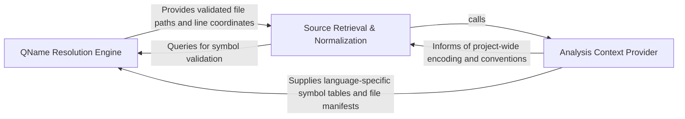

## Details

Manages the normalization and resolution of Qualified Names across different programming languages, mapping agent references to physical file coordinates.

### QName Resolution Engine
Manages the translation of abstract identifiers into internal metadata and serves as the primary lookup mechanism for resolving symbols across different programming languages.

**Related Classes/Methods**:

- `static_analyzer.analysis_result.StaticAnalysisResults.resolve_across_languages`:276-288
- `static_analyzer.analysis_result.StaticAnalysisResults.get_reference`:229-251

**Source Files:**

- [`agents/tools/read_source.py`](https://github.com/CodeBoarding/CodeBoarding/blob/main/.codeboardingagents/tools/read_source.py)
  - `agents.tools.read_source.CodeReferenceReader._run` ([L37-L72](https://github.com/CodeBoarding/CodeBoarding/blob/main/.codeboardingagents/tools/read_source.py#L37-L72)) - Method
  - `agents.tools.read_source.CodeReferenceReader.read_file` ([L75-L85](https://github.com/CodeBoarding/CodeBoarding/blob/main/.codeboardingagents/tools/read_source.py#L75-L85)) - Method
- [`static_analyzer/analysis_result.py`](https://github.com/CodeBoarding/CodeBoarding/blob/main/.codeboardingstatic_analyzer/analysis_result.py)
  - `static_analyzer.analysis_result.StaticAnalysisResults.get_loose_reference` ([L253-L270](https://github.com/CodeBoarding/CodeBoarding/blob/main/.codeboardingstatic_analyzer/analysis_result.py#L253-L270)) - Method

### Source Retrieval & Normalization
Handles the physical extraction of source code from the filesystem and applies normalization logic to ensure accurate, contextually relevant code blocks.

**Related Classes/Methods**:

- `agents.tools.read_source.CodeReferenceReader`:25-85

**Source Files:**

- [`static_analyzer/analysis_result.py`](https://github.com/CodeBoarding/CodeBoarding/blob/main/.codeboardingstatic_analyzer/analysis_result.py)
  - `static_analyzer.analysis_result._reference_key` ([L134-L162](https://github.com/CodeBoarding/CodeBoarding/blob/main/.codeboardingstatic_analyzer/analysis_result.py#L134-L162)) - Function
  - `static_analyzer.analysis_result.StaticAnalysisResults.get_reference` ([L229-L251](https://github.com/CodeBoarding/CodeBoarding/blob/main/.codeboardingstatic_analyzer/analysis_result.py#L229-L251)) - Method
  - `static_analyzer.analysis_result.StaticAnalysisResults.resolve_across_languages` ([L276-L288](https://github.com/CodeBoarding/CodeBoarding/blob/main/.codeboardingstatic_analyzer/analysis_result.py#L276-L288)) - Method

### Analysis Context Provider
Provides global environmental data and project-wide metadata required for disambiguation and populates the search space for the Resolution Engine.

**Related Classes/Methods**: _None_

**Source Files:**

- [`static_analyzer/analysis_result.py`](https://github.com/CodeBoarding/CodeBoarding/blob/main/.codeboardingstatic_analyzer/analysis_result.py)
  - `static_analyzer.analysis_result._strip_java_generics` ([L80-L131](https://github.com/CodeBoarding/CodeBoarding/blob/main/.codeboardingstatic_analyzer/analysis_result.py#L80-L131)) - Function
  - `static_analyzer.analysis_result._strip_java_generics._replace_in_parens` ([L114-L120](https://github.com/CodeBoarding/CodeBoarding/blob/main/.codeboardingstatic_analyzer/analysis_result.py#L114-L120)) - Function
  - `static_analyzer.analysis_result._strip_java_generics._replace_in_parens._subst` ([L117-L118](https://github.com/CodeBoarding/CodeBoarding/blob/main/.codeboardingstatic_analyzer/analysis_result.py#L117-L118)) - Function

### [FAQ](https://github.com/CodeBoarding/GeneratedOnBoardings/tree/main?tab=readme-ov-file#faq)