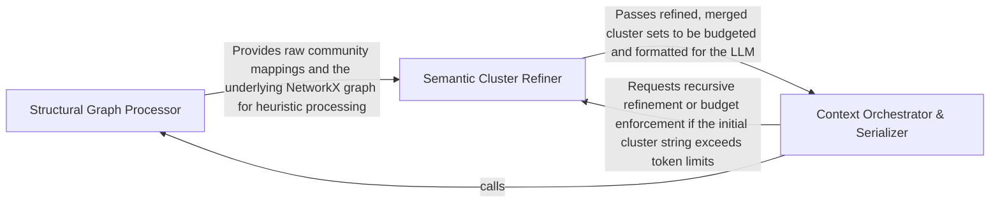

## Details

Post-processes raw mathematical clusters to align with software engineering patterns by merging small fragments and ensuring logical coherence for LLM consumption.

### Structural Graph Processor
Responsible for the initial transformation of static analysis data into a graph format and the execution of community detection algorithms to identify raw clusters.

**Related Classes/Methods**:

- `static_analyzer.graph.CallGraph.cluster`:269-331
- `static_analyzer.graph.CallGraph.to_networkx`:255-267

**Source Files:**

- [`static_analyzer/graph.py`](https://github.com/CodeBoarding/CodeBoarding/blob/main/.codeboardingstatic_analyzer/graph.py)
  - `static_analyzer.graph.CallGraph.to_networkx` ([L255-L267](https://github.com/CodeBoarding/CodeBoarding/blob/main/.codeboardingstatic_analyzer/graph.py#L255-L267)) - Method
  - `static_analyzer.graph.CallGraph.cluster` ([L269-L331](https://github.com/CodeBoarding/CodeBoarding/blob/main/.codeboardingstatic_analyzer/graph.py#L269-L331)) - Method
  - `static_analyzer.graph.CallGraph._coverage` ([L554-L559](https://github.com/CodeBoarding/CodeBoarding/blob/main/.codeboardingstatic_analyzer/graph.py#L554-L559)) - Method

### Semantic Cluster Refiner
Implements software engineering heuristics to refine raw clusters, including merging small fragments into larger logical units and resolving cross-language dependencies.

**Related Classes/Methods**:

- `static_analyzer.cluster_helpers.merge_clusters`:432-470
- `static_analyzer.cluster_helpers._absorb_small_communities`:346-378
- `static_analyzer.cluster_helpers._build_meta_graph`:163-187
- `static_analyzer.cluster_helpers._find_nearest_by_file_overlap`:291-312

**Source Files:**

- [`static_analyzer/cluster_helpers.py`](https://github.com/CodeBoarding/CodeBoarding/blob/main/.codeboardingstatic_analyzer/cluster_helpers.py)
  - `static_analyzer.cluster_helpers._build_node_to_cluster_lookup` ([L154-L160](https://github.com/CodeBoarding/CodeBoarding/blob/main/.codeboardingstatic_analyzer/cluster_helpers.py#L154-L160)) - Function
  - `static_analyzer.cluster_helpers._build_meta_graph` ([L163-L187](https://github.com/CodeBoarding/CodeBoarding/blob/main/.codeboardingstatic_analyzer/cluster_helpers.py#L163-L187)) - Function
  - `static_analyzer.cluster_helpers._community_files` ([L240-L245](https://github.com/CodeBoarding/CodeBoarding/blob/main/.codeboardingstatic_analyzer/cluster_helpers.py#L240-L245)) - Function
  - `static_analyzer.cluster_helpers._find_nearest_by_graph_distance` ([L248-L288](https://github.com/CodeBoarding/CodeBoarding/blob/main/.codeboardingstatic_analyzer/cluster_helpers.py#L248-L288)) - Function
  - `static_analyzer.cluster_helpers._find_nearest_by_file_overlap` ([L291-L312](https://github.com/CodeBoarding/CodeBoarding/blob/main/.codeboardingstatic_analyzer/cluster_helpers.py#L291-L312)) - Function
  - `static_analyzer.cluster_helpers._absorb_small_communities` ([L346-L378](https://github.com/CodeBoarding/CodeBoarding/blob/main/.codeboardingstatic_analyzer/cluster_helpers.py#L346-L378)) - Function
  - `static_analyzer.cluster_helpers._build_merged_cluster_result` ([L386-L424](https://github.com/CodeBoarding/CodeBoarding/blob/main/.codeboardingstatic_analyzer/cluster_helpers.py#L386-L424)) - Function
  - `static_analyzer.cluster_helpers.merge_clusters` ([L432-L470](https://github.com/CodeBoarding/CodeBoarding/blob/main/.codeboardingstatic_analyzer/cluster_helpers.py#L432-L470)) - Function

### Context Orchestrator & Serializer
Manages the final preparation of refined clusters for LLM consumption, enforcing token budgets and formatting the graph into human-readable (and AI-parsable) strings.

**Related Classes/Methods**:

- `agents.cluster_methods_mixin.ClusterMethodsMixin`:64-853
- `static_analyzer.graph.CallGraph.to_cluster_string`:377-427
- `static_analyzer.cluster_helpers.enforce_cross_language_budget`:106-146

**Source Files:**

- [`agents/cluster_methods_mixin.py`](https://github.com/CodeBoarding/CodeBoarding/blob/main/.codeboardingagents/cluster_methods_mixin.py)
  - `agents.cluster_methods_mixin.ClusterMethodsMixin` ([L64-L853](https://github.com/CodeBoarding/CodeBoarding/blob/main/.codeboardingagents/cluster_methods_mixin.py#L64-L853)) - Class
  - `agents.cluster_methods_mixin.ClusterMethodsMixin._expand_to_method_level_clusters` ([L345-L399](https://github.com/CodeBoarding/CodeBoarding/blob/main/.codeboardingagents/cluster_methods_mixin.py#L345-L399)) - Method
  - `agents.cluster_methods_mixin.ClusterMethodsMixin._create_strict_component_subgraph` ([L401-L480](https://github.com/CodeBoarding/CodeBoarding/blob/main/.codeboardingagents/cluster_methods_mixin.py#L401-L480)) - Method
- [`static_analyzer/cfg_skip_planner.py`](https://github.com/CodeBoarding/CodeBoarding/blob/main/.codeboardingstatic_analyzer/cfg_skip_planner.py)
  - `static_analyzer.cfg_skip_planner.ContextBudgetExceededError.__init__` ([L38-L40](https://github.com/CodeBoarding/CodeBoarding/blob/main/.codeboardingstatic_analyzer/cfg_skip_planner.py#L38-L40)) - Method
  - `static_analyzer.cfg_skip_planner.plan_skip_set.render` ([L188-L189](https://github.com/CodeBoarding/CodeBoarding/blob/main/.codeboardingstatic_analyzer/cfg_skip_planner.py#L188-L189)) - Function
- [`static_analyzer/cluster_helpers.py`](https://github.com/CodeBoarding/CodeBoarding/blob/main/.codeboardingstatic_analyzer/cluster_helpers.py)
  - `static_analyzer.cluster_helpers.enforce_cross_language_budget` ([L106-L146](https://github.com/CodeBoarding/CodeBoarding/blob/main/.codeboardingstatic_analyzer/cluster_helpers.py#L106-L146)) - Function
  - `static_analyzer.cluster_helpers.reindex_cluster_result` ([L315-L343](https://github.com/CodeBoarding/CodeBoarding/blob/main/.codeboardingstatic_analyzer/cluster_helpers.py#L315-L343)) - Function
- [`static_analyzer/graph.py`](https://github.com/CodeBoarding/CodeBoarding/blob/main/.codeboardingstatic_analyzer/graph.py)
  - `static_analyzer.graph.CallGraph.to_cluster_string` ([L377-L427](https://github.com/CodeBoarding/CodeBoarding/blob/main/.codeboardingstatic_analyzer/graph.py#L377-L427)) - Method
  - `static_analyzer.graph.CallGraph._common_dot_prefix` ([L595-L608](https://github.com/CodeBoarding/CodeBoarding/blob/main/.codeboardingstatic_analyzer/graph.py#L595-L608)) - Method
  - `static_analyzer.graph.CallGraph.__cluster_str` ([L611-L700](https://github.com/CodeBoarding/CodeBoarding/blob/main/.codeboardingstatic_analyzer/graph.py#L611-L700)) - Method
  - `static_analyzer.graph.CallGraph.__non_cluster_str` ([L703-L723](https://github.com/CodeBoarding/CodeBoarding/blob/main/.codeboardingstatic_analyzer/graph.py#L703-L723)) - Method

### [FAQ](https://github.com/CodeBoarding/GeneratedOnBoardings/tree/main?tab=readme-ov-file#faq)