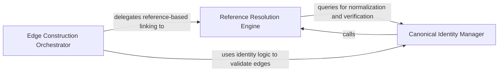

## Details

The intelligence layer that performs name resolution and reference linking, mapping call sites to canonical definitions.

### Edge Construction Orchestrator
Acts as the high-level strategy selector and coordinator, determining whether to resolve edges based on definitions or references by interfacing with language-specific adapters.

**Related Classes/Methods**:

- `static_analyzer.engine.call_graph_builder.CallGraphBuilder._build_edges`:120-124
- `static_analyzer.engine.edge_builder.build_edges_via_definitions`:226-255
- `static_analyzer.engine.language_adapter.LanguageAdapter.edge_strategy`:290-296
- `static_analyzer.engine.edge_builder._build_definition_lookups`:258-276

**Source Files:**

- [`static_analyzer/engine/call_graph_builder.py`](https://github.com/CodeBoarding/CodeBoarding/blob/main/.codeboardingstatic_analyzer/engine/call_graph_builder.py)
  - `static_analyzer.engine.call_graph_builder.CallGraphBuilder._build_edges` ([L120-L124](https://github.com/CodeBoarding/CodeBoarding/blob/main/.codeboardingstatic_analyzer/engine/call_graph_builder.py#L120-L124)) - Method
- [`static_analyzer/engine/edge_builder.py`](https://github.com/CodeBoarding/CodeBoarding/blob/main/.codeboardingstatic_analyzer/engine/edge_builder.py)
  - `static_analyzer.engine.edge_builder.build_edges_via_definitions` ([L226-L255](https://github.com/CodeBoarding/CodeBoarding/blob/main/.codeboardingstatic_analyzer/engine/edge_builder.py#L226-L255)) - Function
  - `static_analyzer.engine.edge_builder._build_definition_lookups` ([L258-L276](https://github.com/CodeBoarding/CodeBoarding/blob/main/.codeboardingstatic_analyzer/engine/edge_builder.py#L258-L276)) - Function
- [`static_analyzer/engine/language_adapter.py`](https://github.com/CodeBoarding/CodeBoarding/blob/main/.codeboardingstatic_analyzer/engine/language_adapter.py)
  - `static_analyzer.engine.language_adapter.LanguageAdapter.edge_strategy` ([L290-L296](https://github.com/CodeBoarding/CodeBoarding/blob/main/.codeboardingstatic_analyzer/engine/language_adapter.py#L290-L296)) - Method

### Reference Resolution Engine
The core logic for mapping specific code positions to symbols, processing batches of references, handling complex call-site lookups, and applying disambiguation logic.

**Related Classes/Methods**:

- `static_analyzer.engine.edge_builder.build_edges_via_references`:33-122
- `static_analyzer.engine.edge_builder._resolve_definitions`:279-368
- `static_analyzer.engine.edge_builder._resolve_definition_to_symbol`:454-495
- `static_analyzer.engine.symbol_table.SymbolTable.lift_to_callable`:243-265

**Source Files:**

- [`static_analyzer/engine/call_graph_builder.py`](https://github.com/CodeBoarding/CodeBoarding/blob/main/.codeboardingstatic_analyzer/engine/call_graph_builder.py)
  - `static_analyzer.engine.call_graph_builder.CallGraphBuilder._bulk_did_open` ([L173-L185](https://github.com/CodeBoarding/CodeBoarding/blob/main/.codeboardingstatic_analyzer/engine/call_graph_builder.py#L173-L185)) - Method
- [`static_analyzer/engine/edge_builder.py`](https://github.com/CodeBoarding/CodeBoarding/blob/main/.codeboardingstatic_analyzer/engine/edge_builder.py)
  - `static_analyzer.engine.edge_builder.build_edges_via_references` ([L33-L122](https://github.com/CodeBoarding/CodeBoarding/blob/main/.codeboardingstatic_analyzer/engine/edge_builder.py#L33-L122)) - Function
  - `static_analyzer.engine.edge_builder._process_references_for_position` ([L159-L218](https://github.com/CodeBoarding/CodeBoarding/blob/main/.codeboardingstatic_analyzer/engine/edge_builder.py#L159-L218)) - Function
  - `static_analyzer.engine.edge_builder._resolve_definitions` ([L279-L368](https://github.com/CodeBoarding/CodeBoarding/blob/main/.codeboardingstatic_analyzer/engine/edge_builder.py#L279-L368)) - Function
  - `static_analyzer.engine.edge_builder._resolve_implementations` ([L371-L431](https://github.com/CodeBoarding/CodeBoarding/blob/main/.codeboardingstatic_analyzer/engine/edge_builder.py#L371-L431)) - Function
  - `static_analyzer.engine.edge_builder._resolve_definition_to_symbol` ([L454-L495](https://github.com/CodeBoarding/CodeBoarding/blob/main/.codeboardingstatic_analyzer/engine/edge_builder.py#L454-L495)) - Function
  - `static_analyzer.engine.edge_builder._best_candidate` ([L498-L506](https://github.com/CodeBoarding/CodeBoarding/blob/main/.codeboardingstatic_analyzer/engine/edge_builder.py#L498-L506)) - Function
- [`static_analyzer/engine/progress.py`](https://github.com/CodeBoarding/CodeBoarding/blob/main/.codeboardingstatic_analyzer/engine/progress.py)
  - `static_analyzer.engine.progress.ProgressLogger` ([L22-L83](https://github.com/CodeBoarding/CodeBoarding/blob/main/.codeboardingstatic_analyzer/engine/progress.py#L22-L83)) - Class
  - `static_analyzer.engine.progress.ProgressLogger.__init__` ([L25-L42](https://github.com/CodeBoarding/CodeBoarding/blob/main/.codeboardingstatic_analyzer/engine/progress.py#L25-L42)) - Method
  - `static_analyzer.engine.progress.ProgressLogger.set_postfix` ([L44-L45](https://github.com/CodeBoarding/CodeBoarding/blob/main/.codeboardingstatic_analyzer/engine/progress.py#L44-L45)) - Method
  - `static_analyzer.engine.progress.ProgressLogger.update` ([L47-L60](https://github.com/CodeBoarding/CodeBoarding/blob/main/.codeboardingstatic_analyzer/engine/progress.py#L47-L60)) - Method
  - `static_analyzer.engine.progress.ProgressLogger.finish` ([L62-L65](https://github.com/CodeBoarding/CodeBoarding/blob/main/.codeboardingstatic_analyzer/engine/progress.py#L62-L65)) - Method
  - `static_analyzer.engine.progress.ProgressLogger._log` ([L67-L83](https://github.com/CodeBoarding/CodeBoarding/blob/main/.codeboardingstatic_analyzer/engine/progress.py#L67-L83)) - Method
- [`static_analyzer/engine/protocols.py`](https://github.com/CodeBoarding/CodeBoarding/blob/main/.codeboardingstatic_analyzer/engine/protocols.py)
  - `static_analyzer.engine.protocols.SymbolNaming` ([L15-L32](https://github.com/CodeBoarding/CodeBoarding/blob/main/.codeboardingstatic_analyzer/engine/protocols.py#L15-L32)) - Class
  - `static_analyzer.engine.protocols.SymbolNaming.is_class_like` ([L30-L30](https://github.com/CodeBoarding/CodeBoarding/blob/main/.codeboardingstatic_analyzer/engine/protocols.py#L30-L30)) - Method
  - `static_analyzer.engine.protocols.SymbolNaming.is_callable` ([L32-L32](https://github.com/CodeBoarding/CodeBoarding/blob/main/.codeboardingstatic_analyzer/engine/protocols.py#L32-L32)) - Method
  - `static_analyzer.engine.protocols.EdgeBuildAdapter` ([L35-L48](https://github.com/CodeBoarding/CodeBoarding/blob/main/.codeboardingstatic_analyzer/engine/protocols.py#L35-L48)) - Class
  - `static_analyzer.engine.protocols.EdgeBuildAdapter.references_batch_size` ([L39-L39](https://github.com/CodeBoarding/CodeBoarding/blob/main/.codeboardingstatic_analyzer/engine/protocols.py#L39-L39)) - Method
  - `static_analyzer.engine.protocols.EdgeBuildAdapter.references_per_query_timeout` ([L42-L42](https://github.com/CodeBoarding/CodeBoarding/blob/main/.codeboardingstatic_analyzer/engine/protocols.py#L42-L42)) - Method
  - `static_analyzer.engine.protocols.EdgeBuildAdapter.is_class_like` ([L46-L46](https://github.com/CodeBoarding/CodeBoarding/blob/main/.codeboardingstatic_analyzer/engine/protocols.py#L46-L46)) - Method
  - `static_analyzer.engine.protocols.EdgeBuildAdapter.is_callable` ([L48-L48](https://github.com/CodeBoarding/CodeBoarding/blob/main/.codeboardingstatic_analyzer/engine/protocols.py#L48-L48)) - Method
- [`static_analyzer/engine/symbol_table.py`](https://github.com/CodeBoarding/CodeBoarding/blob/main/.codeboardingstatic_analyzer/engine/symbol_table.py)
  - `static_analyzer.engine.symbol_table.SymbolTable.find_containing_symbol` ([L190-L241](https://github.com/CodeBoarding/CodeBoarding/blob/main/.codeboardingstatic_analyzer/engine/symbol_table.py#L190-L241)) - Method
  - `static_analyzer.engine.symbol_table.SymbolTable.lift_to_callable` ([L243-L265](https://github.com/CodeBoarding/CodeBoarding/blob/main/.codeboardingstatic_analyzer/engine/symbol_table.py#L243-L265)) - Method

### Canonical Identity Manager
Manages symbol normalization and validation, ensuring different aliases resolve to a single canonical name and filtering out non-trackable entities.

**Related Classes/Methods**:

- `static_analyzer.engine.symbol_table.SymbolTable.get_canonical_name`:279-294
- `static_analyzer.engine.symbol_table.SymbolTable.get_equivalent_names`:267-277
- `static_analyzer.engine.edge_builder._is_valid_edge`:439-451
- `static_analyzer.engine.symbol_table.SymbolTable.is_local_variable`:296-328

**Source Files:**

- [`static_analyzer/engine/edge_builder.py`](https://github.com/CodeBoarding/CodeBoarding/blob/main/.codeboardingstatic_analyzer/engine/edge_builder.py)
  - `static_analyzer.engine.edge_builder._prepare_trackable_symbols` ([L125-L156](https://github.com/CodeBoarding/CodeBoarding/blob/main/.codeboardingstatic_analyzer/engine/edge_builder.py#L125-L156)) - Function
  - `static_analyzer.engine.edge_builder._is_valid_edge` ([L439-L451](https://github.com/CodeBoarding/CodeBoarding/blob/main/.codeboardingstatic_analyzer/engine/edge_builder.py#L439-L451)) - Function
- [`static_analyzer/engine/models.py`](https://github.com/CodeBoarding/CodeBoarding/blob/main/.codeboardingstatic_analyzer/engine/models.py)
  - `static_analyzer.engine.models.SymbolInfo.definition_location` ([L28-L30](https://github.com/CodeBoarding/CodeBoarding/blob/main/.codeboardingstatic_analyzer/engine/models.py#L28-L30)) - Method
- [`static_analyzer/engine/protocols.py`](https://github.com/CodeBoarding/CodeBoarding/blob/main/.codeboardingstatic_analyzer/engine/protocols.py)
  - `static_analyzer.engine.protocols.EdgeBuildAdapter.should_track_for_edges` ([L44-L44](https://github.com/CodeBoarding/CodeBoarding/blob/main/.codeboardingstatic_analyzer/engine/protocols.py#L44-L44)) - Method
- [`static_analyzer/engine/symbol_table.py`](https://github.com/CodeBoarding/CodeBoarding/blob/main/.codeboardingstatic_analyzer/engine/symbol_table.py)
  - `static_analyzer.engine.symbol_table.SymbolTable.get_equivalent_names` ([L267-L277](https://github.com/CodeBoarding/CodeBoarding/blob/main/.codeboardingstatic_analyzer/engine/symbol_table.py#L267-L277)) - Method
  - `static_analyzer.engine.symbol_table.SymbolTable.get_canonical_name` ([L279-L294](https://github.com/CodeBoarding/CodeBoarding/blob/main/.codeboardingstatic_analyzer/engine/symbol_table.py#L279-L294)) - Method
  - `static_analyzer.engine.symbol_table.SymbolTable.is_local_variable` ([L296-L328](https://github.com/CodeBoarding/CodeBoarding/blob/main/.codeboardingstatic_analyzer/engine/symbol_table.py#L296-L328)) - Method

### [FAQ](https://github.com/CodeBoarding/GeneratedOnBoardings/tree/main?tab=readme-ov-file#faq)