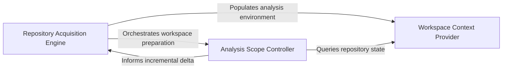

## Details

Handles version control interactions, repository cloning, and workspace management for source code extraction.

### Repository Acquisition Engine
Handles the physical retrieval and low-level inspection of source code repositories, abstracting Git-specific operations.

**Related Classes/Methods**:

- `repo_utils.__init__.clone_repository`:104-126

**Source Files:**

- [`codeboarding_workflows/sources/local.py`](https://github.com/CodeBoarding/CodeBoarding/blob/main/.codeboardingcodeboarding_workflows/sources/local.py)
  - `codeboarding_workflows.sources.local.SourceContext` ([L8-L18](https://github.com/CodeBoarding/CodeBoarding/blob/main/.codeboardingcodeboarding_workflows/sources/local.py#L8-L18)) - Class
- [`codeboarding_workflows/sources/remote.py`](https://github.com/CodeBoarding/CodeBoarding/blob/main/.codeboardingcodeboarding_workflows/sources/remote.py)
  - `codeboarding_workflows.sources.remote.onboarding_materials_exist` ([L18-L28](https://github.com/CodeBoarding/CodeBoarding/blob/main/.codeboardingcodeboarding_workflows/sources/remote.py#L18-L28)) - Function
  - `codeboarding_workflows.sources.remote.remote_source` ([L32-L71](https://github.com/CodeBoarding/CodeBoarding/blob/main/.codeboardingcodeboarding_workflows/sources/remote.py#L32-L71)) - Function
- [`repo_utils/__init__.py`](https://github.com/CodeBoarding/CodeBoarding/blob/main/.codeboardingrepo_utils/__init__.py)
  - `repo_utils.__init__.sanitize_repo_url` ([L64-L78](https://github.com/CodeBoarding/CodeBoarding/blob/main/.codeboardingrepo_utils/__init__.py#L64-L78)) - Function
  - `repo_utils.__init__.remote_repo_exists` ([L82-L93](https://github.com/CodeBoarding/CodeBoarding/blob/main/.codeboardingrepo_utils/__init__.py#L82-L93)) - Function
  - `repo_utils.__init__.get_repo_name` ([L96-L100](https://github.com/CodeBoarding/CodeBoarding/blob/main/.codeboardingrepo_utils/__init__.py#L96-L100)) - Function
  - `repo_utils.__init__.clone_repository` ([L104-L126](https://github.com/CodeBoarding/CodeBoarding/blob/main/.codeboardingrepo_utils/__init__.py#L104-L126)) - Function
  - `repo_utils.__init__.is_repo_dirty` ([L181-L184](https://github.com/CodeBoarding/CodeBoarding/blob/main/.codeboardingrepo_utils/__init__.py#L181-L184)) - Function
- [`repo_utils/errors.py`](https://github.com/CodeBoarding/CodeBoarding/blob/main/.codeboardingrepo_utils/errors.py)
  - `repo_utils.errors.RepoDontExistError` ([L5-L6](https://github.com/CodeBoarding/CodeBoarding/blob/main/.codeboardingrepo_utils/errors.py#L5-L6)) - Class

### Workspace Context Provider
Manages the logical abstraction of the source code environment, providing a consistent interface for accessing file contents and metadata.

**Related Classes/Methods**: _None_

**Source Files:**

- [`repo_utils/__init__.py`](https://github.com/CodeBoarding/CodeBoarding/blob/main/.codeboardingrepo_utils/__init__.py)
  - `repo_utils.__init__.store_token` ([L140-L144](https://github.com/CodeBoarding/CodeBoarding/blob/main/.codeboardingrepo_utils/__init__.py#L140-L144)) - Function
  - `repo_utils.__init__.upload_onboarding_materials` ([L148-L177](https://github.com/CodeBoarding/CodeBoarding/blob/main/.codeboardingrepo_utils/__init__.py#L148-L177)) - Function
- [`repo_utils/errors.py`](https://github.com/CodeBoarding/CodeBoarding/blob/main/.codeboardingrepo_utils/errors.py)
  - `repo_utils.errors.NoGithubTokenFoundError` ([L1-L2](https://github.com/CodeBoarding/CodeBoarding/blob/main/.codeboardingrepo_utils/errors.py#L1-L2)) - Class
- [`repo_utils/git_ops.py`](https://github.com/CodeBoarding/CodeBoarding/blob/main/.codeboardingrepo_utils/git_ops.py)
  - `repo_utils.git_ops._git_argv` ([L34-L42](https://github.com/CodeBoarding/CodeBoarding/blob/main/.codeboardingrepo_utils/git_ops.py#L34-L42)) - Function
  - `repo_utils.git_ops.get_changed_files_since` ([L113-L135](https://github.com/CodeBoarding/CodeBoarding/blob/main/.codeboardingrepo_utils/git_ops.py#L113-L135)) - Function
  - `repo_utils.git_ops.approve_https_credentials` ([L138-L144](https://github.com/CodeBoarding/CodeBoarding/blob/main/.codeboardingrepo_utils/git_ops.py#L138-L144)) - Function
  - `repo_utils.git_ops._list_uncommitted_changed_files` ([L147-L170](https://github.com/CodeBoarding/CodeBoarding/blob/main/.codeboardingrepo_utils/git_ops.py#L147-L170)) - Function
  - `repo_utils.git_ops._parse_name_status_paths` ([L173-L187](https://github.com/CodeBoarding/CodeBoarding/blob/main/.codeboardingrepo_utils/git_ops.py#L173-L187)) - Function

### Analysis Scope Controller
Implements incremental analysis by filtering the workspace based on version control data and configuration to determine the files for processing.

**Related Classes/Methods**: _None_

**Source Files:**

- [`repo_utils/git_ops.py`](https://github.com/CodeBoarding/CodeBoarding/blob/main/.codeboardingrepo_utils/git_ops.py)
  - `repo_utils.git_ops.require_current_commit` ([L65-L74](https://github.com/CodeBoarding/CodeBoarding/blob/main/.codeboardingrepo_utils/git_ops.py#L65-L74)) - Function
  - `repo_utils.git_ops.is_git_repository` ([L77-L89](https://github.com/CodeBoarding/CodeBoarding/blob/main/.codeboardingrepo_utils/git_ops.py#L77-L89)) - Function
  - `repo_utils.git_ops.has_uncommitted_changes` ([L92-L110](https://github.com/CodeBoarding/CodeBoarding/blob/main/.codeboardingrepo_utils/git_ops.py#L92-L110)) - Function
- [`utils.py`](https://github.com/CodeBoarding/CodeBoarding/blob/main/.codeboardingutils.py)
  - `utils.create_temp_repo_folder` ([L24-L28](https://github.com/CodeBoarding/CodeBoarding/blob/main/.codeboardingutils.py#L24-L28)) - Function
  - `utils.remove_temp_repo_folder` ([L31-L35](https://github.com/CodeBoarding/CodeBoarding/blob/main/.codeboardingutils.py#L31-L35)) - Function
  - `utils.copy_files` ([L101-L107](https://github.com/CodeBoarding/CodeBoarding/blob/main/.codeboardingutils.py#L101-L107)) - Function

### [FAQ](https://github.com/CodeBoarding/GeneratedOnBoardings/tree/main?tab=readme-ov-file#faq)